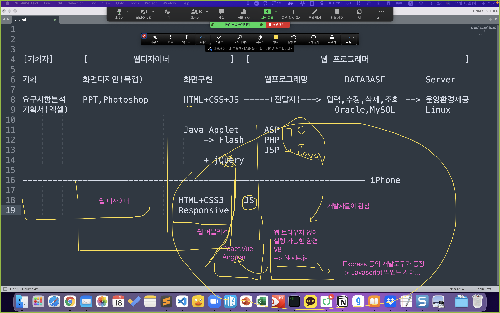

# Hello Javascript

## #01. 웹 사이트 관련 직국 / 언어 분류

## #02. 실행환경 구성

## #03. Hello Javascript

## #04. 프로그램 소스코드가 실행되는 과겅

### 1) 컴파일 언어

반드시 기계어로 컴파일되어야만 실행시킬 수 있는 프로그래밍 언어

1. 개발자가 프로그램 소스코드를 작성.
2. 작성한 소스코드를 2진수(바이너리, 기계어) 형태로 변환 -> '컴파일(compile)'
   - 소스코드를 컴파일 해 주는 소프트웨어-> '컴파일러(complier)'
3. '컴파일'된 바이너리를 실행한다.
   - 한 번 컴파일된 파일은 2진수 형태로 저장되어 있기때문에 재실행시 컴퓨터가 해석할 필요가 없다.
   - 컴파일된 결과물은 독립 실행이 가능한 형태이기 때문에 별다른 도구가 필요 없다. 

> C, C++, Java 등

### 2) 인터프리터 언어

컴파일러를 거쳐서 기계어로 변환되지 않고 바로 실행되는 프로그래밍 언어

1. 컴파일을 거치지 않고 매 실행시마다 소스코드를 해석하는 과정이 반복적으로 수행되는 형태
2. 컴파일을 하지 않는다는 간편함 때문에 상대적으로 배우기 쉽다.
3. 컴파일 언어보다는 실행속도가 느리다.
   - 대용량 서비스에 적용하는 것은 적합하지 않다.
4. 컴파일을 하지 않는 대신 실행을 하기위해 해석기가 매번 필요하다.
   - Javascript코드는 실행하기 위해서 반드시 Node나 웹브라우저가 필요하다. 

> Javascript, Pyton

#### 스크립트 언어

인터프리터 방식에서 사용하기 위해 고안된 프로그래밍 언어. 