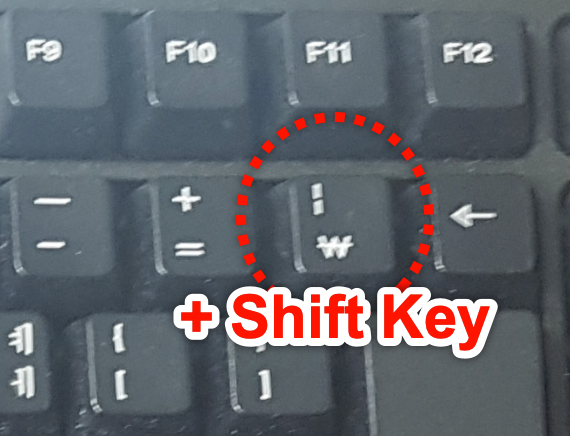

# 03-연산자

변수를 활용하여 각종 연산을 수행하는데 사용되는 특수 기호

## #01. 산술연산자(사칙연산자)

일반적인 덧셈, 뺄셈, 곱셈, 나눗셈에 사용되는 기호

### 1) 산술연산자의 종류

| 연산자 | 설명                                        |
| ------ | ------------------------------------------- |
| +      | 덧셈                                        |
| -      | 뺄셈                                        |
| \*     | 곱셈                                        |
| /      | 나눗셈                                      |
| %      | 나눗셈에서의 정수 부분의 몫을 제외한 나머지 |

### 2) 연산자의 활용

- `console.log()` 명령을 통해 변수간의 연산 결과를 출력
- 연산 결과를 새로운 변수에 할당

### 3) 나눗셈에서의 주의사항

| 케이스                      | 설명                                                                |
| --------------------------- | ------------------------------------------------------------------- |
| 일반적인 나눗셈             | 몫이 소수점까지 갖는 경우 연산할 수 있는 최대한의 자리수까지 계산함 |
| 나누어 떨어지지 않는 나눗셈 | 처리 가능한 범위 안에서 최대한의 소수점 자리수까지 계산함.          |

### 4) 문자열의 연산

| 케이스                    | 설명                                                                                                     |
| ------------------------- | -------------------------------------------------------------------------------------------------------- |
| 문자열 끼리의 덧셈        | 문자열을 하나로 병합하는 효과가 있다.                                                                    |
| 문자열과 다른 타입의 덧셈 | 문자열 이외의 값들을 모두 문자열로 취급하여 덧셈을 수행한다. 즉, 문자열끼리의 연결과 같은 결과를 갖는다. |

```js
/** 1) 사칙 연산 출력하기 */
const a = 5;
const b = 3;
console.log(a + b);
console.log(a - b);
console.log(a * b);

/** 2) 연산 결과를 다른 변수에 할당 */
const x = 5;
const y = 3;
const z = x + y - 2;

/** 3) 나눗셈 주의사항 */
// 일반적인 나눗셈
const myValue1 = 10;
const myValue2 = 4;
console.log(myValue1 / myValue2);

// 나누어 떨어지지 않는 나눗셈
const myValue3 = 4;
const myValue4 = 3;
console.log(myValue3 / myValue4);

/** 4) 문자열 연산 */
// 1) 문자열 끼리의 덧셈 (문장간에는 다른 연산자는 불가)
const myString1 = "Hello";
const myString2 = "World";
console.log(myString1 + myString2);

// 2) 문자열과 다른 타입의 덧셈
// --> 문자열과 연산되는 다른 타입은 모두 문자열로 자동 변환된다.
// 결국 문자열끼리의 덧셈과 동일한 결과
console.log("안녕하세요" + 123);
console.log("안녕하세요" + true);
```

> 출력결과
> 

## #02. 대입 연산자.

좌변에 우변을 대입한다는 의미의 `=` 연산자.

이미 앞에서 많이 사용한 기호이다.

### 활용 방법

1. 연산 결과를 새로운 변수에 대입
1. 이미 생성된 변수의 값을 다른 값으로 변경
1. 연산 결과를 변수 스스로에게 덮어 씌우기

- 어떤 변수 x에 대한 연산 결과를 다시 x에 덮어 씌울 수 있다.

```js
/** 1) 연산 결과를 새로운 변수에 대입 */
let myNumber1 = 123;
let myNumber2 = 234;
let myResult = myNumber1 + myNumber2;
console.log(myResult);

/** 2) 이미 생성된 변수의 값을 다른 값으로 변경  */
let myNumber3 = 1;
let myNumber4 = 2;

myNumber3 = 200;
myNumber4 = 300;

console.log(myNumber3);
console.log(myNumber4);

/** 3) 연산 결과를 변수 스스로에게 덮어 씌우기  */
let selfValue = 300;
selfValue = selfValue + 100;
console.log(selfValue);
```

> 출력결과
> 

## #03. 단항 연산자

- 어떤 변수 `x`에 대한 연산 결과를 다시 `x`에 덮어 씌우는 연산을 축약한 표현
- `+=`, `-=`, `*=`, `/=`, `%=`

```js
let x = 100;

x += 10;
console.log(x);

x -= 30;
console.log(x);

x *= 2;
console.log(x);

x /= 5;
console.log(x);

x %= 10;
console.log(x);
```

> 출력결과
> 

## #04. 증감연산자

### 1) 스스로 1 증가 혹은 감소

- 단항 연산자를 덧셈과 뺄셈에 한하여 축약한 형태.
- 스스로 1증가 혹은 1감소로 해석할 수 있다.

### 2) 증감 연산자의 위치

- `++`, `--` 연산자가 독립적으로 사용되는 경우는 위치에 상관 없이 결과가 동일하지만, 다른 수식에 포함된 상태로 사용되는 경우 위치에 따라 결과값이 달라진다.

#### 전위 증감 연산자

- 연산자가 앞에 위치한 경우 (앞북)
- 증감연산자가 앞에 위치한 경우 변수 스스로의 값에 대해 증가, 감소를 먼저 수행한 후 전체 수식을 연산한다.

#### 후위 증감 연산자

- 연산자가 뒤에 위치한 경우 (뒷북)
- 변수에 대한 증감연산자가 작용하기 전에 전체 수식을 먼저 처리한 다음 나중에서야 증감 연산자가 수행된다.

```js
/** 1) 변수 스스로 1증가 */
let selfPlus = 1;
console.log(selfPlus);

selfPlus++;
console.log(selfPlus);

++selfPlus;
console.log(selfPlus);

/** 2) 변수 스스로 1감소 */
let selfMinus = 1;
console.log(selfMinus);

selfMinus--;
console.log(selfMinus);

--selfMinus;
console.log(selfMinus);

/** 3) 전위 증감 연산자  */
let prevValue = 1;

// prevValue를 먼저 1 증가 시키고 전체 수식을 처리한다.
// --> 앞북
let prevResult = 100 + ++prevValue;

console.log(prevResult);
console.log(prevValue);

/** 4) 후위 증감 연산자 */
let nextValue = 1;

// 100+nextValue를 먼저 처리하고 나중에서야 nextValue가 1 증가한다.
let nextResult = 100 + nextValue++;

console.log(nextResult);
console.log(nextValue);
```

> 출력결과
> 

## #05. 비교 연산자

- 두 값간의 크기를 비교하는 식에 대한 **참**, **거짓**을 판별한다.
- 비교 연산의 결과는 논리값(`true` 혹은 `false`)로 결정된다.

### 1) 이상(`>=`), 초과(`>`), 이하(`<=`), 미만(`<`)

- 초등학교에서 배우는 부등식

### 2) 같다(`==`, `===`), 다르다(`!=`, `!==`)

- `==`, `!=` : 값의 내용만 비교하기 때문에 문자열 1(`"1"`)과 숫자형 1(`1`)을 같다고 판단한다.
- `===`, `!==` : 값의 데이터 타입까지도 일치해야만 같다고 판단하기 때문에 문자열 1(`"1"`)과 숫자형 1(`1`)을 다르다고 판단한다.
- Javascript에서 `1 === 1.0` 은 정수와 실수를 구분하지 않고 모두 number 타입으로 처리하기 때문에 `true` 로 판단한다.

```js
/** 1) 이상, 이하. 미만., 초과 */
let x = 100;
let y = 50;

let compare1 = x >= y;
let compare2 = x > y;
let compare3 = x <= y;
let compare4 = x < y;

console.group("1) 이상, 이하 미만, 초과");
console.log(compare1);
console.log(compare2);
console.log(compare3);
console.log(compare4);

/** 2) 같다 */
let a1 = "1";
let a2 = 1;
let a3 = 1.0;
let a4 = true;

console.group("2) 같다");
console.group("내용만 비교하는 경우");
console.log(a1 == a2);
console.log(a1 == a3);
console.log(a1 == a4);

console.log(a2 == a3);
console.log(a2 == a4);

console.group("데이터 타입까지 비교하는 경우");
console.log(a1 === a2);
console.log(a1 === a3);
console.log(a1 === a4);

console.log(a2 === a3);
console.log(a2 === a4);

console.log(a3 === a4);
console.groupEnd();
console.groupEnd();

/** 3) 다르다 */
let b1 = "1";
let b2 = 1;
let b3 = 1.0;
let b4 = true;

console.group("3) 다르다");
console.group("내용만 비교하는 경우");
console.log(b1 != b2);
console.log(b1 != b3);
console.log(b1 != b4);

console.log(b2 != b3);
console.log(b2 != b4);

console.log(b3 != b4);
console.groupEnd();

console.group("데이터 타입까지 비교하는 경우");
console.log(b1 !== b2);
console.log(b1 !== b3);
console.log(b1 !== b4);

console.log(b2 !== b3);
console.log(b2 !== b4);

console.log(b3 !== b4);
console.groupEnd();
console.groupEnd();
```

> 출력결과
> 

## #06. 논리 연산자

두 개의 논리값(`true` 혹은 `false`)간에 AND(`&&`), OR(`||`) 연산을 수행한다.

| 연산자          | 설명                                                                                                     |
| --------------- | -------------------------------------------------------------------------------------------------------- |
| AND (**`&&`**)  | 연산에 사용되는 모든 값이 `true`인 경우만 결과가 `true`이고 그 외의 경우는 모든 결과가 `false`           |
| OR (**`\|\|`**) | 연산에 사용되는 값중에서 하나라도 `true`라면 결과가 `true`이고 모든 값이 `false`인 경우만 결과가 `false` |
| NOT (**`!`**)   | 느낌표 `!`를 사용하여 논리형 값 true, false를 부정하여 반대의 결과를 만들어 내는 연산자.                 |

### 파이프



### 특이사항

- AND가 OR보다 항상 우선한다.
- 숫자 값에 적용할 경우 `0`은 false으로 식별되고 `0`이 아닌 모든 수는 true로 식별된다.
- 문자열에 적용할 경우 빈 문자열(`""`)은 false로 식별되고 한 글자라도 포함된 문자열은 true로 식별된다.

```js
/** 1) and */
// --> 전체가 참인 경우만 결과가 참
console.group("1) and");
console.log(true && true);
console.log(true && false);
console.log(false && true);
console.log(false && false);
console.groupEnd();

/** 2) and연산 여러 개 사용 */
console.group("2) and연산 여러 개 사용");
console.log(true && true && true);
console.log(true && true && false);
console.log(false && false && true);
console.log(false && true && true);
console.groupEnd();

/** 3) or */
// --> 하나라도 참이 포함되어 있다면 결과는 참
console.group("3) or");
console.log(true || true);
console.log(true || false);
console.log(false || true);
console.log(false || false);
console.groupEnd();

/** 4) or연산 여러 개 사용 */
console.group("2) and연산 여러 개 사용");
console.log(true || true || true);
console.log(true || true || false);
console.log(false || false || true);
console.log(false || true || true);
console.groupEnd();

/** 5) 복합사용 */
console.group("5) 복합사용");
// AND가 OR보다  항상 우선한다.
// t || t -> t
console.log((true && true) || true);
// t || f ->
console.log((true && true) || false);
// f || t -> t
console.log((false && false) || true);
// f || t -> t
console.log((false && true) || true);

console.log(true || (true && true));

console.log(true || (true && false));

console.log(false || (false && true));

console.log(false || (true && true));
console.groupEnd();

/** 6) not */
console.group("6) not");
let success = true;
let fail = !success;
console.log(fail);

let k = 1;
console.log(!k);

let l = 0;
console.log(!l);

let str1 = "Hello";
console.log(!str1);

let str2 = "";
console.log(!str2);
console.groupEnd();
```

> 출력결과
> 

## #07. 삼항 연산자 `? :`

```js
let 변수 = 조건식 ? 값1 : 값2;
```

조건식을 판별하여 식이 참인 경우 `값1`이 변수에 대입되고, 조건식이 거짓인 경우 `값2`가 변수에 대입되는 연산자.

```js
const age1 = 19;
const type1 = age1 >= 20 ? "성인" : "청소년";
console.log("당신은 %s입니다.", type1);

const age2 = 22;
const type2 = age2 >= 20 ? "성인" : "청소년";
console.log("당신은 %s입니다.", type2);
```

> 출력결과
> 

# 김도유 연산자 연습문제

> 2022-01-25

## 문제1.

현재 년도에 대한 값을 `year`라는 상수로 생성하고 이 값을 활용하여 자신의 나이를 연산한 후 `age`라는 이름의 지역변수에 할당하고 "나는 OO세 입니다." 라는 형식의 문장으로 이스케이프 문자를 활용하여 출력하시오.

```javascript
const year = new Date().getFullYear();
let age = year - 1986 + 1;

// console.log(year);
// console.log(age);

console.group("문제1");
console.log("나는  %d세 입니다.", age);
console.groupEnd();

// 풀이
// 현재 년도에 대한 값을 'year'라는 상수로 생성
const year = 2022;

// 자신의 나이를 연산한 후 'age'라는 이름의 지역변수에 할당
let age = year - 2000 + 1;

// 이스케이프 문자를 활용하여 출력
console.log("나는 %d세 입니다.", age);
```

## 문제2.

자신의 나이를 의미하는 상수 `age`를 정의하고 이 값을 활용하여 자신이 태어난 년도 `year`를 전역 변수 형식으로 산출하여 "나는 OOOO년도에 태어났습니다."라는 형식의 문장으로 이스케이프 문자를 활용하여 출력하시오.

```javascript
const age = 37;
var year = new Date().getFullYear() - age + 1;

// console.log(age);
// console.log(year);

console.group("문제2");
console.log("나는  %d년도에 태어났습니다.", year);
console.groupEnd();

// 풀이
// 자신의 나이를 의미하는 상수 'age'를 정의
const age = 23;

// 자신이 태어난 년도 'year' 를 전역 변수
var year = 2022 - (23 - 1);

// 이스케이프 문자를 활용하여 출력
console.log("나는 %d년도에 태어났습니다.", year);
```

## 문제3.

사과를 바구니에 나누어 담으려고 한다. 하나의 바구니는 사과를 10개씩 담을 수 있으며 사과를 담다가 10개 미만으로 남는 경우 하나의 바구니를 추가로 사용해야 한다. 예를 들어 120개의 사과를 나누어 담기 위해서는 12개의 바구니가 필요하지만 121~130개까지 사과가 있다면 13개의 바구니가 필요하고 다시 131개의 사과를 나누어 담기 위해서는 14개의 바구니가 필요하게 된다.

현재 갖고 있는 사과의 수를 의미하는 `numOfApples` 변수에 123이라는 값이 할당되어 있을 경우 필요한 바구니의 수를 구하는 프로그램을 구현하시오.

```javascript
const numOfApples = 123;
let basket = numOfApples / 10;
if (basket >= 10) {
  ++basket;
}
console.group("문제3");
console.log("바구니는 총 %d개가 필요합니다.", parseInt(basket));
console.groupEnd();

// 풀이
// 사과의 수

const numOfApples = 123;

// 10으로 나눈 나머지를 소수점 값으로 환산
const extra = (numOfApples % 10) / 10;
console.log(extra);

//첫번째 풀이
let basketCount = numOfApples / 10;
console.log(basketCount);
let basketCount =
  extra > 0 ? numOfApples / 10 - extra + 1 : numOfApples / 10 - extra;
console.log(basketCount);

// 두번째 풀이
let basketCount = numOfApples / 10 - extra;
basketCount += extra > 0 ? 1 : 0;
console.log(basketCount);
```

## 문제4.

어떤 계산기는 입력된 값에서 백의자리 이하를 버리고 결과를 도출한다고 한다. 예를 들어 입력된 값이 456이라면 400이 결과로 출력된다. 이러한 출력결과를 만들 수 있는 코드를 작성하시오.

```javascript
const number = 456;
let calcNumber01 = number % 100;
let calcNuber02;

if (calcNumber01 != 0) {
  calcNuber02 = number - calcNumber01;
}

// console.log(number);
// vconsole.log(calcNumber01);
console.group("문제4");
console.log(calcNuber02);
console.groupEnd();

// 풀이
const number = 457;

// 100e단위에 대한 나머지값을 소수점으로 구하기
const extra = (number % 100) / 100;
console.log(extra);

const result = (number / 100 - extra) * 100;
console.log(result);
```
