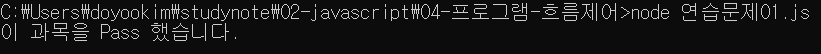
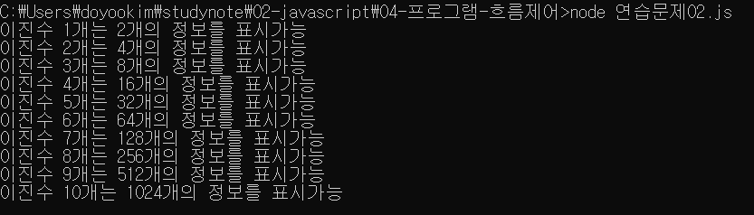
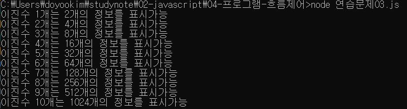

# 04-프로그램_흐름제어

프로그램 구문이 무조건 순차적으로 실행되는 것이 아니라 주어진 조건을 판별하여 선택적 혹은 반복적으로 실행 여부를 결정하도록 흐름을 제어하는 코드 작성 기법

## #01. 조건문

### 1) if문

주어진 조건식이 참인 경우에만 블록(`{}`)안을 실행하는 구문 형태.

```js
if (조건식) {
    ... 조건이 참인 경우에 실행할 명령 ...
}
```

#### a) 조건식에 따른 구분

#####  논리값을 사용한 경우

`true`나 `false`를 저장하고 있는 변수를 조건으로 지정한다.

```js
const a = true;

// 주어진 조건이 참이므로 블록을 실행함.
if (a) {
    ... 조건이 참인 경우에 실행할 명령 ...
}
```

```js
const b = false;

// 주어진 조건이 거짓이므로 블록을 실행하지 않음
if (b) {
    ... 조건이 참인 경우에 실행할 명령 ...
}
```

##### 숫자형 값을 사용한 경우

숫자형인 경우 0은 거짓, 0이 아닌 모든 수는 참으로 식별한다.

```js
const a = 123;

// 주어진 조건이 참이므로 블록을 실행함.
if (a) {
    ... 조건이 참인 경우에 실행할 명령 ...
}
```

```js
const b = 0;

// 주어진 조건이 거짓이므로 블록을 실행하지 않음
if (b) {
    ... 조건이 참인 경우에 실행할 명령 ...
}
```

##### 문자열 값을 사용한 경우

빈 문자열 `""`은 `false`, 내용이 한 글자라도 포함된 문자열은 `true`로 식별한다.

문자열 변수를 조건으로 사용하는 경우는 **문자열에 내용이 포함되어 있다면?** 으로 해석할 수 있다.

```js
const a = "hello";

// 주어진 조건이 참이므로 블록을 실행함.
if (a) {
    ... 조건이 참인 경우에 실행할 명령 ...
}
```

```js
const b = "";

// 주어진 조건이 거짓이므로 블록을 실행하지 않음
if (b) {
    ... 조건이 참인 경우에 실행할 명령 ...
}
```

##### 비교식을 사용한 조건문

`()` 안의 식이 참인 경우 `{}` 안의 구문이 실행된다.

```js
const a = 100 > 10;

// 주어진 조건이 참이므로 블록을 실행함.
if (a) {
    ... 조건이 참인 경우에 실행할 명령 ...
}
```

```js
// 주어진 조건이 거짓이므로 블록을 실행하지 않음
if (100 < 10) {
    ... 조건이 참인 경우에 실행할 명령 ...
}
```

##### 논리식을 사용한 조건문

AND(`&&`) 연산모든 값이 `TRUE`인 경우에만 결과가 `TRUE`

```js
let a = true;
let b = true;
// 주어진 조건이 참이므로 블록을 실행함.
if (a && b) {
    ... 조건이 참인 경우에 실행할 명령 ...
}
```

```js
let c = true;
let d = false;
// 주어진 조건이 거짓이므로 블록을 실행하지 않음
if (c && d) {
    ... 조건이 참인 경우에 실행할 명령 ...
}
```

OR(`||`) 연산은 하나라도 `참`이 포함되어 있다면 결과가 `참`

```js
let a = true;
let b = false;
// 주어진 조건이 참이므로 블록을 실행함.
if (a || b) {
    ... 조건이 참인 경우에 실행할 명령 ...
}
```

```js
let c = false;
let d = false;
// 주어진 조건이 거짓이므로 블록을 실행하지 않음
if (c || d) {
    ... 조건이 참인 경우에 실행할 명령 ...
}
```

`!` 연산자는 논리값을 부정한다.

```js
let a = false;
// 주어진 조건이 참이므로 블록을 실행함.
if (!a) {
    ... 조건이 참인 경우에 실행할 명령 ...
}
```

```js
let b = true
// 주어진 조건이 거짓이므로 블록을 실행하지 않음
if (!b) {
    ... 조건이 참인 경우에 실행할 명령 ...
}
```

문자열도 `true`, `false`를 판단할 수 있으므로 `!`로 처리 가능하다.

문자열에 대해 not 연산자를 적용할 경우 **내용이 없다면?** 으로 해석할 수 있다.

```js
let a = "";
// 주어진 조건이 참이므로 블록을 실행함.
if (!a) {
    ... 조건이 참인 경우에 실행할 명령 ...
}
```

```js
let b = "...";
// 주어진 조건이 거짓이므로 블록을 실행하지 않음
if (!b) {
    ... 조건이 참인 경우에 실행할 명령 ...
}
```

```js
/** 1) 논리값을 사용한 경우 */
console.group("1) 논리값을 사용한 경우");

// 일반구문 - 무조건 실행된다.
console.log("배고픈데;");

// 조건문에서 사용할 조건값을 생성
const have_money = true;
//const have_money = false;

if(have_money){
    console.log("식당에서");
}

 console.log("밥을 먹자");

 console.groupEnd();

 /** 2) 숫자형 값을 사용한 경우 */
 console.group("2) 숫자형 값을 사용한 경우");

 const money1 = 10000;
 // const money = 0;

 if(money1){
     console.log("택시를 타고");
 }

 console.log("집에가자");

console.groupEnd();

/** 3) 비교식을 사용한 조건문 */
console.group("3) 비교식을 사용한 조건문");

const money2 = 12000;
// const money2 = 3000;

if(money2 >= 5000){
    const k = money2-5000;
    // 조건값들을 공백을 기준으로 하나의 값으로 연결하는 함수.
    console.log("선물을 사고 %d원 남는다.", k);
}

console.groupEnd();

/** 4) 논리식을 사용한 조건문 (AND) */
console.log("4) 논리식을 사용한 조건문 (AND)");

const x1 = true;
const y1 = true;

if(x1 && y1){
    console.log("x1 && y1 조건은 참 입니다.");
}

const x2 = true;
const y2 = false;

// AND(&&) 연산은 하나라도 거짓이 포함되어 있다면 결과가 거짓이므로
// 아래의 조건문은 실행되지 않는다.
if(x2 && y2){
    console.log("x2 && y2 조건은 참 입니다.");
}

console.groupEnd();

/** 5) 논리식을 사용한 조건문 (OR) */
console.group("5) 논리식을 사용한 조건문 (OR)");

const x3 = true;
const y3 = true;

 if(x3 || y3){
     console.log("x3 || y3 조건은 참 입니다.");
 }

 const x4 = true;
 const y4 = false;

 // OR(||) 연산은 모든 값이 거짓인 경우에만 결과가 거짓이므로
 // 아래의 조건문은 실행되지 않는다.

if(x4 || y4){
    console.log("x4 || y4 조건은 참 입니다.");
}

console.groupEnd();

/** 6) Not 연산 */
console.group("6) Not 연산");

const a = true;

// 조건이 거짓이므로 출력되지 않음.
if(!a){
    console.log("HelloWorld");
}

const b = false;

// 조건이 참이므로 출력됨
if(!b){
    console.log("헬로월드");
}

console.groupEnd();

/** 07) 논리식 Not */
console.group("7) 논리식 Not")

const x5 = true;
const y5 = false;

// true && false 는 거짓이지만 그 결과를 부정했으므로 결과는 참이된다.
if(!(x5 && y5)){
    console.log("!(x5 && y5) 조건은 참 입니다. ");
}

const x6 = true;
const y6 = false;

// true || false 는 참이지만 그 결과를 부정했으므로 결과는 거짓이 된다. -> 실행안함
if(!(x6 || y6)){
    console.log("(!(x6 || y6) 조건은 참 입니다.")
}

console.groupEnd();
```

> 출력결과


#### b) if ~ else 문

그렇지 않으면~~

```js
if (조건식) {
    ... 조건이 참인 경우에 실행할 명령 ...
} else {
    ... 조건이 참이 아닌 경우에 실행할 명령 ...
}
```

- if문은 조건이 참인 경우에만 수행되고 조건이 거짓인 경우는 수행되지 않는다.
- if문 뒤에 else문을 덧붙여 조건이 거짓인 경우에 수행되는 구문을 추가할 수 있다.
- else문은 if문 뒤에만 위치할 수 있고 독립적으로는 존재할 수 없다.

```js
const age = 19;

if (age > 19) {
    console.log("성인입니다.");
} else {
    console.log("성인이 아닙니다.")
}
```
> 출력결과


#### c) if ~ else if ~ else 문

여러가지 경우의 수를 나열하는 조건문.

순차적으로 조건을 판별하면서 **가장 처음 만나는 `참`인 조건의 블록을 수행**하고 빠져나간다.

```js
if (조건식1) {
    ... 조건이 참인 경우에 실행할 명령 ...
} else if (조건식2) {
    ... 조건이 참인 경우에 실행할 명령 ...
} else if (조건식3) {
    ... 조건이 참인 경우에 실행할 명령 ...
} else if (조건식n) {
    ... 조건이 참인 경우에 실행할 명령 ...
} else {
    ... 조건이 참이 아닌 경우에 실행할 명령 ...
}
```

```js
const point = 72;

// 순차적으로 조건을 판별하면서 가장 처음 만나는 `참` 조건의 블록을 수행하고 빠져나간다.

if (point > 90 ) {
    console.log("A학점");
} else if (point > 80 ) {
    console.log("B학점");
} else if (point > 70 ) {
    console.log("C학점");
} else if (point > 60 ) {
    console.log("D학점");
} else {
    console.log("F학점");
}
```

> 출력결과


### 2) switch 문

#### 기본 구문

하나의 변수나 수식에 대한 여러가지 경우의 수를 나열하는 형식.

조건에 맞는 `case` 블록부터 `break` 키워드를 만날 때 까지 실행한다.

switch의 조건을 식으로 설정하는 것도 가능하다.

마지막의 default는 모든 케이스를 충족하지 않을 경우 실행되고, 필요 없다면 생략할 수 있다.

```js
switch (변수) {
    case 1:
        ... 실행할 명령 ...
        break;
    case 2:
        ... 실행할 명령 ...
        break;
    case n:
        ... 실행할 명령 ...
        break;
    default:
        ... 실행할 명령 ...
        break;
}
```

#### `break`가 없는 경우

중단점이 없기 때문에 그 아래 블록까지 함께 실행된다.

필요에 따라 의도적으로 `break`의 위치를 조절 할 수 있다.

```js
/** 1) Switch 기본 구문 */
console.group("1) Switch 기본 구문");

const 국어 = "B";

// 조건에 맞는 'case' 블록부터 'break' 키워드를 만날 때 까지 실행한다.
switch (국어) {
    case 'A' :
        console.log("A학점 입니다.");
        break;
    case 'B':
        console.log("B학점 입니다.");
        break;
    case 'C':
        console.log("C학점 입니다.");
        break;
    default:
        console.log("C학점 미만 입니다.");
        break;    
}

console.groupEnd();

/** 2) break가 없는 경우 */
console.group("2) break가 없는 경우");

const 영어 = "B";

switch (영어) {
    case 'A' :
        console.log("A학점 입니다.");
    case 'B':
        console.log("B학점 입니다.");
    case 'C':
        console.log("C학점 입니다.");
    default:
        console.log("C학점 미만 입니다.");   
}

console.groupEnd();

/** 3) 의도적으로 break 조절하기 */
// case는 다르지만 수행해야할 로직이 동일한 경우 의도적으로 break의 위치를 조절할 수 있다.
console.group("3) 의도적으로 break 조절하기");

const 수학 ="B";

switch (수학) {
    case 'A':
    case 'B':
    case 'C':
        console.log("이 과목을 Pass 했습니다.");
    default:
        console.log("이 과목을 Pass하지 못했습니다.");
        break;            
}

console.groupEnd();


/** 4) break의 조건을 식으로 설정하는 경우 */
console.group("4) break의 조건을 식으로 설정하는 경우");

const 과학 = 72;

// 수식이 비교식이므로 case는 true/false에 대한 경우의 수가 되어야 한다.
switch ( 과학 > 70){
    case true:
        console.log("이 과목을 Pass 했습니다.");
        break;
    default:
        console.log("이 과목을 Pass하지 못했습니다.");
        break;
}

console.groupEnd();
```
> 출력결과


## #02. 반복문

### 1) while문

#### a) while문의 구문 형식

주어진 조건이 참을 충족하는 동안 수행되는 문법

```jsx
초기식
while (조건식) {
    ... 반복적으로 수행될 구문 ...
    증감식
}
```

##### 실행과정

- 초기식, 조건식, 증감식의 요소를 충족해야 성립된다.
- `{}` 안에서 선언되는 변수나 상수는 그 블록 안에서만 유효하다.
- 반복문 `{}` 안에서 선언되는 변수나 상수는 그 회차에서만 유효하고 새로운 회차의 반복에서는 기존 변수는 삭제되고 새롭게 생성된다.

#### b) 증가량 조절하기

- 증감식을 조절하여 증가량을 조절할 수 있다.
- ex) `0`부터 `100`전(=99)까지 `**10씩 증가**`하기

```js
let x = 1;                      //초기식 -> 반복에 사용될 조건값을 지정한다.

while (x <= 10) {               // 조건식 -> x가 10보다 작거나 같은 동안 반복수행
    const k = "x=" + x;         // 반복이 진행되는 동안 수행할 명령
    console.log(k);
    x++                         // 증감식 -> 조건에 사용되는 값을 변경
}

console.log("x의 최종값: " + x);
```

> 출력결과


#### while-구구단
```js
/** 구구단 7단 출력하기 */
// y가 1부터 10보다 작은 동안 1씩 증가하면서 반복하므로 반복의 범위는 1~9
// 반복문이 수행되는 동안 y값에 7을 곱해서 z값을 생성

let y = 1;

while ( y <  10) {
    const z = y * 7;
    console.log("7 x %d = %d", y, z);
    y++;
}
```
> 출력결과


#### while-합계구하기
```js
// 누적합을 구하기 위해서는 반복이 시작되기 전, 합산에 사용할 변수를 0으로 초기화 해 놓고 반복문 안에서 누적 합산을 수행한다.
let x = 0;                          // 합계를 구하기 위한 변수
let i = 1;                          // 초기식

while (i <= 10) {                   // 조건식 --> i의 범위 : 1~10
    x += i;                         // x부터 1부터 10까지 반복하면서 합산한다.
    console.log("i=%d, x=%d", i, x);
    i++;                            // 증감식
}

console.log("1부터 10까지의 합: " + x);
```
> 출력결과


#### while-10증가
```js
/** 반복의 조건값이 10씩 증가하는 경우 */
let a = 0;                      // 초기식
while (a < 100) {               // 조건식 --> a의 범위: 0~99
    console.log("a=%d", a);     
    a += 10;                    // 증감식
}
```
> 출력결과


#### while-감소
```js
let b = 10;                 // 초기식
while (b > 0) {             // 조건식 --> b의 범위: 10~1
    console.log("b=%d", b);
    b -=2;
}
```
> 출력결과


### 2) For문

#### a) For문의 구문 형식

초기식, 조건식, 증감식이 하나의 괄호`()` 안에 모두 명시되는 형태.

```jsx
for (초기식; 조건식; 증감식) {
    ...
}
```

###### 실행과정

1. 초기식을 실행한다.
2. 조건식을 판별한다.
    - 조건식이 참인 경우 `{}`안을 1회 실행하고 증감식으로 이동한다.
        - 증감식을 실행한 후 다시 조건식으로 이동한다.
    - 조건식이 거짓인 경우 `{}` 블록을 실행하지 않고 빠져나간다.

```js
// x가 1부터 10이하인 동안 1씩 증가
for (let x = 1; x <= 10; x++) {
    const k = "x=" + x;
    console.log(k);
}
```

> 실행결과


#### for-구구단
```js
// y가 1부터 10보다 작은 동안 1씩 증가 --> y의 범위: 1~9

for (let y=1; y < 10; y++) {
    const z = y * 7;
    console.log("7 X %d = %d", y, z);
}
```
> 실행결과


#### for-합계구하기
```js
// 합계를 구하기 위해서는 반복문 집인 전 0으로 초기화 된 변수가 필요하다.
// 이 변수에 합계 대상값들을 누적합산한다.
let x = 0;

// i가 1부터 10이하인 동안 1씩 증가 --> i의 범위 : 1~10
for (let i = 1; i <= 10; i++) {
    // 미리 준비한 변수에 i를 합산
    x += i;
    console.log("i=%d, x=%d", i, x);
}

console.log("1부터 10까지의 합: " + x);
```

> 실행결과


#### for-10증가
```js
// a가 0부터 100보다 작은 동안 10씩 증가
for (let a=0; a < 100; a+=10) {
    console.log("a=%d", a);
}
```

> 실행결과


#### for-감소
```js
// b가 10부터 0보다 큰 동안 2씩 감소
for (let b=10; b > 0; b-=2) {
    console.log("b=%d", b);
}
```
> 실행결과


# 김도유 프로그램 흐름제어 연습문제

> 2022-01-26
 
## 문제1

아래의 `switch문`을 `if문`으로 재작성 하시오.

```javascript
const 수학 = "B";

switch (수학) {
    case 'A':
    case 'B':
    case 'C':
        console.log("이 과목을 Pass 했습니다.");
        break;
    default:
        console.log("이 과목을 Pass하지 못했습니다.");
        break;
}
```

```javascript
const 수학 = "B";

if (수학 == "A") {
    console.log("이 과목을 Pass 했습니다.");
} else if (수학 == "B"){
    console.log("이 과목을 Pass 했습니다.");
} else if (수학 == "C"){
    console.log("이 과목을 Pass 했습니다.");
} else {
    console.log("이 과목을 Pass하지 못했습니다.");
}


// 강사님 답안
if (수학 == "A" || 수학 == "B" || 수학 == "C") {
    console.log("이 과목을 Pass 했습니다.");
} else {
    console.log("이 과목을 Pass하지 못했습니다.");
}


```
실행결과



## 문제2

한 개의 2진수는 `0`과 `1` 두 개의 정보를 표시할 수 있고 두 개의 이진수는 `00`,`01`,`10`,`11`과 같이 총 네 개의 정보를 표시할 수 있다. 이처럼 이진수가 하나 늘어날 때 마다 2배씩 표현할 수 있는 정보의 수가 늘어날 때 10개의 이진수는 총 몇개의 정보를 표현할 수 있는지를 while문으로 구현하시오.

### 출력예시

```
이진수 1개는 2개의 정보를 표시가능
이진수 2개는 4개의 정보를 표시가능
이진수 3개는 8개의 정보를 표시가능
이진수 4개는 16개의 정보를 표시가능
이진수 5개는 32개의 정보를 표시가능
이진수 6개는 64개의 정보를 표시가능
이진수 7개는 128개의 정보를 표시가능
이진수 8개는 256개의 정보를 표시가능
이진수 9개는 512개의 정보를 표시가능
이진수 10개는 1024개의 정보를 표시가능
```

```javascript
let x = 1;

while (x <=10){
   const i = 2 ** x;
   console.log("이진수 %d개는 %d개의 정보를 표시가능", x, i);
   x++;
}


// 강사님 풀이

let bit = 1;         // 누적된 곱셈에 대한 초기갑은 1부터 시작
let i = 1;           // 초기식

while ( i <= 10 ) {  // 조건식
   bit *= 2;
   console.log('이진수 %d개는 %d개의 정보를 표시가능', i, bit);
   i++;              // 증감식
}
```
실행결과



## 문제3

위 2번 문제를 for문으로 다시 표현하시오.

```javascript
for (let y=1; y <= 10; y++) {
    const z = 2 ** y;
    console.log("이진수 %d개는 %d개의 정보를 표시가능", y, z);
}

// 강사님 풀이

let bit = 1;

for ( let i = 1; i <= 10; i++){
    bit *=2;
    console.log('이진수 %d개는 %d개의 정보를 표시가능', i, bit);
}

```
실행결과

