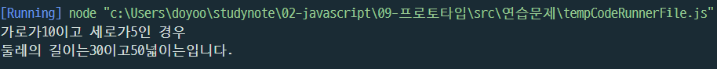

# 김도유 프로토타입 연습문제

> 2022-02-09

## 문제1. 

국어, 영어, 수학 점수를 생성자 파라미터로 입력받아서 합계와 평균을 구하는 클래스 Student를 작성하시오.

이 때 Stuent 클래스는 합계를 리턴하는 메서드인 `sum()`과 평균을 리턴하는 `avg()`를 제공합니다.

작성된 클래스를 활용하여 아래 표에 대한 학생별 합계 점수와 평균점수를 출력하시오.

클래스는 JSON 형식으로 작성되어야 합니다.

| 이름 | 국어 | 영어 | 수학 |
|---|---|---|---|
| 철수 | 92 | 81 | 77 |
| 영희 | 72 | 95 | 98 |
| 민혁 | 80 | 86 | 84 |


#### 출력결과

```
철수의 총점은 249점 이고 평균은 83점 입니다.
영희의 총점은 251점 이고 평균은 83.66666666666667점 입니다.
민혁의 총점은 264점 이고 평균은 88점 입니다.
```


```javascript
function Student(name, kor, eng, mat){
    this._name = name;
    this._kor = kor;
    this._eng = eng;
    this._mat = mat;
}


var studSum = 0;
var studAvg = 0;

Student.prototype = {
    get name() {
        return this._name;
    },

    set name(param) {
        this._name = param;
    },

    get kor() {
        return this._kor;
    },

    set kor(param) {
        this._kor = param;
    },

    get eng() {
        return this._eng;
    },

    set eng(param) {
        this._eng = param;
    },

    get mat() {
        return this._mat;
    },

    set mat(param) {
        this._mat = param;
    },


    sum: function(){
        studSum = this.kor + this.eng + this.mat;
        console.log(stud1.name+"의 총점은"+ studSum +"이고");
    },

    avg: function(){
        studAvg = studSum / 3;
        console.log("평균은"+ studAvg+ "입니다.");
 }      
};


const stud1 = new Student('철수', 92, 81, 77);
const stud2 = new Student('영희', 72, 95, 98);
const stud3 = new Student('민혁', 80, 86, 84);


stud1.sum();
stud1.avg();

stud2.sum();
stud2.avg();

stud3.sum();
stud3.avg();

```


## 문제2.

가로(`width`), 세로(`height`)정보를 getter, setter로 관리하는 Rectangle 클래스를 정의하시오.

이 클래스는 생성자의 파라미터가 없으며 둘레의 길이를 구해 리턴하는 getAround() 메서드와 넓이를 구해 리턴하는 gerArea() 메서드를 제공합니다.

클래스는 JSON 형식으로 작성되어야 합니다.


#### 출력결과


가로가 10이고 세로가 5인 경우

```
둘레의 길이는 30이고 넓이는 50입니다.
```


```javascript

function Rectangle() {
    this._width = null;
    this._height = null;
}
var recArea = 0;
var recAround = 0;


Rectangle.prototype = {
    get width() {
        return this._width;
    },

    set width(param) {
        this._width = param;
    },

    get height() {
        return this._height;
    },

    set height(param) {
        this._height = param;
    },

    getAround: function() {
       recAround =  this.height * 2 + this.width * 2 
      
      
    },

    getArea: function(){
        recArea = this.height * this.width
  
    }

    
};


const rectangel1 = new Rectangle();
rectangel1.width = 10;
rectangel1.height = 5;
rectangel1.getAround();
rectangel1.getArea();


console.log("가로가" + rectangel1.width + "이고 세로가"+ rectangel1.height +"인 경우");
console.log("둘레의 길이는"+recAround +"이고"+ recArea +"넓이는입니다.")
```


