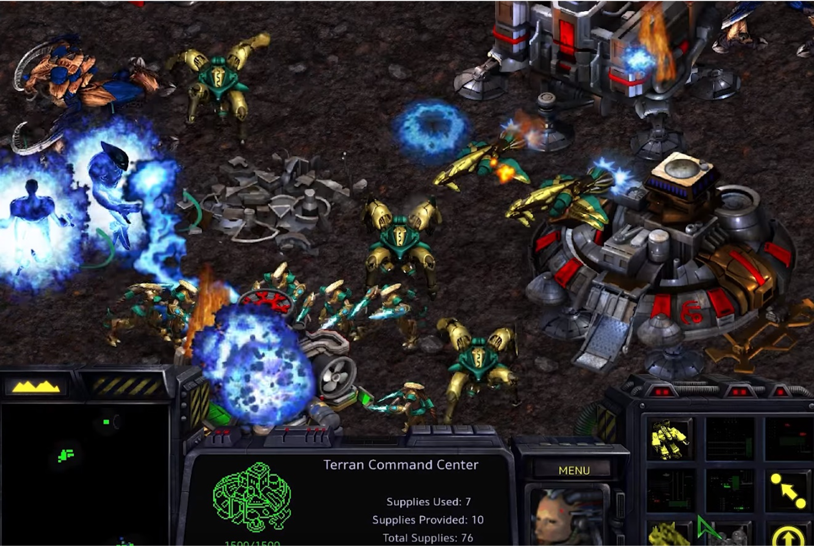

# Prototype

프로그래밍 언어의 종류에는 **객체지향 언어**와 **절차지향 언어**가 있다.

그 중 **객체지향 언어**는 **클래스 기반 객체지향**과 **프로토타입 기반 객체지향**으로 구분된다.

ES5까지의 Javascript는 **프로토타입 기반 객체지향 언어**에 해당한다.

## #01. 객체의 의미

하나의 변수 안에 비슷한 특성을 갖는 변수와 함수가 내장된 형태.

객체 안에 내장된 변수를 **멤버변수** 혹은 **프로퍼티(속성)**라고 한다.

객체 안애 내장된 함수를 **메서드**라고 한다.   
> A(객체).B()<함수> ex) console.log() : console 객체의 log 함수 

## #02. 생성자 함수

### 1) 생성자 함수 정의하기

함수를 `new` 연산자를 사용하여 호출하는 경우 이 함수는 Javascript에 의해 객체를 만들기 위한 함수로 분류된다.

```javascript
function helloworld() {
    ...
}

const h = new helloworld();
```

위와 같이 사용되는 함수를 **생성자(Constructor)**한다.

생성자를 호출하면서 리턴을 받는 변수는 생성자 함수 자체의 리턴 유무에 상관 없이 객체가 된다.

화살표 함수 형식은 생성자로 사용할 수 없다.

### 2) 생성자에 멤버변수 포함시키기

생성자 함수 안에서 `this` 키워드를 통해 정의한 변수는 객체의 멤버변수 역할을 한다.

멤버변수는 객체 내부에 포함되는 형식으로 존재한다.

```javascript
function helloworld() {
    this.x = 5;
    this.y = 10;
}

const h = new helloworld();
const z = h.x + h.y; // 5 + 10
```

같은 생성자를 통해 할당된 객체는 동일한 자료 구조를 갖지만 각각 다른 정보를 저장할 수 있다.

#### 하나의 생성자를 통해 동일한 구조를 갖는 객체를 여러개 생성한 예




#### 생성자
```js
/** 멤버변수를 갖는 생성자를 통해서 객체 만들기*/
function User() {
    // 멤버 변수 정의하기
    // 일반적으로 멤버변수는 일반 변수와 구분하기 위해 언더바로 시작하는 이름을 갖는다.
    this._id = null;
    this._email = null;

}

// 생성자를 통한 객체 만들기
const foo = new User();
foo._id = 'hello';
foo._email = 'hello@javascript.com';
console.log(foo);

const bar = new User();
bar._id = "world";
bar._email = "bar@javascript.com";
console.log(bar);
```
> 실행결과


### 3) 파라미터를 갖는 생성자

객체에 포함되는 멤버변수의 초기값을 설정하기 위한 용도로 생성자 함수는 파라미터를 갖을 수 있다.

생성자 파라미터를 통해 객체 생성시 초기값을 한번에 설정하면, 객체를 생성한 후 개별적으로 파라미터를 지정하는 것 보다 전체 코드가 축약된다.


#### 생성자 파라미터
```js
/** 파라미터를 멤버변수에 복사하는 생성자 */
const User2 =  function(id, eamil){
    this._id = id;
    this._email = eamil;
};

const foo = new User2("hello", "hello@javascript.com");
const bar = new User2("world", "world@javascript.com");

console.log(foo);
console.log(bar);
```


## #02. 메서드

객체에 포함된 함수.

특정한 목적을 위한 함수가 다수 존재할 때, 이 함수들을 그룹화 해 놓은 형태를 객체로 볼 수 있다.

### 1) prototype 속성

Javascript의 모든 객체는 `prototype`이라는 속성을 갖는다.

이 속성을 생성자 함수에 대해 활용하면 생성자 함수에 속한 다른 변수나 함수를 추가할 수 있다. (주로 함수 추가에 사용한다.)

즉, 먼저 정의된 생성자의 기능을 prototype을 통해 확장할 수 있다.

```javascript
생성자함수.prototype.메서드이름 = function(파라미터1, 파라미터2, ... 파라미터n) {
    ...
    return 돌려줄_값;
}

// 메서드 호출하기
const 객체이름 = new 생성자함수();
const k = 객체이름.메서드이름();
```

#### 메서드
```js
/** prototype을 활용한 메서드 정의 */
const User3 = function(id, eamil) {
    this._id = id;
    this._email = eamil;
};

// 로그인을 수행하는 메서드
User3.prototype.login = function() {
    // 객체안에 속한 메서드 안에서는 생성자가 정의한 멤버변수를 마음껏 활용할 수 있다.
    console.log("로그인 되었습니다. -> id=" + this._id + ", email=" + this._email);
};


User3.prototype.logout = function() {
    console.log("로그아웃 되었습니다. -> id=" + this._id + ", email=" + this._email);
};

// 객체 생성하기
const student  = new User3('학생', 'stud@gmail.com');

// 객체 안에 내장된 메서드 호출하기
student.login();
student.logout();

// 객체 생성하기
const teacher = new User3('강사', 'teac@gmail.com');

teacher.login();
teacher.logout();

// 객체가 갖는 멤버변수 수정하기
teacher._id = '선생님';
teacher._email = 'teacher@gmail.com';
teacher.login();
teacher.logout();
```
> 실행결과


## #03. getter, setter

객체지향에서는 객체를 통한 멤버변수의 직접 접근이 멤버변수에 값을 대입하는 과정에서 그 값의 적절성을 판단할 수 없고, 무조건적으로 대입하기 때문에 코드 보안에 부적절하다고 본다.

멤버변수에 값을 간접적으로 대입하는 특수한 형태의 함수를 `setter`, 멤버변수의 값을 리턴받기 위해 사용하는 특수한 형태의 함수를 `getter`라고 한다.

### 1) getter, setter 정의하기

`Object.defineProperty(생성자이름.prototype, 함수이름, {getter,setter 정의})` 형식으로 특정 멤버변수에 대한 `getter`, `setter`를 정의할 수 있다.

`getter`, `setter`는 같은 함수이름을 공유한다.

```javascript
Object.defineProperty(생성자이름.prototype, "함수이름", {
    get: function() {
        ...
        return this.멤버변수
    },
    set: function(파라미터) {
        ...
        this.멤버변수 = 파라미터;
    }
});
```

### 2) getter, setter 활용하기

함수이지만 변수처럼 사용한다.

```javascript
const 객체 = new 생성자이름();

// setter를 호출한다. 대입되는 값은 setter에 전달되는 파라미터.
객체.함수이름 = OOO;

// getter를 호출한다. 멤버변수를 대입하는 것 같지만 실제로는 getter를 호출해서 리턴값을 받는 과정이다.
const 변수 = 객체.함수이름;
```


#### getter, setter
```js
function User4() {
    // 멤버변수 정의하기
    // 일반적으로 멤버변수는 일반 변수와 구분하기 위해 언더바로 시작하는 이름을 갖는다.
    this._id = null;
    this._email = null;
}

Object.defineProperty(User4.prototype, 'id', {
    get: function() {
        console.log("id에 대한 getter 호출됨");
        // 멤버변수의 값을 반환하는 기능 
        // 반환 전에 필요하다면 멤버변수의 값을 가공하여 반환할 수도 있다
        return this._id;

    },
    set: function(param){
        console.log("id에 대한 setter 호출됨");
        // 파라미터의 값을 멤버변수에 복사하는 기능
        // 필요하다면 파라미터값을 가공하여 멤버변수에 복사할 수 있다
        this._id = param;
    }
});


Object.defineProperty(User4.prototype, 'email', {
    get: function(){
        console.log("email에 대한 getter 호출됨");
        return this._email;
    },
    set: function(param){
        console.log("email에 대한 setter 호출됨");  
        this._email = param;  
    }
});

// 객체 생성하기
const friend = new User4();
friend.id = "친구";
console.log(friend.id);

friend.email = "fri@hanmail.net";
console.log(friend.email);
```
> 실행결과


## #04. JSON 구문 형식을 활용한 Prototype 정의

`생성자이름.prototype = { ... }` 형식으로 getter, setter, 메서드 등을 한번에 추가할 수 있다.

이러한 형식으로 생성자, 멤버변수, getter, setter, 메서드 등이 묶여 있는 단위를 **클래스**라 한다.

클래스에 정의된 기능을 하나의 변수에 모두 부여한 형태가 **객체**이다.

### 1) 클래스 완전체 정의하기

#### 생성자 정의

생성자는 익명함수 형식으로 정의할 수 도 있다.

```javascript
function 생성자이름(파라미터1, 파라미터2, ... 파라미터n) {
    this.멤버변수1 = 파라미터1;
    this.멤버변수2 = 파라미터2;
    ...
    this.멤버변수n = 파라미터n;
}
```

### JSON을 활용하여 getter, setter와 메서드 추가하기

```javascript
생성자이름.prototype = {
    // getter와 setter의 이름은 동일해야 하고, getter/setter 쌍이 멤버변수 수 만큼 정의된다.
    get getter이름() {
        return this.멤버변수;
    },

    set setter이름(파라미터) {
        this.멤버변수 = 파라미터;
    },

    메서드1이름 : function() {
        ...
    },

    메서드n이름 : function() {
        ...
    }
};
```


#### json활용
```js
/** JSON을 활용한 클래스 정의하기 */
// 생성자와 멤버변수 정의
function Member(username, password) {
    this._username = username;
    this._password = password;
}

// getter, setter, 메서드 일괄 정의

Member.prototype = {
    // 멤버변수 _username에 대한 getter, setter
    get username(){
        return this._username;
    },

    set username(param){
        this._username = param;
    },

    // 멤버변수 _password에 대한 getter, setter
    get password(){
        return this._password;
    },

    set password(param) {
        this._password = param;
    },

    // 로그인을 수행하는 메서드
    login : function() {
        console.log("[Member] 로그인되었습니다. username=" + this.username + ", password=" + this.password);
    },

    logout : function() {
        // 로그아웃이므로 아이디와 비밀번호를 비워준다.
        this.username = "";
        this.password = "";
        console.log("[Member] 로그아웃되었습니다. username=" + this.username + ", password=" + this.password);
    }
 };


 console.log(Member.prototype);

 // 생성자를 통한 객체 생성
 const member1 = new Member('hello', '1234');


 // getter를 통한 멤버변수 반환받기
 console.log(member1.username);
 console.log(member1.password);

 // 메서드 호출
 member1.login();
 member1.logout();

 // setter를 통한 멤버변수 변경
 member1.username = "world";
 member1.password = "1234";

 // 메서드 호출 
 member1.login();
 member1.logout();

```
> 실행결과


### 정의된 클래스를 통해 객체 생성하기

```javascript
const 객체 = new 생성자이름();
```

좀 더 정확하게 구분하자면

`const 객체`로 선언된 객체는 **객체 참조 변수**라고 부르고, `new 생성자이름()` 부분에서 생성된 object를 인스턴스 라고 한다.


# 프로토타입 연습문제

## 문제1. 

국어, 영어, 수학 점수를 생성자 파라미터로 입력받아서 합계와 평균을 구하는 클래스 Student를 작성하시오.

이 때 Stuent 클래스는 합계를 리턴하는 메서드인 `sum()`과 평균을 리턴하는 `avg()`를 제공합니다.

작성된 클래스를 활용하여 아래 표에 대한 학생별 합계 점수와 평균점수를 출력하시오.

클래스는 JSON 형식으로 작성되어야 합니다.

| 이름 | 국어 | 영어 | 수학 |
|---|---|---|---|
| 철수 | 92 | 81 | 77 |
| 영희 | 72 | 95 | 98 |
| 민혁 | 80 | 86 | 84 |


#### 출력결과

```
철수의 총점은 249점 이고 평균은 83점 입니다.
영희의 총점은 251점 이고 평균은 83.66666666666667점 입니다.
민혁의 총점은 264점 이고 평균은 88점 입니다.
```

```js

function Student(name, kor, eng, mat){
    this._name = name;
    this._kor = kor;
    this._eng = eng;
    this._mat = mat;
}


var studSum = 0;
var studAvg = 0;

Student.prototype = {
    get name() {
        return this._name;
    },

    set name(param) {
        this._name = param;
    },

    get kor() {
        return this._kor;
    },

    set kor(param) {
        this._kor = param;
    },

    get eng() {
        return this._eng;
    },

    set eng(param) {
        this._eng = param;
    },

    get mat() {
        return this._mat;
    },

    set mat(param) {
        this._mat = param;
    },


    sum: function(){
        studSum = this.kor + this.eng + this.mat;
        console.log(stud1.name+"의 총점은"+ studSum +"이고");
    },

    avg: function(){
        studAvg = studSum / 3;
        console.log("평균은"+ studAvg+ "입니다.");
 }      
};


const stud1 = new Student('철수', 92, 81, 77);
const stud2 = new Student('영희', 72, 95, 98);
const stud3 = new Student('민혁', 80, 86, 84);


stud1.sum();
stud1.avg();

stud2.sum();
stud2.avg();

stud3.sum();
stud3.avg();

// 강사님 풀이

function Student(kor, eng, math) {
    this._kor = kor;
    this._eng = eng;
    this._math = math;

}

Student.prototype = {
    sum : function() {
        return this._kor +  this._eng  + this._math;
    },

    avg : function() {
        return this.sum() / 3;
    }
};


console.group("반복문 안에서 객체 활용");
const grade = [
    ["철수", 92, 81, 77],
    ["영희", 72, 95, 98],
    ["민혁", 80, 86, 84]
];

for (const item of grade) {
    const s = new Student(item[1], item[2], item[3]);
    console.log("%s의 총점은 %d점 이고 평균은 %d점 입니다.", item[0], s.sum(), s.avg());
}
console.groupEnd();

console.group("하드코딩");
const s1 = new Student(92, 81, 77);
const s2 = new Student(72, 95, 98);
const s3 = new Student(80, 86, 84);
console.log("철수의 총점은 %d점 이고 평균은 %d점 입니다.", s1.sum(), s1.avg());
console.log("영희의 총점은 %d점 이고 평균은 %d점 입니다.", s2.sum(), s2.avg());
console.log("민혁의 총점은 %d점 이고 평균은 %d점 입니다.", s3.sum(), s3.avg());
```
> 실행결과


## 문제2.

가로(`width`), 세로(`height`)정보를 getter, setter로 관리하는 Rectangle 클래스를 정의하시오.

이 클래스는 생성자의 파라미터가 없으며 둘레의 길이를 구해 리턴하는 getAround() 메서드와 넓이를 구해 리턴하는 gerArea() 메서드를 제공합니다.

클래스는 JSON 형식으로 작성되어야 합니다.


#### 출력결과

가로가 10이고 세로가 5인 경우

```
둘레의 길이는 30이고 넓이는 50입니다.
```

```js
function Rectangle() {
    this._width = null;
    this._height = null;
}
var recArea = 0;
var recAround = 0;


Rectangle.prototype = {
    get width() {
        return this._width;
    },

    set width(param) {
        this._width = param;
    },

    get height() {
        return this._height;
    },

    set height(param) {
        this._height = param;
    },

    getAround: function() {
       recAround =  this.height * 2 + this.width * 2 
      
      
    },

    getArea: function(){
        recArea = this.height * this.width
  
    }

    
};


const rectangel1 = new Rectangle();
rectangel1.width = 10;
rectangel1.height = 5;
rectangel1.getAround();
rectangel1.getArea();


console.log("가로가" + rectangel1.width + "이고 세로가"+ rectangel1.height +"인 경우");
console.log("둘레의 길이는"+recAround +"이고"+ recArea +"넓이는입니다.")

// 강사님 풀이

function  Rectangle() {
    this._width = null;
    this._height = null;
}

Rectangle.prototype = {
    get width() {
        return this._width;
    },
    set width(param){
        this._width = param;
    },
    get height() {
        return this._height;
    },
    set height(param){
        this._height = param;
    },
    getAround : function () {
        return this.width * 2 +  this.height * 2;
    },
    getArea : function () {
        return this.width * this.height;
    },
};


const rect  = new Rectangle();
rect.width = 10;
rect.height = 5;

console.log('둘레의 길이는 %d이고 넓이는 %d입니다.', rect.getAround(), rect.getArea());
```

> 실행결과
