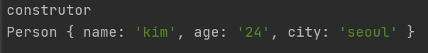
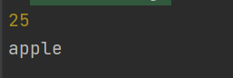
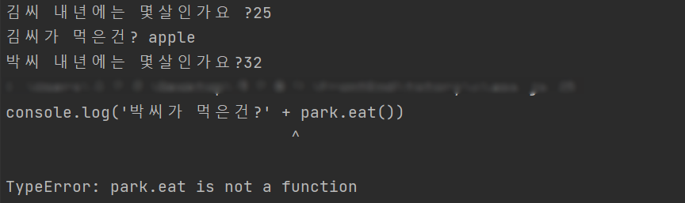
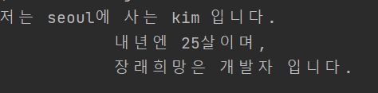

# 클래스와 객체
연관 있는 데이터들을 한군데 모아 놓는 컨테이너 같은 역할을 한다.

```javascript
// 클래스 선언
class person {
    name; // 프로퍼티(혹은 속성(filed))
    age; // 프로퍼티(혹은 속성(filed))
    speak(); // 메소드
}

// 객체 생성
// 객체를 생성할 때는 클래스앞에 new라는 키워드를 사용한다.
const mike = new Person('mike', 20);
console.log(mike.name);
console.log(mike.age);
```
자바스크립트에서 클래스의 ES6에서 소개되었다.
그전에는 클래스를 정의하지 않고 객체를 정의해서 사용하는 방법이 있었고
객체를 만들때 함수를 이용해서 템플릿(클래스 같은 역할)을 만드는 방법이 있었다.

### 클래스
- template, 즉 틀 같은 역할을 한다.
- 한번만 선언한다.
- 클래스 안에는 데이터가 없다.
- 메모리에 올라가지 않는다.

### 객체
- instanc of a class, 클래스의 인스턴스이다.
- 1개의 클래스로 여러개의 객체를 만들수 있다.
- 객체 안에는 데이터가 있다.
- 메모리에 올라간다.

> 클래스는 달고나 틀
> 객체는 클래스(달고나 틀)로 찍어낸 달고나
> 즉 클래스를 정의해서 다양한 객체들을 만든다.

## 1. 생성자 (Constructor)
생성자는 객체를 생성할 때 인자를 프로퍼티에 전달하여 생성한다.

즉, 객체를 만들때 필요한 데이터를 전달하여 생성한다.
```javascript
class Person {
  // constructor(생성자)
  constructor(name, age) { // 인자를 받아 할당한다.
    // fields
    this.name = name; // this는 객체(변수명)를 지칭한다.
    this.age = age; // this.name, this.age는 클래스의 필드(프로퍼티)이다.
  }

  // methods
  speak() {
    console.log(`${this.name}: hello!`);
  }
}
```
인자를 전달할 필요가 없이 프로퍼티를 선언하고 할당 할 수 있다.
```javascript
class Person {
    name = 'mike';
	age = 21;
}
```

## 2. Getter & Setter
getter는 객체의 특정 프로퍼티 값을 가져오도록 하기 위한 메소드이다.

setter는 객체의 특정 프로퍼티 값을 설정하기 위한 메소드이다.

둘 다 프로퍼티 처럼 사용한다.


### getter
```javascript
get probName() { // 인자를 받지 않는다.
  return this._probName;
}
```
동적으로 계산이 필요한 프로퍼티 값을 가져와야 할 때 사용한다.

`obj.propName` 을 사용해 프로퍼티를 읽으려고 할 때 실행이 된다.

`obj.propName` 을 사용할 때 `get propName() {}` 이 호출되어 계산이 된 이후에 리턴받은값이 `obj.propName` 의 값이 되어진다.

#### getter의 기능

1. 계산 미루기
etter가 호출되기 전까진 계산을 하지 않고 대기한다. getter의 값계산은 실제 값이 필요할 때 이루어 지게 된다.

1. 캐싱처리
getter는 프로퍼티 값을 나중에 접근하기 위해 값을 캐싱한다. 값은 getter가 호출될 때 계산되며, 캐싱하게 된다. (이후의 호출은 다시 계산하지 않고 이 캐시값을 반환한다.)


### setter
```javascript 
set probName(value) { // 인자를 받아서 할당한다.
    this._probName = value < 0 ? 0 : value; 
  }
```
프로터티 값이 변경되어 질 때마다 함수를 실행하는데 사용이 된다.

`obj.propName = value` 으로 프로퍼티에 값을 할당하려 할 때 실행됩니다.

`obj.propName = value` 을 사용할때 `set propName() {}` 이 호출되어 `obj.propName` 에 값이 저장된다.

setter는 주로 잘못된 값을 할당 할 때 예외처리를 하기 위해 사용한다.

예를들어 Person클래스에 age프로퍼티가 있는데 age에 음수값을 할당하면 말이 안되기 때문에 음수를 넣으면 에러를 던저주거나 0을 저장한다.


예제
```javascript
class User {
  constructor(firstName, lastNamem, age) {
    this.firstName = firstNamem;
    this.lastName = lastNamem;
    this.age = age;
  }

  get age() {
    return this._age;
  }

  set age(value) {
    // 잘못된 값 할당 적극적으로 막기 (에러 던저주기)
    // if (value < 0) {
    //   throw Error(`age can not be negative`);
    // }
    
    // 잘못된 값 할당 젠틀하게 막기 (0으로 저장하기)
    this._age = value < 0 ? 0 : value; 
  }
}
```
이 때 getter와 setter 안에서 사용되는 프로퍼티 이름앞에 관습적으로 언더바를 작성해준다.

`this.age` 를 호출하면 `get age() {}` 가 호출되어 지는데 안에서 또 this.age 를 사용하면 다시 `get age() {}` 가 호출되어 무한루프에 빠지기 때문이다. 이 때 `get age() {}` 안에서는 `this._age` 같은 형태로 작성하면 무한루프를 방지할 수 있다.

마찬가지로 `this.age = value` 와 같이 값을 할당할 때 `set age() {}` 가 호출되어 지는데 안에서 또 다시 `this.age = value` 와 같이 사용하면 또다시 `set age() {}` 가 호출되어 무한루프에 빠지기 때문이다. 이 때 `set age() {}` 안에서는 `this._age = value` 같은 형태로 작성하면 무한루프를 방지할 수 있다.


## 3. Public & Private (공개 프로퍼티와 비공개 프로퍼티)
최신에 도입되었기 때문에 아직 브라우저에 지원되지 않는 경우가 있다.


### Public Property (공개 프로퍼티)
클래스에서 일반적인 방식으로 프로퍼티를 선언하고 할당하면 Public Property(공개 프로퍼티)이다

퍼블릭 프로퍼티는 외부에서 프로퍼티에 접근하여 값을 사용하거나 수정이 가능하다.


### Private Property (비공개 프로퍼티)
클래스에서 프로퍼티 앞에 `#` 키워드를 작성하여 선언하면 Private Property (비공개 프로퍼티)가 된다.

프라이빗 프로퍼티는 오직 클래스 안에서만 사용, 변경이 가능하다. 외부에서는 접근이 불가능하다.

```javascript
class Experiment {
  publicField = 2; // 퍼블릭 프로퍼티, 위부에서 프로퍼티에 접근하여 값을 사용하거나 수정이가능하다.
  #privateField = 0; // 프라이빗 프로퍼티, 오직 클래스안에서만 사용, 변경이 가능하다. 외부에서 사용불가.
}
const experiment = new Experiment();
console.log(experiment.publicField);
console.log(experiment.privateField); // undefined
```

## 4. Static property and methods
클래스를 선언할때 프로퍼티와 메소드 앞에 `static` 키워드를 작성하여 선언한다.

static property와 static method 는 객체로 접근하여 사용할 수 없다. ( `obj.propery` , `obj.method` )

클래스(클래스명)로만 접근하여 사용할 수 있다. ( Class.propery , Class.method )

어떤 객체든 상관없이 공통된 모든 객체에 같은 프로퍼티, 메서드가 필요할 때 사용하면 메모리를 줄일수 있는 이점이 있다.


예제
```javascript
class Article {
  static publisher = 'alice'; // Static property
  constructor(articleNumber) {
    this.articleNumber = articleNumber; // 일반적인 property
  }

  static printPublisher() { // Static methods
    console.log(Article.publisher);
  }
}

const article1 = new Article(1);
// bad
console.log(article1.publisher); // undefined
article1.printPublisher(); // 에러

// good
console.log(Article.publisher);
Article.printPublisher();
```

## 5. 클래스 상속 (Inheritance)

### 상속
클래스에서 다른 클래스로 상속하면서 클래스의 기능을 확장해 나갈수 있다.

상속받을 클래스를 선언할 때 `extend 부모클래스` 키워들 사용하여 선언한다.
```javascript
class 자식클래스 extends 부모클래스 {}
```
예제
```javascript
class Shape {
  constructor(width, height, color) {
    this.width = width;
    this.height = height;
    this.color = color;
  }

  draw() {
    console.log(`drawing ${this.color} color of`);
  }

  getArea() {
    return this.width * this.height;
  }
}
```
Shape 라는 부모 클래스를 선언한다.

```javascript
class Rectangle extends Shape {} // Shape의 모든 정의들이 Rectangle클래스에 포함이 된다.
class Triangle extends Shape {
  getArea() {
    // 메서드 오버라이딩 - Shape에 정의되었던 메서드를 덮어씌워서 재정의한다.. 프로퍼티도 오버라이딩이 가능하다.
    return (this.width * this.height) / 2;
  }

  draw() {
    super.draw(); // super는 부모클래스, 즉 Shape클래스를 지칭한다.
    console.log(`🔺`);
  }
}

const rectangle = new Rectangle(20, 20, 'red');
rectangle.draw();
console.log(rectangle.getArea());

const triangle = new Triangle(20, 20, 'blue');
triangle.draw();
console.log(triangle.getArea());
```
Rectangle클래스와 , Triangle클래스가 Shape클래스를 상속받는다.

상속받을때 프로퍼티와 메소드는 오버라이딩이 가능하다.

`spuer.메서드`, `spuer.프로퍼티` 로 부모클래스의 메서드와 프로퍼티에 접근이 가능하다.

### 오버라이딩

자식클래스가 부모클래스를 상속받으면서 선언될 때

부모클래스의 프로퍼티와 메서드를 다시 새롭게 정의하여 덮어 씌운다.

## 6. Class checking: instanceOf
```javascript
객체 instancof 클래스
```
객체가 클래스의 속해있는지 여부를 확인하는 용도이다.

결과는 bool이다.

```javascript
console.log(rectangle instanceof Rectangle); // true
console.log(triangle instanceof Rectangle); // false
console.log(triangle instanceof Triangle); // true
console.log(triangle instanceof Shape); // true
console.log(triangle instanceof Object); // true, 
// 모든 객체는 자바스크립트의 Object클래스를 상속한다. 따라서 Object에 정의되어있는 메서드를 오버라이딩 할수도 있다.
```

## 참고
MDN, 자바스크립트에 내장된 객체(https://developer.mozilla.org/en-US/docs/Web/JavaScript/Reference)

자바스크립트 내부에 포함되어있는 객체들이 어떤게 있는지 카테고리화 되어 있어 참고하기 좋다.


> 출처 : https://velog.io/@younoah/JS-%EC%9E%90%EB%B0%94%EC%8A%A4%ED%81%AC%EB%A6%BD%ED%8A%B8-%ED%81%B4%EB%9E%98%EC%8A%A4%EC%99%80-%EA%B0%9D%EC%B2%B4-%EC%B4%9D%EC%A0%95%EB%A6%AC


### Class 초기값 설정해주기
Constructor(생성자)를 이용하면 class 객체의 초기 값을 설정해 줄 수 있다.

class 내부에서 Constructor는 한 개만 존재할 수 있으며, 2번 이상 사용 시 Syntax Error가 발생할 수 있다.

 

Constructor를 이용하여 Person 클래스에 초기 값을 설정해보도록 하자. 

```javascript
class Person { 
    constructor (name,age, city) { 
        console.log('construtor'); 
        this.name = name; 
        this.age = age; 
        this.city = city; 
    } 
} 
let kim = new Person('kim','24','seoul'); 
console.log(kim);
```

이처럼 Constructor는 새로운 클래스를 생성할 때 가장 처음 실행되면서 초기값을 설정해준다. 

### Class  메서드 사용하기
class에서 설정한 초기값을 접근해 특정 기능을 하는 메서드를 만드는 것도 가능하다.

간단한 메서드를 하나 만들어보자.

 

class안에 function 형식으로 만들어준 뒤 해당 메서드를 호출하기만 하면 된다.

너무 당연하지만 내년에 해당 사람이 한 살 더 먹는다는 메서드를 class안에 정의한 뒤 호출해봤다.
```javascript
class Person { 
    constructor (name,age, city) { 
        this.name = name; 
        this.age = age; 
        this.city = city; 
    } 
        //메서드생성 
    nextYearAge() { 
        return Number(this.age) + 1; 
    } 
}

```


class는 javascript 상 객체의 형태이므로 생성된 class 객체에
class 밖에서 새로운 메서드를 넣는 것도 가능하다.
다음 예시를 보자.

```javascript
class Person { 
    constructor (name,age, city) { 
        this.name = name; 
        this.age = age; 
        this.city = city; 
        } 
        //메서드생성 
        nextYearAge() { 
            return Number(this.age) + 1; 
        } 
    } 
    let kim = new Person('kim','24','seoul');

    kim.eat = function () { 
        return 'apple' 
    } 
    
    console.log(kim.nextYearAge()); 
    console.log(kim.eat());
```


class밖에서 추가한 eat이라는 메서드도 정확히 작동한다.

하지만, 이렇게 밖에서 추가한 class는 추후 새로운 new Person class로 새로운 객체를 만들었을 때는

호출하여 사용할 수 없다

```javascript
class Person { 
    constructor (name,age, city) { 
        this.name = name; 
        this.age = age; 
        this.city = city; 
    } 
    //메서드생성 
    nextYearAge() { 
        return Number(this.age) + 1; 
    } 
} 
let kim = new Person('kim','24','seoul'); 

kim.eat = function () { 
    return 'apple' 
} 

console.log('김씨 내년에는 몇살인가요 ?' + kim.nextYearAge()); 
console.log('김씨가 먹은건? ' + kim.eat()); 

let park = new Person('park', '31', 'busan'); 

console.log('박씨 내년에는 몇살인가요?' + park.nextYearAge()); 
console.log('박씨가 먹은건?' + park.eat())

```

park class에서 eat 호출 시 실행되지 않음

### 상속(extends)
class에서 상속 개념을 이용할 수 있습니다.

css를 이용한 분들이라면 하나의 속성이 하위 속성에도 같이 적용되는 것처럼

class에서도 상속을 이용하면 기존의 class의 값을 모두 접근하여 사용할 수 있다.

상속은 extends를 써서 이용할 수 있다.

 

다음 예제를 통해서 introducePerson클래스에서 Person을 상속받았기 때문에

this.city와 this.name을 모두 사용할 수 있는 것을 확인할 수 있다.

```javascript
class Person { 
    constructor (name,age, city) { 
        this.name = name; 
        this.age = age; 
        this.city = city; 
    } 
    //메서드생성 
    nextYearAge() { 
        return Number(this.age) + 1; 
    } 
} 

class introducePerson extends Person {
    introduce () { 
        return `저는 ${this.city}에 사는 ${this.name} 입니다.` 
    } 
} 

let kim = new introducePerson('kim','24','seoul'); 

console.log(kim.introduce())
```


### super 사용하기
 

introducePerson 하위 클래스에서 기존 class의 값을 가져다 쓰는 건 좋았지만,

추가적으로 introducePerson이라는 하위 클래스에서만 사용하고 싶은 값이 있을 수도 있다.

 

이때 이용하는 것은 super라는 키워드이며

이는 객체의 부모가 가지고 있는 메서드를 호출할 수 있다.

 

 

자식 쪽의 추가적으로 사용할  초기값이 필요할 경우 constructor에 super로 부모 초기값을 세팅한 뒤

자식 class에서만 사용할 초기값을 따로 지정하는 것도 가능하며

super 기능을 이용해서 자식 class에서 부모 메서드를 호출할 수도 있다.

```javascript
class Person { 
    constructor (name,age, city) { 
        this.name = name; 
        this.age = age; 
        this.city = city; 
    } 
    //메서드생성 
    nextYearAge() { 
        return Number(this.age) + 1; 
    } 
} 

class introducePerson extends Person { 
    constructor(name, age, city, futureHope) { 
        super(name, age, city); 
        this.futureHope = futureHope
        } 
        introduce () { 
            return `저는 ${this.city}에 사는 ${this.name} 입니다. 
            내년엔 ${super.nextYearAge()}살이며, 
            장래희망은 ${this.futureHope} 입니다.` 
    } 
} 

let kim = new introducePerson('kim','24','seoul', '개발자'); 

console.log(kim.introduce())
```

class를 이용할 경우 규칙성을 갖는 객체를 일관성 있게 만드는 게 가능하며,

상속을 통해서 기능 확장이 용이하다는 것 알 수 있었다.

> Reference (opentutorials.org/module/4047/24614developer.mozilla.org/ko/docs/Web/JavaScript/Reference/Classes)


> 출처: https://ordinary-code.tistory.com/22 [김평범's OrdinaryCode]