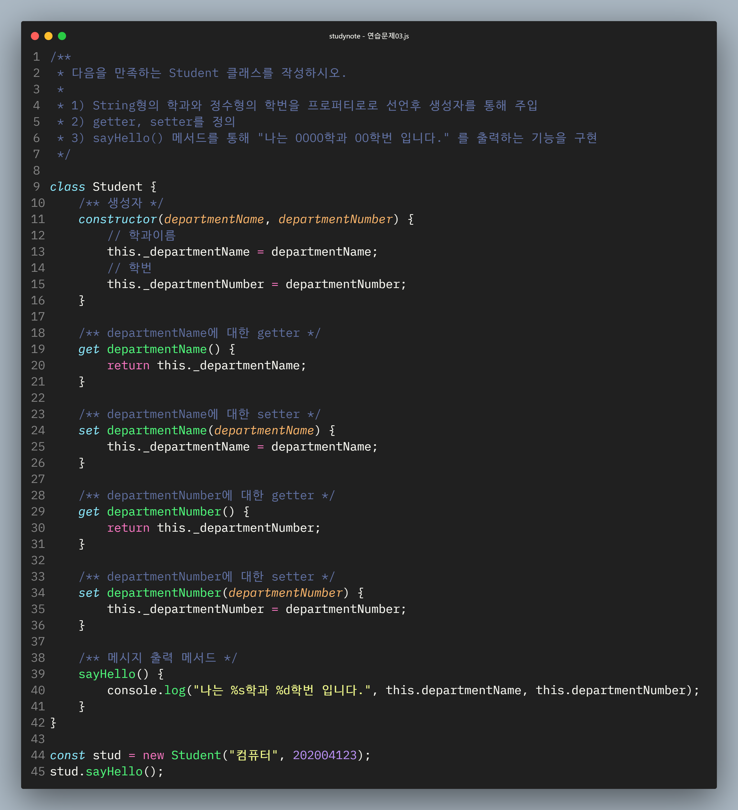
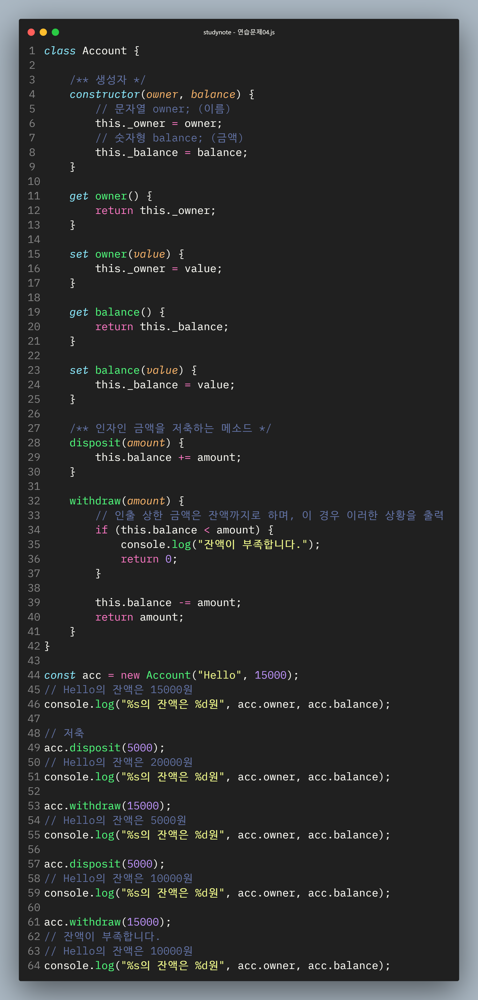

# 김도유 Class 기반 객체지향 연습문제2

> 2022-02-10


# 문제 3.  

다음을 만족하는 Student 클래스를 작성하시오.

1. String형의 학과와 정수형의 학번을 프로퍼티로로 선언후 생성자를 통해 주입
1. getter, setter를 정의
1. sayHello() 메서드를 통해 "나는 OOOO학과 OO학번 입니다." 를 출력하는 기능을 구현


```javascript
class Student {
    constructor() {
        this._major =  null;
        this._num = null;

    }

    set major(value) {
        return this._major = value;
    }

    get major() {
        return this._major;
    }

    set num(value) {
        return this._num = value;
    }

    get num() {
        return this._num;
    }

    sayHello() {
         console.log("나는 %s학과 %d학번이다.", this.major, this.num);
    }
}

const stud1 = new Student();
stud1.major = "경영";
stud1.num = "12356";
stud1.sayHello();

```

출력결과



> 수정 코드

``` javascript
class Student {
    constructor(major, num) {
        this._major =  major;
        this._num = num;

    }

    set major(major) {
         this._major = major;
    }

    get major() {
        return this._major;
    }

    set num(num) {
         this._num = num;
    }

    get num() {
        return this._num;
    }

    sayHello(major, num) {
         console.log("나는 %s학과 %d학번이다.", this.major, this.num);
    }
}

const stud1 = new Student("경영", 123456);
stud1.sayHello();
```


# 문제 4

 다음을 만족하는 클래스 Account를 작성하시오.

1. 다음의 2 개의 필드를 선언
    문자열 owner; (이름)
    숫자형 balance; (금액)
1. 위 모든 필드에 대한 getter와 setter의 구현
1. 위 모든 필드를 사용하는 가능한 모든 생성자의 구현
1. 메소드 deposit()의 헤드는 다음과 같으며 인자인 금액을 저축하는 메소드
    deposit(amount)
1. 메소드 withdraw()의 헤드는 다음과 같으며 인자인 금액을 인출(리턴)하는 메소드
    withdraw(long amount)
    인출 상한 금액은 잔액까지로 하며, 이 경우 이러한 상황을 출력

 ```javascript
var amount = 0;
var long_amount = 0; 


class Account {
    constructor() {
        this._owner = null;
        this._balance = null;
    }

    set owner(value) {
         this._owner = value;
    }

    get owner() {
        return this._owner;
    }

    set balance(value) {
         this._balance = value;
    }

    get balance() {
        return this._balance;
    }


    deposit() {
        amount += this._balance ;
        //console.log(amount);
        return console.log("%s님의 계좌에 %d원이 입금되었습니다.", this._owner, amount);
    }

    withdraw() {
        
        if (amount < this._balance) {
            console.log("잔액이 부족합니다.");
            return;
         } else {
            long_amount -= amount - this._balance;
         }

    }

}


const dy = new Account();
dy.balance = 50000;
dy.owner = "김도유";
dy.deposit();
dy.balance = 70000;
dy.withdraw();
```
출력결과



> 수정 코드

```javascript
class Account {
    constructor(owner, balance) {
        this._owner = owner;
        this._balance = balance;
    }

    set owner(value) {
         this._owner = value;
    }

    get owner() {
        return this._owner;
    }

    set balance(value) {
         this._balance = value;
    }

    get balance() {
        return this._balance;
    }


    deposit(amount) {
        this._balance += amount;
    }

    withdraw(amount) {
        
        if (this.balance < amount) {
            console.log("잔액이 부족합니다.");
            return 0;
         } 

         this.balance -= amount;
         return amount;
    }

}


const dy = new Account("김도유", 50000);
console.log("%s의 잔액은 %d원", dy.owner, dy.balance);

// 저축 
dy.deposit(20000);
console.log("%s의 잔액은 %d원", dy.owner, dy.balance);

// 인출
dy.withdraw(60000);
console.log("%s의 잔액은 %d원", dy.owner, dy.balance);

// 저축 
dy.deposit(20000);
console.log("%s의 잔액은 %d원", dy.owner, dy.balance);


// 인출
dy.withdraw(250000);
console.log("%s의 잔액은 %d원", dy.owner, dy.balance);

```