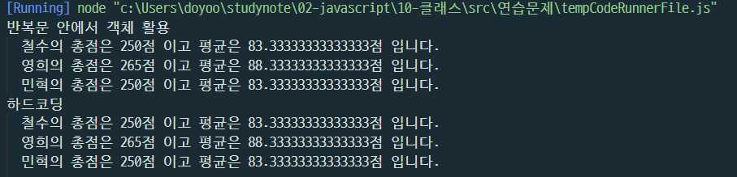
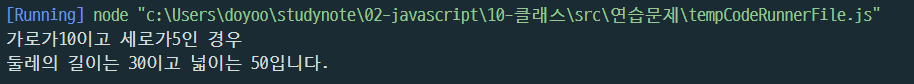

# 김도유 Class 기반 객체지향 연습문제

> 2022-02-09

## 문제1.

앞 단원에서 수행한 연습문제 1,2번을 Class 기반의 객체지행으로 재구성하시오.


```javascript
class Student {
    constructor(kor, eng, math) {
        this._kor = kor;
        this._eng = eng;
        this._math = math;
    }


    sum() {
        return this._kor + this._eng + this._math;
    }

    avg() {
        return this.sum() / 3;
    }


};

console.group("반복문 안에서 객체 활용");
const grade = [
    ["철수", 92, 81, 77],
    ["영희", 72, 95, 98],
    ["민혁", 80, 86, 84]
];

for (const item of grade) {
    const s = new Student(item[1], item[2], item[3]);
    console.log("%s의 총점은 %d점 이고 평균은 %d점 입니다.", item[0], s.sum(), s.avg());
}
console.groupEnd();


console.group("하드코딩");
const s1 = new Student(92, 81, 77);
const s2 = new Student(72, 95, 98);
const s3 = new Student(80, 86, 84);
console.log("철수의 총점은 %d점 이고 평균은 %d점 입니다.", s1.sum(), s1.avg());
console.log("영희의 총점은 %d점 이고 평균은 %d점 입니다.", s2.sum(), s2.avg());
console.log("민혁의 총점은 %d점 이고 평균은 %d점 입니다.", s3.sum(), s3.avg());
```





```javascript

class Rectangle {
    constructor() {
        this._width = null;
        this._height = null;
    }

    set width(value) {
        if (!value) {
            console.log("값을 입력하세요.");
            return;
        }

    this._width = value;
    
    }

    get width() {
        return this._width;
    }

    set height(value) {
        if (!value) {
            console.log("값을 입력하세요.");
            return;
        }

        this._height = value;
    }

    get height() {
        return this._height;
    }

    getAround() {
        return this._width * 2 + this._height * 2;
    }
    
    getArea() {
        return this._width * this._height;
    }

}


const rect = new Rectangle();
rect.width = 10;
rect.height = 5;

console.log("가로가" + rect.width + "이고 세로가"+ rect.height +"인 경우");
console.log('둘레의 길이는 %d이고 넓이는 %d입니다.', rect.getAround(), rect.getArea());
```
