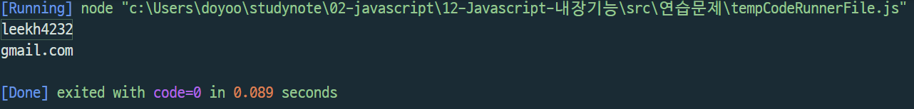
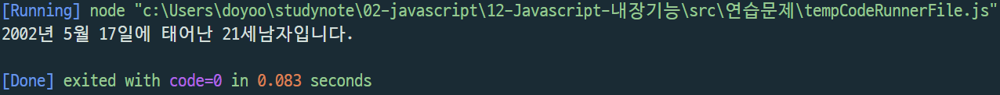
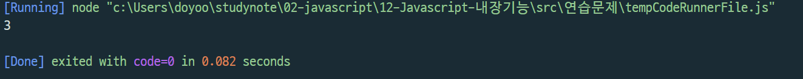
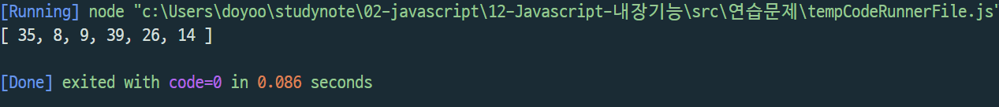
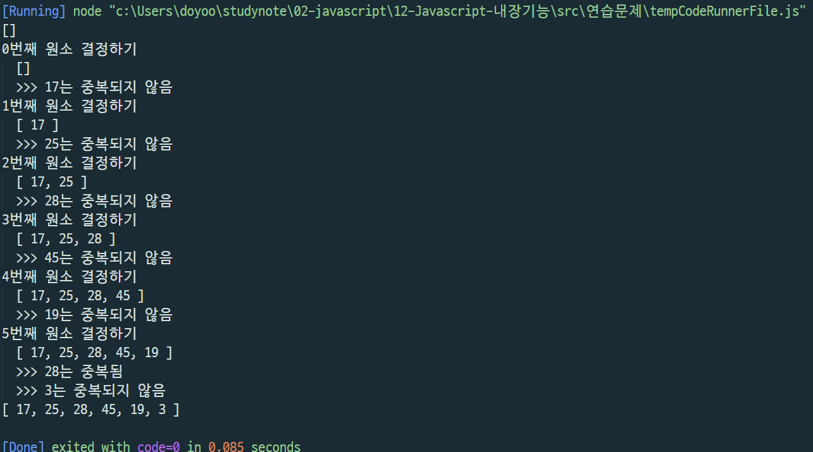
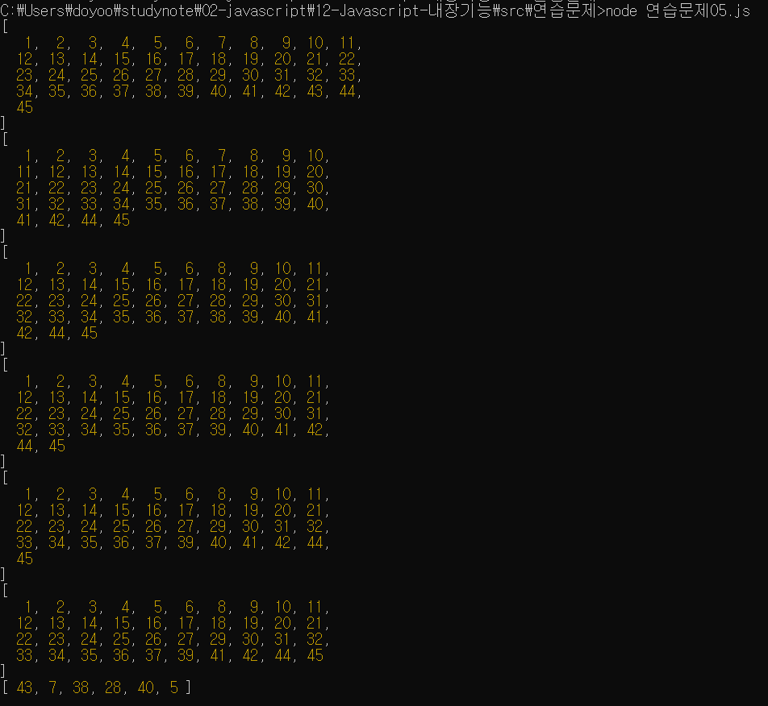
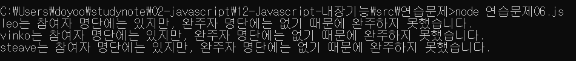

# 내장객체 연습문제 김도유

> 2022-02-15

## 문제1.

자신의 이메일 주소를 `email` 이라는 변수에 저장하고 `@`를 기준으로 아이디와 도메인 부분을 분리하여 출력하시오.


### 출력결과

이메일이 leekh4232@gmail.com 인 경우

```
leekh4232
gmail.com
```

```javascript
const email = "leekh4232@gmail.com";
const arr = email.split("@");
for (let i =0; i< arr.length; i++) {
    console.log(arr[i]);
}
```



## 문제2.

임의의 주민번호를 다음과 같이 `*`을 포함하여 변수에 저장하시오.

```
ssn = '020517-3******'
```

또한 현재 년도를 now_year라는 변수로 저장하시오.

이 값을 사용하여 생년월일, 나이, 성별을 출력하시오.

#### 출력결과

```
2002년 5월 17일에 태어난 20세 남자 입니다.
```

```javascript
ssn = '020517-3******';
now_year = new Date().getFullYear();
var genType = ssn.substring(7,8);
var age = 0;
var gender_str = "";
var birth_year = parseInt(ssn.substring(0,2));
var birth_month = parseInt(ssn.substring(2,4));
var birth_day = parseInt(ssn.substring(4,6));

if(genType <= 2) {
    age = now_year - (1900 + parseInt(ssn.substring(0,2))) +1 ; // 1,2 일 경우
} else {
    age = now_year - (2000 + parseInt(ssn.substring(0,2))) +1 ; //그 외의 경우
}


if (genType > 2) {
    birth_year = birth_year + 2000;
} else {
    birth_year = birth_year + 1900;
}


if (genType == 1 || 3){
    gender_str = "남자"
} else {
    gender_str ="여자"
}


console.log(birth_year+"년 "+  birth_month +"월 "+  birth_day+"일에 태어난 " +age+"세"+  gender_str+"입니다.");
```


## 문제3.

아래의 문장에서 "수업시간"이라는 단어가 총 몇 번 등장하는지 카운트 하는 프로그램을 구현하시오.

```
str = "수업시간에 배운것은 수업시간에 다 이해하고 넘어가야지 수업시간에 놓치면 따라오기 힘들다."
```

#### 출력결과

```
3
```

```javascript
str = "수업시간에 배운것은 수업시간에 다 이해하고 넘어가야지 수업시간에 놓치면 따라오기 힘들다.";
       

var count = 0;

var searchWord = '수업시간';

var x = str.indexOf(searchWord);
//console.log(x);

while (x != -1) {
    //console.log(x);
    count ++;
    //console.log(count);
    x = str.indexOf(searchWord, x + 1);
    //console.log(x);
}

console.log(count);
```



## 문제4. (로또번호 생성기 1)

주어진 범위 안에서 랜덤한 숫자를 추출하는 함수는 아래와 같다.

```javascript
function random(n1, n2) {
    return parseInt(Math.random() * (n2 - n1 + 1)) + n1;
}
```

0개의 원소를 갖는 배열 `lotto`를 생성하고 6회의 반복을 수행하는 for문을 사용하여 배열의 각 원소를 `1~45` 사이의 범위를 갖는 임의의 숫자로 채워 넣으시오.

반복이 종료되었을 때 `lotto`의 원소는 6개의 숫자가 채워져 있어야 하고 각 숫자는 중복되지 않아야 합니다.

중복되지 않는 숫자를 생성하기 위해 for문 안에서 무한반복을 위한 while문을 수행해야 합니다.

```javascript
function random(n1, n2) {
    return parseInt(Math.random() * (n2 - n1 + 1)) + n1;
}


const lotto = [];


for (let i=0; i<6; i++) {
    const num = random(1, 45);
    lotto.push(num)
}

console.log(lotto);  
```


> 중복에 대한 문제 미해결

#### 강사님 풀이 보고 코딩 

``` javascript 
/** 랜덤함수 */
function random(n1, n2) {
    return parseInt(Math.random() * (n2 - n1 + 1)) + n1;
}

// 0개의 원소를 갖는 배열
const lotto = [];
console.log(lotto);

// 6회의 반복을 수행
for (let i=0; i<6; i++) {
    console.group("%d번째 원소 결정하기", i);
    console.log("%s", lotto);
    // 중복되지 않는 숫자가 몇 번째에 생성될 지 알 수 없으므로 무한반복
    while(true) {
        // 랜덤한 숫자
        const rnd = random(1, 45);

        // rnd값이 lotto배열안의 원소와 중복되지 않는다면?
        if (!lotto.includes(rnd)) {
            console.log(">>> %d는 중복되지 않음", rnd);
            lotto.push(rnd);
            break;
        } else {
            console.log(">>> %d는 중복됨", rnd);
        }
    }
    console.groupEnd();
}

console.log(lotto);
```



## 문제5. (로또번호 생성기 2)

`1~45`사이의 범위의 1씩 증가 하는 원소가 저장되어 있는 배열 `balls`을 생성하고 6개의 빈 칸을 갖는 배열 `lotto`를 생성하시오.

`lotto` 배열을 탐색하는 반복을 수행하면서 `balls` 배열에서 임의의 원소 하나를 추출하여 `lotto` 배열에 채워 넣으시오.

추출된 숫자는 `balls` 배열에서는 삭제되어야 합니다.

> 미풀이 

#### 강사님 풀이보고 코딩

```javascript

function random(n1, n2) {
    return parseInt(Math.random() * (n2 - n1 + 1)) + n1;
}


// '1~45'사이의 범위의 1씩 증가 하는 원소가 저장되어 있는 배열 'balls'을 생성
const balls = new Array(45);  

for (let i=0; i<balls.length; i++) {
    balls[i] = i+1;
}

//console.log(balls);

// 6개의 빈 칸을 갖는 배열 'lotto'를 생성
const lotto = new Array(6);

for (let i=0; i<lotto.length; i++) {
    
   console.log(balls);

    // balls의 index범위 안에서 임의의 위치를 선정
    const rnd = random(0, balls.length-1);

    // 'balls' 배열에서 임의의 원소 하나를 추줄하여 'lotto' 배열에 채워넣기
    lotto[i] = balls[rnd];
 
    // rnd번째 위치에서 하나의 데이터를 잘라냄
    balls.splice(rnd, 1);
   
}


console.log(lotto);
```


## 문제6.

수많은 마라톤 선수들이 마라톤에 참여하였습니다. 단 한 명의 선수를 제외하고는 모든 선수가 마라톤을 완주하였습니다.

마라톤에 참여한 선수들의 이름이 담긴 배열 participant와 완주한 선수들의 이름이 담긴 배열 completion이 주어질 때, 완주하지 못한 선수의 이름을 return 하도록 solution 함수를 작성해주세요.

```javascript
function solution(participant, completion) {
    var answer = '';
    return answer;
}
```

### 제한사항

- 마라톤 경기에 참여한 선수의 수는 1명 이상 100,000명 이하입니다.
- completion의 길이는 participant의 길이보다 1 작습니다.
- 참가자의 이름은 1개 이상 20개 이하의 알파벳 소문자로 이루어져 있습니다.
- 참가자 중에는 동명이인이 있을 수 없습니다.

### 입출력 예

| participant | completion | return |
|---|---|---|
| ["leo", "kiki", "eden"] | ["eden", "kiki"] | "leo" |
| ["marina", "josipa", "nikola", "vinko", "filipa"] | ["josipa", "filipa", "marina", "nikola"] | "vinko" |
| ["mislav", "stanko", "steave", "ana"] | ["stanko", "ana", "mislav"] | "steave |

```javascript
// "leo"는 참여자 명단에는 있지만, 완주자 명단에는 없기 때문에 완주하지 못했습니다.
// 출력결과: "leo"가 출력
console.log(solution(["leo", "kiki", "eden"], 
                     ["eden", "kiki"]));

// "vinko"는 참여자 명단에는 있지만, 완주자 명단에는 없기 때문에 완주하지 못했습니다.
// 출력결과: "vinko"가 출력
console.log(solution(["marina", "josipa", "nikola", "vinko", "filipa"], 
                     ["josipa", "filipa", "marina", "nikola"]));

// "steave"는 참여자 명단에는 있지만, 완주자 명단에는 없기 때문에 완주하지 못했습니다.
// 출력결과: "steave"가 출력
console.log(solution(["mislav", "stanko", "steave", "ana"], 
                     ["stanko", "ana", "mislav"]));
```

> 미풀이 
#### 강사님 풀이보고 코딩

```javascript
function solution(participant, completion) {
    var answer = '';

    // participant 원소 중에서 completion에 포함되지 않은 하나의 원소를 찾아서 answer에 저장하는 것이 문제 내용.
    // --> participant의 원소를 탐색하여 completion에 속하지 않음을 확인하면 그 순간 반복 중단

/** 1) for문을 사용하다 탐색하다가 break 사용 */
//     for (let i=0; i<participant.length; i++) {
//         const p = participant[i];
        
//         // i번째 원소가 completion에 들어 있다면?
//         if (!completion.includes(p)) {
//             answer = p;
//             break;
//         }
//     }

//     return answer;
// }


/** 2) 배열의 some함수 사용 */
participant.some((v, i)=>{
        if(!completion.includes(v)) {
            answer = v;
            return true;
        }
    });

    return answer;
}

console.log(solution(["leo", "kiki", "eden"], 
                     ["eden", "kiki"])+"는 참여자 명단에는 있지만, 완주자 명단에는 없기 때문에 완주하지 못했습니다.");

console.log(solution(["marina", "josipa", "nikola", "vinko", "filipa"], 
                     ["josipa", "filipa", "marina", "nikola"])+"는 참여자 명단에는 있지만, 완주자 명단에는 없기 때문에 완주하지 못했습니다.");


console.log(solution(["mislav", "stanko", "steave", "ana"], 
                     ["stanko", "ana", "mislav"])+"는 참여자 명단에는 있지만, 완주자 명단에는 없기 때문에 완주하지 못했습니다.");


```

