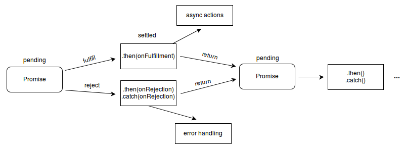

## 비동기처리란?
특정 로직의 실행이 끝날때까지 기다려주지 않고 나머지 코드를 먼저 실행하는것을 비동기 처리라고 한다.

비동기처리가 필요한 이유는 화면에서 서버로 데이터를 요청했을때 서버가 언제 그 요청에대한 응답을 줄지 모르는데 마냥 기다릴순 없기 때문이다.

>간단한 비동기 처리 예제
```javascript
// #1
console.log('Hello');
// #2
setTimeout(function() {
	console.log('Bye');
}, 3000);
// #3
console.log('Hello Again');
```

위코드로 다음과같은 출력결과를 기대했지만

- ‘Hello’ 출력
- 3초 있다가 ‘Bye’ 출력
- ‘Hello Again’ 출력


setTimeout() 역시 비동기방식으로 처리되기때문에 실제로는 다음과같이 실행된다.

- ‘Hello’ 출력
- ‘Hello Again’ 출력
- 3초 있다가 ‘Bye’ 출력

> 출처 : https://velog.io/@zayong/%EB%B9%84%EB%8F%99%EA%B8%B0%EC%B2%98%EB%A6%AC

동기 --> 순차작업   
비동기 --> 비순차작업

## Promise가 뭔가요?
“A promise is an object that may produce a single value some time in the future”

프로미스는 자바스크립트 비동기 처리에 사용되는 객체입니다. 여기서 자바스크립트의 비동기 처리란 ‘특정 코드의 실행이 완료될 때까지 기다리지 않고 다음 코드를 먼저 수행하는 자바스크립트의 특성’을 의미합니다.

 ### 프로미스의 3가지 상태(states)
프로미스를 사용할 때 알아야 하는 가장 기본적인 개념이 바로 프로미스의 상태(states)입니다. 여기서 말하는 상태란 프로미스의 처리 과정을 의미합니다. new Promise()로 프로미스를 생성하고 종료될 때까지 3가지 상태를 갖습니다.

- Pending(대기) : 비동기 처리 로직이 아직 완료되지 않은 상태
- Fulfilled(이행) : 비동기 처리가 완료되어 프로미스가 결과 값을 반환해준 상태
- Rejected(실패) : 비동기 처리가 실패하거나 오류가 발생한 상태

#### Pending(대기)
먼저 아래와 같이 new Promise() 메서드를 호출하면 대기(Pending) 상태가 됩니다.

```javascript
new Promise();
```

`new Promise()` 메서드를 호출할 때 콜백 함수를 선언할 수 있고, 콜백 함수의 인자는 resolve, reject입니다.

```javascript
new Promise(function(resolve, reject) {
  // ...
});
```
#### Fulfilled(이행)
여기서 콜백 함수의 인자 resolve를 아래와 같이 실행하면 이행(Fulfilled) 상태가 됩니다.

```javascript
new Promise(function(resolve, reject) {
  resolve();
});
```

그리고 이행 상태가 되면 아래와 같이 then()을 이용하여 처리 결과 값을 받을 수 있습니다.

```javascript
function getData() {
  return new Promise(function(resolve, reject) {
    var data = 100;
    resolve(data);
  });
}

// resolve()의 결과 값 data를 resolvedData로 받음
getData().then(function(resolvedData) {
  console.log(resolvedData); // 100
});
```

#### Rejected(실패)
`new Promise()`로 프로미스 객체를 생성하면 콜백 함수 인자로 `resolve`와 `reject`를 사용할 수 있다고 했습니다. 여기서 `reject`를 아래와 같이 호출하면 실패(Rejected) 상태가 됩니다.

```javascript
new Promise(function(resolve, reject) {
  reject();
});
```
그리고, 실패 상태가 되면 실패한 이유(실패 처리의 결과 값)를 catch()로 받을 수 있습니다.

```javascript
function getData() {
  return new Promise(function(resolve, reject) {
    reject(new Error("Request is failed"));
  });
}

// reject()의 결과 값 Error를 err에 받음
getData().then().catch(function(err) {
  console.log(err); // Error: Request is failed
});
```


> 출처: https://joshua1988.github.io/web-development/javascript/promise-for-beginners/

# 동기식 (Synchronous) / 비동기식 (Asynchronous)

## 동기식 (Synchronous)
먼저 시작된 하나의 작업이 끝날 때까지 다른 작업을 시작하지 않고 기다렸다가 다 끝나면 새로운 작업을 시작하는 방식이다.
위 그림 `Synchronous`와 같이 작업이 직렬로 배치되어 실행되며 작업 실행의 순서가 확실히 정해져 있는 것을 `동기식 처리`라 부른다.

## 비동기식 (Asynchronous)
동기식 방식과는 다르게 먼저 시작된 작업의 완료 여부와는 상관없이 새로운 작업을 시작하는 방식이다.
위 그림 `Asynchronous`와 같이 작업이 병렬로 배치되어 실행되며 작업의 순서가 확실하지 않아 나중에 시작된 작업이 먼저 끝나는 경우도 발생한다.
이와 같은 방식을 `비동기식 처리`라 부른다.

# 자바스크립트 비동기 처리
자바스크립트에는 아래와 같이 3가지 `비동기 처리방식`이 있다.

1. 콜백 함수 사용
1. Promise
1. Promise를 활용한 async/await


자바스크립트는 기본적으로 비동기적으로 동작을 한다.
개발하다 보면 비동기식으로 동작하는 부분이 동기적으로 동작해야 하는 경우가 생긴다.
이럴 때 비동기식 동작이 동기식으로 동작하도록 해주는 걸 `비동기 처리`라고 한다.

각 방식들을 하나씩 알아보도록 하자.

## 1. 콜백 함수 사용
- 콜백 함수를 사용하지 않을 경우
```javascript
// 콜백 함수
function printString(callbackParam) {
  console.log(callbackParam);
}

// 콜백 함수 호출
function callHello() {
  let value;
  
  console.log("Wait 3 sec.");
  console.log('waiting...');
  
  setTimeout(function() {
    value = 'Hello';
  }, 3000);
  
  return value;
}

// 실행
const r = callHello();
printString(r);
```
- 결과
```javascript
# 시작
Wait 3 sec.
waiting...
undefined
(3초 대기)
# 종료
```
위에서 말했듯 자바스크립트는 비동기적으로 동작하기 때문에 `callHello()`의 결괏값이 `r`로 전달되기 전에 `printString(r)`을 실행하게 되면서 `undefined`가 출력된다.
그리고 그 후 `setTimeout()`에 의해서 3초 대기 후 종료하게 된다.

-----
- 콜백 함수를 사용할 경우

```javascript 
// 콜백 함수
function printString(callbackParam) {
  console.log(callbackParam);
}

// 콜백 함수 호출
function printString(callbackParam) {
  console.log(callbackParam);
}

function callPrint(callback) {
  let value;
  
  console.log("Wait 3 sec.");
  console.log("waiting...");
  
  setTimeout(function() {
    value = "Hello";
    callback(value);
  }, 3000);
}

// 실행
callPrint(printString);
```
- 결과

```javascirpt
# 시작
Wait 3 sec.
waiting...
(3초 대기)
Hello
# 종료
```

콜백 함수를 사용하면 위 결과에서 볼 수 있듯이 `setTimeout()`에 의해 3초간 대기 후 `콜백 함수`로 전달된 `printString()`을 실행하여 `Hello`를 출력하게 된다.

----

그러나 위의 예제와 다르게 실제로 개발을 하다 보면 `콜백 함수`가 복잡해지는 경우가 많아진다.
소위 말하는 `콜백 지옥(Callback hell)`에 빠지는 경우가 생길 수 있다.
```javascript
a(function (resultsFromA) {
  b(resultsFromA, function (resultsFromB) {
    c(resultsFromB, function (resultsFromC) {
      d(resultsFromC, function (resultsFromD) {
        e(resultsFromD, function (resultsFromE) {
          f(resultsFromE, function (resultsFromF) {
            console.log(resultFromF);
          })    
        })
      })
    })
  })
});
```

이렇듯 `콜백 함수`를 남용하게 되면 `가독성`과 `에러 처리` 등에서 불편함이 발생한다.
이를 해소하기 위해 `ES6`에서 비동기 처리의 새로운 방법으로 `Promise 객체`가 등장한다.


## 2. Promise
> The Promise object represents the eventual completion (or failure) of an asynchronous operation and its resulting value.(번역: Promise 개체는 비동기 작업의 최종 완료 (또는 실패)와 그 결과 값을 나타낸다.)  출처 MDN Web Docs


Promise는 자바스크립트 비동기 처리에 사용되는 객체이다.
이를 사용하면 비동기 작업이 종료된 이후의 성공 결괏값이나 실패에 대하여 처리할 수 있다.

'Promise'는 자바스크립트 비동기 처리에 사용되는 객체이다.
이를 사용하면 비동기 작업이 종료된 이후의 '성공 결괏값'이나 '실패'에 대하여 처리할 수 있다.


- Promise 처리 흐름

> 출처 MDN Web Docs

Promise는 다음 중 하나의 상태를 가진다.

- 대기(pending): 이행하거나 거부되지 않은 초기 상태
- 이행(fulfilled): 연산이 성공적으로 완료됨
- 거부(rejected): 연산이 실패함


### Promise 사용 방법
```javascript
new Promise(function(resolve, reject) {
  // ...
});
```
`new Promise()` 객체를 생성하여 `콜백 함수`를 선언할 수 있는데 이때의 인자는 `resolve, reject`를 사용한다.
`resolve`는 결과가 성공인 `Promise 객체`를 반환하고 `reject`는 결과가 실패인 `Promise 객체`를 반환한다.

반환된 `Promise 객체`를 처리할 때 성공 시 `then`을 사용하고 실패 시 `catch`를 사용하여 처리한다.


### Promise 사용 예시
- 성공 예시
```javascript
let myFirstPromise = new Promise((resolve, reject) => {
  setTimeout(function(){
    // 성공 시 resolve 사용
    resolve(`Success!`);
  }, 3000);
});

// 성공 시 then 사용하여 결과 처리
myFirstPromise.then((successMessage) => {
  console.log(`Yay! ` + successMessage);
});
```

- 결과
```javascript
# 시작
(3초 대기)
Yay! Success!
# 종료
```

- 실패 예시
```javascript
let myFirstPromise = new Promise((resolve, reject) => {
  setTimeout(function(){
    // 실패 시 resolve 사용
    reject(new Error(`Fail!`));
  }, 3000);
});

// reject를 사용하여 Promise 객체를 반환하기 때문에 then은 실행되지 않는다.
myFirstPromise.then((successMessage) => {
  console.log(`Yay! ` + successMessage);
})
// 실패 시 catch 사용하여 결과 처리
.catch((reason) => {
  console.log('여기서 거부된 프로미스( ' + reason + ' )를 처리하세요.');
});
```

- 결과
```javascript
# 시작
(3초 대기)
여기서 거부된 프로미스( Error: Fail )를 처리하세요.
# 종료
```


### 그렇다면 Promise 방식이 콜백 함수보다 좋은 점이 무엇일까?
바로 위에서 말했던 콜백 지옥을 해결할 수 있는 방식이기 때문이다.
```javascript
function a() {
  return new Promise({
    // ...
  });
}

function b() {
  return new Promise({
    // ...
  });
}

function c() {
  return new Promise({
    // ...
  });
}

myFirstPromise()
.then(a)
.then(b)
.then(c);
```

`콜백 함수`를 사용했으면 훨씬 길어지고 복잡해졌을 코드도 위 예시와 같이 `Promise 객체`를 반환하면 여러 개의 `then`을 연결하여 간단히 처리할 수 있다.


## 3. Promise를 활용한 async/await
`ES2017`에 새로 추가된 `async/await`는 위에서 알아봤던 `Promise 객체`를 기반으로 사용한다.
위 `Promise` 설명의 마지막에서 말했듯이 `Promise` 대신 쓰는 새로운 방식이 아니라 `Promise`를 다른 방식으로 사용하는 내용이기 때문에 `Promise`에 대한 개념을 익히고 와야 이해할 수 있다.

Promise에 대하여 충분히 이해됐다면 함께 async/await를 알아보도록 하자.

 ### 기존 Promise와의 차이점
가장 큰 차이점은 위에서 배웠던 `resolve`, `reject`, `then`, `c`atch`를 쓰지 않는다는 것이다.


사실 async/await만 사용하려면 저 4가지는 어떻게 사용했는지 잊어버려도 된다.

하지만 위에서 알아본 Promise 객체에 대한 내용을 전혀 모른 채로 왔다면 async/await를 이해하는 데에 더 머리가 아팠을 것이다.

__*이미 충분히 개념을 익혀온 여러분은 아주 짧은 설명만으로도 async/await를 이해하고 사용하는 데에 어려움이 없을 것이다!*__


### async
- async 사용 예시
```javascript
// async 키워드만 붙이면 된다.
async function hello() {
  return 'Hello';
}

function callHello() {
  const r = hello();
  console.log(r); 
}

callHello();
```

- 결과
```javascript
# 시작
Promise { 'Hello' }
# 끝
```
놀랍게도 위에서 사용했던 `new Promise()`고 뭐고 아무것도 없다.
그냥 기본 메소드 앞에 `async`만 붙이면 반환되는 값이 `Promise 객체`가 된다.
`Promise 객체`가 무엇인지는 이미 익히고 온 여러분은 이 간단한 예시만으로 `async`를 어떻게 쓰는지 이해가 다 됐을 거라 생각된다.

그런데 우리는 위 예시처럼 객체 형태의 `Promise { 'Hello' }`가 아니라 그 안에 있는 String 형태의 `Hello`를 출력하고 싶다.

어떻게 해야 할까??
다음 설명을 보도록 하자.
----
### await
이제 우리는 async를 어떻게 쓰는지 또 어떤 결과가 나오는지는 알고 있다.
이번엔 그 결과를 어떻게 내가 원하는 방식으로 사용할지를 알아보도록 하겠다.

- await 사용 예시
```javascript
async function hello() {
  return 'Hello';
}

// (2) 새로 추가된 async 키워드
async function callHello() {
  // (1) 새로 추가된 await 키워드
  const r = await hello();
  console.log(r);
}

callHello();
```

- 결과
```javascript 
# 시작
Hello
# 끝
```
자 달라진 내용을 살펴보자.
먼저 `(1)` 부분을 보면 `hello();` 앞에 `await` 키워드가 추가됐다.
`await`가 붙으면 반환된 `Promise 객체`에서 실제 `hello()` 메소드의 반환 값인 `String 값`을 뽑아낸다고 보면 된다.
그렇다면 위 예시의 `r` 값에 String 형태의 `Hello`가 입력될 것이다.
출력 결과를 보면 `await`가 붙기 전이랑 다르게 `r`을 출력하면 `문자열`만 출력되는 걸 확인 할 수 있다.

다음은 `(2)` 부분을 보면 `callHello()`메소드에도 `async`가 추가됐다.
`await` 키워드는 `async` 키워드가 붙은 메소드에서만 사용할 수 있다.
만약 `async`가 없는 메소드에서 `await`를 사용한다면 아래와 같은 `SyntaxError`가 발생한다.

.png)

### 결과 처리방법
위 내용은 굉장히 쉬워서 이해하는 데에 어려움이 없었을 것 같다.

하지만 아직 끝난 게 아니다.

이제 우리는 성공과 실패에 대해 처리를 해서 마무리를 지어줘야 하는데 기존 `Promise` 방식으로 생각하면 `then`, `catch` 부분을 처리해줘야 한다.
당연히 이 부분도 훨씬 쉽다.

위에서 사용한 예시를 활용하여 바로 알아보자!

- 성공 처리 예시
```javascript
async function hello() {
  return 'Hello';
}

async function callHello() {
  // 새로 추가된 try 키워드
  try {
    const r = await hello();
    console.log('성공: ' + r);
  } catch (e) {
    console.log('실패: ' + e.message);
   }
}

callHello();
```

- 결과
```javascript
# 시작
성공: Hello
# 끝
```

- 실패 처리 예시
```javascript
async function hello() {
  throw new Error(`Fail!`);
}

async function callHello() {
  try {
    const r = await hello();
    console.log(r);
    // 새로 추가된 catch 키워드
  } catch (e) {
    console.log(e.message);
   }
}

callHello();
```
- 결과
```javascript
# 시작
실패: Fail!
# 끝
```

기존 then과 catch는 각각 try-catch로 바뀌었다.
위 예시와 같이 await를 붙인 메소드의 결과가 성공일 경우는 try 부분이 실행되고 실패일 경우는 catch 부분이 실행된다.
이 내용은 기존 C언어나 Java언어 등에서 사용하는 try-catch 개념과 비슷하기 때문에 별다른 설명 없이도 충분히 이해가 될 거라 생각한다.

여기까지 자바스크립트의 3가지 비동기 처리 방법에 대해서 알아봤다.


> 출처: https://velog.io/@change/JavaScript-asyncawait%EC%97%90-%EB%8C%80%ED%95%B4%EC%84%9C
