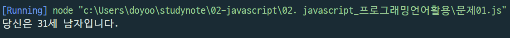
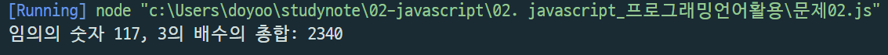
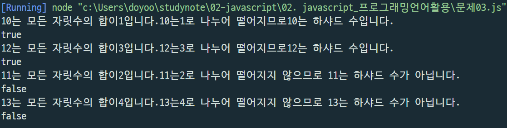
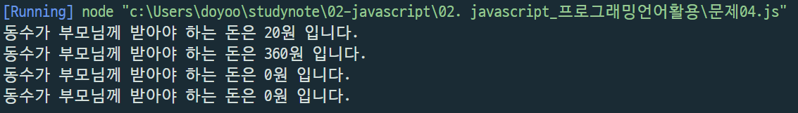
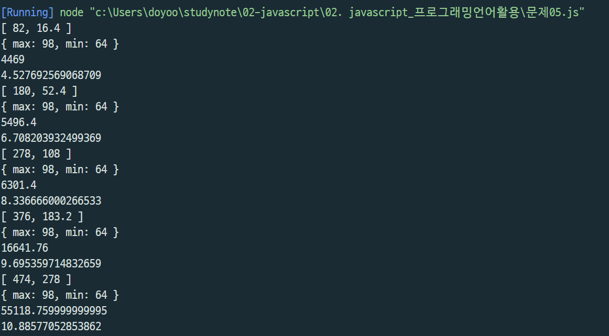

# 김도유 프로그래밍 언어활용  

> 2022-02-22


【문항1】 주민번호의 앞 부분과 뒷 부분의 첫 번째 글자 아래와 같이 변수에 저장하시오. (15분/5점)
ssn = “9203211”
그 값을 통해 아래와 같은 출력 결과를 만드시오.
ssn당신은 30세 남자입니다.

```js
const ssn = '9203211';

let yy = parseInt(ssn.substring(0, 2));
let gen = parseInt(ssn.substring(6, 7));

const date = new Date();
const now_year = date.getFullYear();
yy = (gen > 2) ? yy+2000 : yy+1900;
//console.log(yy);
const age = now_year - yy + 1;
//console.log(age);
const sex = (gen % 2) ? "남자" : "여자";
//console.log(sex);

console.log("당신은 %d세 %s입니다.", age, sex);
```



【문항2】 100~200 사이의 임의의 숫자를 number 라는 변수에 저장하고, 1부터 number까지의 수 중에서 3의 
배수에 대한 총 합을 구하시오. (범위에는 number가 포함됩니다.) (15분/5점)

```js
function random(n1, n2) {
    return parseInt(Math.random() * (n2 - n1 + 1)) + n1;
}

let number = random(100, 200);
//console.log(number);

let sum = 0;

for(let i=1; i<=number; i++) {
    //console.log(i);
    if ( i % 3 == 0){
        sum += i;        
       // console.log(sum);
    }
     
}
console.log("임의의 숫자 %d, 3의 배수의 총합: %d", number, sum);   
 
```


【문항3】 양의 정수 x가 하샤드 수이려면 x의 자릿수의 합으로 x가 나누어져야 한다. 예를 들어 18의 자릿수 
합은 1+8=9이고, 18은 9로 나누어 떨어지므로 18은 하샤드 수이다. 자연수 x를 입력받아 x가 하샤드 
수인지 아닌지 검사하는 함수, solution을 완성하여 아래의 테스트 코드에 대한 출력 결과를 만드시오. 
(30분/20점)

```js
function solution(x) {
    var sum = 0;
    var arr = String(x).split("");

    for(let i=0; i<arr.length; i++) {
        sum += Number(arr[i])
        //console.log(sum);
        
    }

    if((x % sum == 0) == true ){
        console.log(x+"는 모든 자릿수의 합이"+sum+"입니다."+x+"는"+sum+"로 나누어 떨어지므로"+x+"는 하샤드 수입니다.");
    } else {
        console.log(x+"는 모든 자릿수의 합이"+sum+"입니다."+x+"는"+sum+"로 나누어 떨어지지 않으므로 "+x+"는 하샤드 수가 아닙니다.");
    }
    
    return (x % sum == 0) ? true : false;
   
 
  
    
}


console.log(solution(10));
console.log(solution(12));
console.log(solution(11));
console.log(solution(13));
```




【문항4】 동수는 제과점에 과자를 사러 가는데 현재 가진 돈이 모자랄 경우 부모님께 모자란 돈을 받으려고 
한다. 과자 한 개의 가격이 K, 사려고 하는 과자의 개수가 N, 현재 가진 돈의 액수를 M이라 할 때 
여러분은 동수가 부모님께 받아야 하는 모자란 돈을 계산하려고 한다. 예를 들어, 과자 한 개의 가격이 30원, 사려고 하는 과자의 개수가 4개, 현재 동수가 가진 돈이 100원이라 할 때, 동수가 부모님께 받아야 하는 돈은 20원이다. 과자 한 개의 가격이 250원, 사려고 하는 과자의 개수가 2개, 현재 동수가 가진 돈이 140원이라 할 
때, 동수가 부모님께 받아야 하는 돈은 360원이다. 과자 한 개의 가격이 20원, 사려고 하는 과자의 개수가 6개, 현재 동수가 가진 돈이 120원이라 할 때 
동수가 부모님께 받아야 하는 돈은 0원이다. 과자 한 개의 가격이 20원, 사려고 하는 과자의 개수가 10개, 현재 동수가 가진 돈이 320원이라 할 때 
동수가 부모님께 받아야 하는 돈은 역시 0원이다. 과자 한 개의 가격, 사려고 하는 과자의 개수와 동수가 현재 가진 돈의 액수가 주어질 때 동수가 
부모님께 받아야 하는 돈의 액수를 리턴하는 함수 solution을 작성하고 리턴값을 출력하시오. 
(30분/20점)

```js
let sum = 0;
let money = 0;


function solution(K, N, M){
    sum = K * N;
    //console.log(sum);
    if ( sum > M){
        money = sum - M;
       // console.log(money);
        console.log("동수가 부모님께 받아야 하는 돈은 %d원 입니다.", + money);
    } else {
        money = 0;
        console.log("동수가 부모님께 받아야 하는 돈은 %d원 입니다.", + money);
    }

    
    
}

// K=30, N=4, M=100인 경우
solution(30, 4, 100);
// K=250, N=2, M=140인 경우
solution(250, 2, 140);
// K=20, N=6, M=120인 경우
solution(20, 6, 120);
// K=20, N=10, M=320인 경우
solution(20, 10, 320);

```



【문항5】 어느 학급의 중간고사 평균 성적이 아래의 표와 같았다.    
 셀2|제목 셀3|제목 셀4|제목 셀5|

|민수|철영|나영|수철|영민|
|---|---|---|---|--|
|82|76|91|98|64|


학생의 성적에 대해 아래의 요구사항을 충족하는 Student 클래스를 작성하고 각 메서드의 
실행결과를 제시시오. (60분/50점)


요구사항
1. 생성자에서 원소가 0개인 빈 배열 grade를 생성합니다. 
2. setter에 학생 한명의 점수를 주입하면 grade의 원소로 추가됩니다. getter는 제공되지 않습니다. 
3. 주입된 점수의 총점과 평균을 배열로 리턴하는 getSumAvg() 함수를 제공합니다. 
4. 주입된 점수 중에서 최하점과 최고점을 JSON으로 리턴하는 getMinMax() 함수를 제공합니다. 
5. 주입된 점수에 대한 분산을 리턴하는 getVar() 함수를 제공합니다. 
6. 주입된 점수에 대한 표준편차를 리턴하는 getStd() 함수를 제공합니다.

Javascript에서 제곱근은 Math.sqrt(input)을 사용하여 리턴받을 수 있다.

```js
let sum = 0;
let avg = 0;
let devTotal = 0;   /* 편차값의 합계 */
let minmax = {};
let variance = 0;
let std = 0;
let tmp1 = 0;
let tmp2 =0;

class Student{
    constructor(){
        const grade = new Array();
    }
    set grade(grade) {
        this._grade = grade;
    }

    getSumAvg() {
        sum += parseInt(grade);
        avg += sum/grade.length;
        return [sum, avg];
    }

    getMinMax() {

        for (let i=0; i<grade.length-1; i++) {
            for (let j=i+1; j<grade.length; j++) {

                if (grade[i] > grade[j]) {
                    tmp1 = grade[i];
                    grade[i] = grade[j];
                    grade[j] = tmp1;
        
                }
                //console.log(grade[j])
        }
    }
        for (let i=0; i<grade.length-1; i++) {

            for (let j=i+1; j<grade.length; j++) {

                if (grade[i] < grade[j]) {
                    tmp2 = grade[i];
                    grade[i] = grade[j];
                    grade[j] = tmp2;
        
                }
        }
    }
        return {max : tmp1, min: tmp2};
    }

    getVar() {

        for (let i=0; i < grade.length; i++){
            let dev = grade[i] - avg;
            devTotal += dev * dev;
        }
        return variance = devTotal/grade.length;
    }

    getStd(){
        return std = Math.sqrt(sum/(grade.length-1));
    }
}


const grade =[82, 76, 91, 98, 64];


for (const item of grade) {
    const s = new Student();
    console.log(s.getSumAvg());
    console.log(s.getMinMax());
    console.log(s.getVar());
    console.log(s.getStd());
}
```
;

