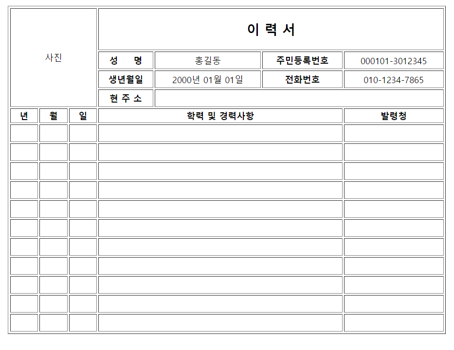

# 김도유 HTML_Table 과제 

> 2022-02-24

```html
<!DOCTYPE html>
<html lang="ko">

<head>
    <meta charset="UTF-8" />
    <meta http-equiv="X-UA-Compatible" content="IE=edge">
    <meta name="viewport" content="width=device-width, initial-scale=1.0, minimum-scale=1.0, maximum-scale=1.0, user-scalable=no" />
    <title>My Web Page</title>
    <style>
        td {
            height: 20px;
            font-size: 12px;
        }
        
        th {
            font-size: 12px;
        }
    </style>
</head>

<body>
    <div id="content">
        <table border="1" width="600" align="center">
            <thead>
                <tr align="center">
                    <td colspan="3" rowspan="4" align="center" width="80">사진</td>
                    <td colspan="4">
                        <h2>이 력 서</h2>
                    </td>
                </tr>
                <tr align="center">
                    <th>성&nbsp;&nbsp;&nbsp;&nbsp;&nbsp;명</th>
                    <td>홍길동</td>
                    <th>주민등록번호</th>
                    <td>000101-3012345</td>
                </tr>
                <tr align="center">
                    <th>생년월일</th>
                    <td>2000년 01월 01일</td>
                    <th>전화번호</th>
                    <td>010-1234-7865</td>
                </tr>
                <tr align="center">
                    <th>현 주 소</th>
                    <td colspan="3"></td>
                </tr>
            </thead>
            <tbody>
                <tr>
                    <th>년</th>
                    <th>월</th>
                    <th>일</th>
                    <th colspan="3">학력 및 경력사항</th>
                    <th>발령청</th>
                </tr>
                <tr>
                    <td></td>
                    <td></td>
                    <td></td>
                    <td colspan="3"></td>
                    <td></td>
                </tr>
                <tr>
                    <td></td>
                    <td></td>
                    <td></td>
                    <td colspan="3"></td>
                    <td></td>
                </tr>
                <tr>
                    <td></td>
                    <td></td>
                    <td></td>
                    <td colspan="3"></td>
                    <td></td>
                </tr>
                <tr>
                    <td></td>
                    <td></td>
                    <td></td>
                    <td colspan="3"></td>
                    <td></td>
                </tr>
                <tr>
                    <td></td>
                    <td></td>
                    <td></td>
                    <td colspan="3"></td>
                    <td></td>
                </tr>
                <tr>
                    <td></td>
                    <td></td>
                    <td></td>
                    <td colspan="3"></td>
                    <td></td>
                </tr>
                <tr>
                    <td></td>
                    <td></td>
                    <td></td>
                    <td colspan="3"></td>
                    <td></td>
                </tr>
                <tr>
                    <td></td>
                    <td></td>
                    <td></td>
                    <td colspan="3"></td>
                    <td></td>
                </tr>
                <tr>
                    <td></td>
                    <td></td>
                    <td></td>
                    <td colspan="3"></td>
                    <td></td>
                </tr>
                <tr>
                    <td></td>
                    <td></td>
                    <td></td>
                    <td colspan="3"></td>
                    <td></td>
                </tr>
                <tr>
                    <td></td>
                    <td></td>
                    <td></td>
                    <td colspan="3"></td>
                    <td></td>
                </tr>
            </tbody>
        </table>
    </div>
</body>

</html>
```
