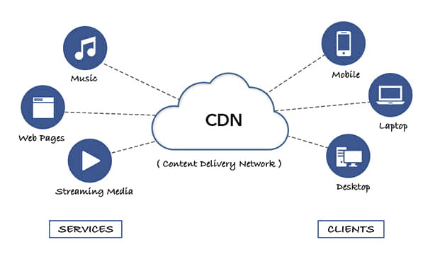

# 폰트 관련 속성

## #01. 글자 모양 관련 속성

글자의 모양은 문단, 문장 요소를 구분하지 않고 모든 HTML 요소에 적용 가능하다.

| 속성 | 설명 |
|--------|------|
| font-family | 글꼴의 이름을 쉼표로 구분하여 나열.<br/>글꼴 이름에 공백이나 "-"가 포함된 경우 글꼴 이름을 따옴표로 감싸야 한다.<br/>개발자 PC가 아닌 접속자 PC를 기준으로 하는 글꼴이 명시되어야 한다.<br/>접속자에게 글꼴이 설치되지 않은 경우 정상적으로 표시되지 않는다.<br/>ex) font-family: NanumGothic, Gulim, 궁서체 |
| font-size | 글자크기 (px단위를 주로 사용함) |
| font-style | 글자의 기울임 여부 --> italic, normal(기본값) |
| font-weight | 글자의 굵게 표현 여부<br/>border, bold, normal, light, lighter<br/>100~900사이의 100단위 숫자값을 사용하기도 한다.(400이 normal에 해당) |
| color | 글자 색상 |
| line-height | 한 줄의 높이 (px, %단위 표현) --> %단위인 경우 font-size를 기준으로 함 |
| font | 일괄표현 --> [style]  [weight] size[/line-height] family |

### `em` 단위

부모 요소에게 부여된 글자 크기를 `1em`으로 놓고 이에 대한 상대적인 크기를 지정하는 방식.

아래 코드에서 `.child`의 부모가 `100px`의 글자크기를 갖고 있기 때문에 `.child`에게 `1em`은 `100px`이 된다. 그러므로 `0.5em`은 `50px`이 된다.

```html
<style>
    .parent {
        font-size: 100px;
    }

    .child {
        font-size: 0.5em;
    }
</style>

<div class='parent'>
    <div class='child'>Hello World</div>
</div>
```


## #02. 웹 폰트

CSS에서 font-family 속성으로 지정한 글꼴이 접속자의 PC에 설치되어 있지 않을 경우 고르게 표시되지 않는 문제를 해결하기 위해 폰트파일을 온라인에 올려두고 접속자의 PC에 설치되어 있지 않은 경우 웹 상의 글꼴을 내려받아 사용할 수 있게 하는 기법

```CSS
@font-face {
    font-family: 사용자지정_폰트_이름;
    src: local('실제폰트이름'), url('웹상의_폰트파일_경로') format('truetype');
}
```

실제로 글꼴을 지정할 항목에 대하여 **사용자지정_폰트_이름**을 적용한다.

```CSS
selector {
    font-family: 사용자지정_폰트_이름
}
```

### 1) 구글 웹 폰트 (https://fonts.google.com)

- 구글에서 운영하는 무료 웹 폰트 사이트.
- 이곳에서 참조할 CSS 구문을 얻을 수 있다.

### 2) 아이콘 폰트 ([font awesome](https://fontawesome.com/))

- 특수문자에 반응하여 글꼴파일에 저장되어 있는 기호가 표시되게 하는 특수 폰트
- [font awesome](https://fontawesome.com/)이 가장 널리 알려져 있다.
    - version 4까지는 무료
    - version 5,6은 부분 유료화 됨, 도메인이 없는 경우 사용 불가.

### 3) Font awesome 4 (https://fontawesome.com/v4/)

무료로 도메인의 제약 없이 사용할 수 있는 가장 일반적인 버전.

#### 다운로드 받아 사용하기

- [https://fontawesome.com/v4/get-started/](https://fontawesome.com/v4/get-started/) 페이지의 중간 부분에서 "Download" 버튼을 클릭
- 다운로드 받은 파일의 압축을 해제하고 `css`폴더와 `fonts`폴더를 작업중인 위치로 복사.
- `css`폴더와 `fonts`폴더는 반드시 같은 폴더 안에 존재해야 함.
- html에서 `font-awesome.min.css` 파일을 참조.
    ```html
    <link rel='stylesheet' type='text/css' href='assets/css/font-awesome.min.css' />
    ```
- [https://fontawesome.com/v4/icons/](https://fontawesome.com/v4/icons/)에서 사용하고자 하는 폰트를 검색하여 사용.
    ```html
    <i class="fa fa-user" aria-hidden="true"></i>
    ```


#### CDN 방식 사용하기

파일을 직접 다운로드 받기 번거로운 경우 온라인에 공개되어 있는 CSS를 직접 참조하여 사용할 수 있다.

```html
<link rel='stylesheet' type='text/css' href='https://cdnjs.cloudflare.com/ajax/libs/font-awesome/4.7.0/css/font-awesome.min.css' />
```


# CDN이란?



`Content Delivery Network`의 약자인 CDN은 `지리적 제약 없이 전 세계 사용자에게 빠르고 안전하게 콘텐츠를 전송할 수 있는 콘텐츠 전송 기술`을 의미합니다.   
 CDN은 서버와 사용자 사이의 물리적인 거리를 줄여 콘텐츠 로딩에 소요되는 시간을 최소화합니다. CDN은 각 지역에 캐시 서버(PoP, Points of presence)를 분산 배치해, 근접한 사용자의 요청에 원본 서버가 아닌 캐시 서버가 콘텐츠를 전달합니다.
예를 들어 미국에 있는 사용자가 한국에 호스팅 된 웹 사이트에 접근하는 경우 미국에 위치한 PoP 서버에서 웹사이트 콘텐츠를 사용자에게 전송하는 방식입니다.


콘텐츠 전송 네트워크 또는 CDN 간단히 말해서, `사용자가 물리적으로 위치한 곳으로 콘텐츠를 더 빠르게 전달하기 위해 함께 작동하는 연결된 캐싱 서버의 글로벌 네트워크입니다.`


## CDN 진행

CDN(콘텐츠 전송 네트워크)은 사용자의 지리적 위치, 웹 사이트 콘텐츠의 출처 및 콘텐츠 전달 서버를 기반으로 웹 콘텐츠를 사용자에게 전달하는 분산 CDN 서버(네트워크)의 인프라입니다. 목표는 빠르고 안정적인 방식으로 콘텐츠에 대한 액세스를 제공하는 것입니다. 이 콘텐츠는 이미지 및 비디오에서 JavaScript 파일, HTML 페이지 및 스타일 시트에 이르기까지 무엇이든 될 수 있습니다. 

콘텐츠 전송 네트워크의 작동 방식에 대한 정보를 찾고 있다고 가정해 보겠습니다. 자연스러운 경향은 브라우저 창에 입력하고 검색 또는 Enter 키를 누른 다음 검색한 내용을 읽는 것입니다. 이 조치는 우리가 태초부터 연구를 수행해 온 방식이기 때문에 가장 논리적인 조치인 것 같습니다.

그러나 모든 사람이 빠른 인터넷 연결이나 더 나은 DSL 기술을 사용하기 전인 1990년이었다면 이 작업은 시간이 많이 걸리고 실망스러웠을 것입니다.

CDN 서비스는 서버의 분산 네트워크입니다. 즉, 일반적으로 하나의 중앙 위치에 있지 않고 전 세계에 분산되어 사용자에게 더 가까운 콘텐츠를 제공합니다. 웹 주소나 도메인 이름을 브라우저에 입력하면 서버가 어디에 있는지 알 수 없습니다.

반면 CDN은 콘텐츠를 더 빠르게 전달할 수 있도록 서버가 가까이에 있을 가능성이 더 큽니다. Google예를 들어 의 CDN(콘텐츠 전송 네트워크)은 전 세계 100개국에 75개의 접속 지점을 보유하고 있습니다.

CDN은 콘텐츠 전송 네트워크를 의미합니다. Netflix, Amazon Video, Hulu와 같은 모든 스트리밍 공급자는 자체 콘텐츠 전송 네트워크를 가지고 있어 사용자에게 문제를 주지 않는 최고의 서버로 전 세계 국가를 안전하게 연결합니다.

즉, 이러한 서버를 사람들이 보고 있는 위치에 더 가깝게 배치하여 비디오를 더 빠르게 푸시할 수 있지만 다른 사용자도 적절하게 연결된 상태를 유지할 수 있도록 대역폭 소비의 30% 이상을 사용하지 않을 것이라고 말하는 것이 중요합니다.

저희 서비스를 사용하면 비용을 절약할 수 있습니다. 저희가 귀하를 위해 모든 것을 해주기 때문에 귀하의 웹사이트 또는 애플리케이션이 계속 작동하기 위해 IT 기술자 군대가 필요하지 않습니다. 웹 트래픽은 사용자 경험의 품질을 향상시킬 방법을 찾고 있습니다. 이를 수행하는 한 가지 방법은 스트리밍에서 CDN 평균을 사용하는 것입니다.

>https://library.gabia.com/contents/infrahosting/8985/
>https://www.websiterating.com/ko/web-hosting/glossary/what-is-cdn/


# 캐시(cache)
`캐시`(cache, 문화어: 캐쉬, 고속완충기, 고속완충기억기)는 컴퓨터 과학에서 `데이터나 값을 미리 복사해 놓는 임시 장소`를 가리킨다. 캐시는 캐시의 접근 시간에 비해 원래 데이터를 접근하는 시간이 오래 걸리는 경우나 값을 다시 계산하는 시간을 절약하고 싶은 경우에 사용한다.


