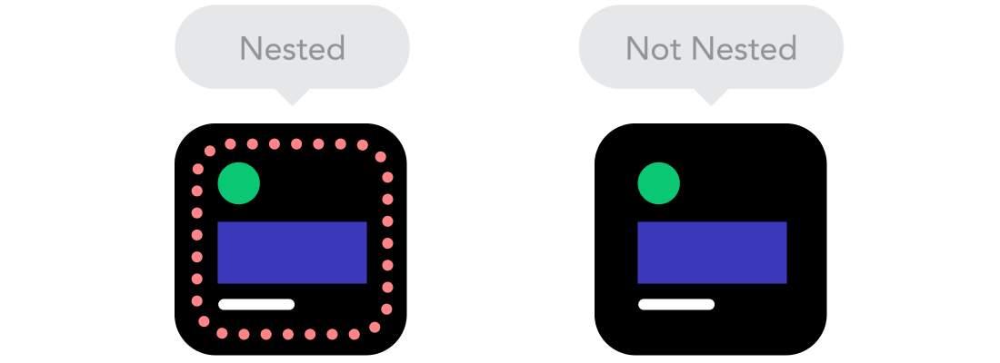

# HTML 기본 구조

## #01. 웹 페이지 제작 개요

### 1) 웹 페이지 작성 방법

1. 일반 텍스트 파일의 확장자를 `*.html`로 변경하여 사용.
1. 웹 페이지를 구성하기 위한 정형화된 형식의 내용(=소스코드)을 기술 -> 코딩
1. 하나의 웹 페이지는 `HTML` + `CSS` + `Javascript`가 조합된 소스코드로 구성됨.


### 2) 웹 페이지 작성시 준수해야 할 점.

> 웹 접근성을 확보하기 위해 시멘틱 웹을 작성해야 하며 이를 위해서 웹 표준을 준수해야 한다.

#### 웹 접근성

- 모든 사람 (혹은 모든 기기)는 정보의 접근에 차별을 받지 않아야 한다.   
- 장애인 차별 금지법에 명시되어 있음.

#### 시멘틱 웹

- 사전적 의미: 의미있는 문서
- HTML태그는 원래 특정 단어나 문장의 용도를 시각적으로 강조하기 위해 사용되는 언어임.  
- HTML 태그를 강조할 목적에 맞게 사용하여 기계가 이해할 수 있도록 의미를 부여한 형태.  
- 시멘틱 웹으로 작성된 웹 페이지는 시각장애인용 웹 브라우저(스크린리더) 를 활용하여 웹 페이지 탐색이 가능하다.

> 즉, 시멘틱 웹이란 기계가 문장의 용도를 파악할 수 있도록 문장에 의미를 부여한 형태.

> 시맨틱웹의_예시 

#### 웹 표준

- 올바른 시멘틱 웹을 구성할 수 있도록 권장되는 HTML 제작기법
- 웹 표준이 준수될 경우 기기의 종류를 가리지 않고 모두 동일한 형태의 결과를 확인할 수 있기 때문에 웹 접근성이 확보된다.
- HTML로 골격을 구성하고 CSS로 디자인을 적용한 후 Javascript로 동작을 구현한다.


## #02. HTML
1. 웹 페이지를 구성하는 기본 골격을 만드는 언어.
1. 특정 단어나 문장을 태그라는 형식으로 강조하는 형태로 구성되고 각 태그는 시각적 효과를 정의하기 위해 속성과 값을 포함할 수 있다.
    ```html
    <태그 속성="값" 속성="값">강조할 내용</태그>
    ```
    - 모든 태그는 시작태그 `<태그>`와 끝태그 `</태그>`로 구성된다.
    - 시작 태그에는 시각적 효과를 의미하는 속성들이 명시되기도 한다.
    - 끝 태그는 `</ ... >`와 같이 `/`가 표시되어야 한다.
    - 끝 태그가 필요 없는 경우 `<태그 />`와 같이 괄호를 닫을 때 `/`를 명시하기도 한다.
1. HTML 태그는 내용 강조할 목적에 따라 종류가 구분되어 있다.
    ```
    ex) h1->제목, p->본문 등...
    ```

### HTML 페이지 기본 구조
```html
<!doctype html>         ← HTML5 버전 선언(DTD선언)
<html lang="ko">        ← 전체 웹 페이지 영역 정의
    <head>
                        ← 페이지 특성 설정 부분
    </head>
    <body>
                        ← 웹 브라우저에 표시되는 부분
    </body>
</html>
```


### `<head>`안에 기술되는 주요 내용

#### 언어 저장 특성 명시 (다국어 지원을 위해 utf-8 사용)

```html
<meta charset="utf-8" />
```

#### 모바일 장치 별 해상도 단일화

```html
<meta name="viewport" 
      content="width=device-width,initial-scale=1,minimum-scale=1,maximum-scale=1,user-scalable=no" />
```

#### 브라우저 타이틀

```html
<title>제목</title>
```

### 주석문

소스코드 내에 작성되는 설명문.

코드의 용도와 기능을 설명하기 위한 용도로 작성된다.

`<!--`와 `-->`로 감싸서 표현한다.

```html
<!-- 이 부분은 주석입니다. 브라우저가 설명문으로 인식하여 화면에 표시하지 않습니다. -->
```


### 앞으로의 실습을 위한 HTML 파일 기본 구조

```html
<!DOCTYPE html>
<html lang="ko">
    <!-- 페이지 설정 부분 -->
    <head>
        <!-- 저장시에 사용된 인코딩(파일의 저장 형식) 값을 웹 브라우저에게 알려준다. 
             ANSI(euc-kr), UTF-8 -->
        <meta charset="utf-8" />
        <!-- 스마트 장치에서의 해상도 균일화 처리 -->
        <meta name="viewport" content="width=device-width,initial-scale=1.0,minimum-scale=1.0,maximum-scale=1.0,user-scalable=no" />
        <!-- 브라우저에 표시될 문서 제목 -->
        <title>My Web Page</title>
    </head>

    <!-- 브라우저에 보여질 부분 -->
    <body>
        Hello HTML
    </body>
</html>
```

## #03. HTML 작성에 도움을 주는 Visual Studio Code Extension

| 이름 | 설명 |
|---|---|
| Auto Close Tag | 시작태그를 작성하면 종료태그를 자동으로 추가해준다. |
| Auto Rename Tag | 시작태그를 수정하면 종료태그도 자동으로 수정해준다. 단, 한글인 경우는 동작안함. |
| Color Highlight | 색상 코드 값을 실제 그 색상으로 강조한다. |
| Prettier - Code formatter | 코드의 줄바꿈, 들여쓰기등을 자동으로 정렬한다.<br/>사용방법: `Ctrl+Shift+P` > `Format Document` 명령 선택 |
| Highlight Matching Tag | 선택한 태그와 함께 반대쪽 시작(혹은 종료)태그를 색상으로 강조한다. |
| Live Server | 웹 페이지의 변경사항을 감지하여 페이지를 자동으로 새로고침 한다 |


<br/><br/><br/>


# 문단 관련 요소

## #01. 단락 나누기

### 1) 제목

```html
<h1>H1 수준의 제목</h1>
<h2>H2 수준의 제목</h2>
<h3>H3 수준의 제목</h3>
<h4>H4 수준의 제목</h4>
<h5>H5 수준의 제목</h5>
<h6>H6 수준의 제목</h6>
```

- h1~h6: 제목을 표시하기 위한 태그로서, 6단계의 수준을 갖는다.
- "h"는 Heading의 줄임말.


### 2) 본문

#### 문단 나누기

```html
<p>내용</p>
```
1. 본문안에 다른 본문 중첩 사용 가능<br/>
    * `<p> <p> ... </p> </p>`
1. 두 개 이상의 본문을 연속적으로 사용 가능. 각 문단간에는 여백이 형성된다.<br/>
    * `<p> ... </p> <p> ... </p>`

#### 인용문

```html
<blockquote> ... <blockquote>
```

- 출처가 존재하는 형식의 문장 구성
- 이 태그 안에는 다른 문단 요소들이 포함될 수 있다.
- 인용문으로 설정된 문단은 오른쪽으로 들여쓰기가 적용된다.

### 목록

모든 형태의 웹 사이트 메뉴 구성에 사용되는 태그

1. 목록의 영역 정의
    * 순서없는 목록(unordered list) : `<ul>~</ul>`
    * 순서있는 목록(ordered list) : `<ol>~</ol>`
1. 목록의 영역 안에 항목(list item)을 나열하기
    * `<li> 내용 </li>`
1. 항목 안에서는 독립적인 본문을 구성할 수 있다.
    * p, div, h(n) 태그 사용 가능함
1. 항목 안에서는 새로운 목록을 하위 요소로 포함할 수 있다.<br/>
`<li>`태그 안에서 새롭게 `<ul>`이나 `<ol>`태그를 시작할 수 있다는 의미.
    ```html
    <ul | ol>
        <li>
          <ul | ol> ... </ul | ol>
        </li>
    </ul | ol>
    ```


## #02. 페이지 영역 나누기 --> div

1. 개념적으로만 나눈다.
    * HTML에서는 디자인이 적용되지 않음
1. 연속적으로 사용할 경우 간격 없는 문단을 구성.
1. 중첩해서 사용할 수 있으며 모든 종류의 HTML 태그 포함 가능
1. 용도에 따라 시멘틱 요소로 세분화 할 수 있다.
    * header, section, article, nav, aside, hgroup 등...
1. 대부분의 웹 사이트가 시멘틱 요소를 디테일하게 사용하지는 않는다.<br/>
(div로 대동단결!!!)

### 모든 태그 요소에 사용할 수 있는 `id`속성

각 태그에게 고유한 기능을 부여하기 위해 다른 요소와 중첩되지 않는 값을 부여해야 한다.

id속성을 통해 고유한 기능을 부여하기 위해 이 속성이 CSS나 Javascript와 연계된다.

반드시 그 파일 안에서 고유한 값을 명시해야 한다.

## #03. 기타
- 화면상에 직선 긋기 : `<hr />`
- copyright 특수문자 : `&copy;`
- HTML 코드에서는 띄어쓰기나 줄바꿈을 아무리 많이 사용하더라도<br/>
브라우저상에서는 띄어쓰기 한 칸으로 표시된다.
    * 줄바꿈 : `<br />`
    * 띄어쓰기 특수문자 : `&nbsp;`


<br/><br/><br/>

# 문장 관련 요소

단어나 문장을 강조하는 방법

## #01. 단어나 문장 강조하기

### 1) 글자의 모양, 색상, 크기

```html
<font [face="글꼴이름"] [color="색상값"] [size="크기"]> ... 내용 ... </font>
```

#### 글꼴

내 컴퓨터에 설치되어 있는 글꼴이 접속자에게 없다면 운영체제의 기본 글꼴로 표시된다.

#### 색상값

`#RRBBGG` 형식의 16진수 모음을 사용하거나 `rgb(red, green, blue)` 형태를 사용한다.

- RR, GG, BB : `00~ff`의 16진수 숫자값 (00=어두움, ff=밝음)
- red,green,blue : 0~255 사이의 숫자값 (0=어두움, 255=밝음)

구글에서 **color picker** 검색 후 나타나는 도구 사용 가능


### 2) 단어, 문장 강조하기


#### 형광팬 강조 효과

```html
<mark> ... 내용 ... </mark>
```

#### 내용을 굵게 표시하기

```html
<strong>내용</strong>
```

혹은

```html
<b>내용</b>
```

#### 밑줄 표시

```html
<u>내용</u>
```

#### 기울임꼴 표시하기

```html
<i>내용</i>
```

#### 굵게 + 밑줄

```html
<strong><i>내용</i></strong>
<b><i>내용</i></b>
<i><strong>내용</strong></i>
<i><b>내용</b></i>
```

#### 밑줄 + 기울임

```html
<u>><i>내용</i></u>
<i><u>내용</u></i>
```

그 밖의 다양한 조합으로 사용 가능함.

#### CSS를 적용하기 위한 영역 지정

```html
<span> ... 내용 ... </span>
```

이 태그는 HTML 코드 자체만으로는 아무런 기능이 없다.

추후 공부할 CSS(디자인코드)가 적용되기 위한 영역을 구성하기 위해 사용한다.


## #02. 페이지 이동처리 (링크)

### 1) 링크 기본

```html
<a href="파일이름 혹은 사이트 주소" [target="_blank"]> ... 내용 ... </a>
```

target 속성을 적용할 경우 새창(새탭)으로 표시됨.

같은 사이트 내의 파일을 지정할 경우는 상대경로, 절대경로 사용 가능.

웹에서의 절대경로는 `http://`부터 시작되는 온라인 상의 주소를 의미

다른 사이트 주소를 명시할 경우 절대경로 형식만 가능함.

### 2) 스크롤 이동하기

href 속성에 `#`을 지정한 경우 현제 페이지의 맨 위로 스크롤 이동

href 속성에 `#id값`을 지정한 경우 해당 id값을 갖고 있는 HTML태그의 위치로 스크롤 이동

### 3) 데이터 링크

#### 이메일 보내기

```html
<a href="mailto:이메일주소"> ... 내용 ... </a>
```

#### 전화걸기(스마트폰 전용)

```html
<a href="tel:전화번호"> ... 내용 ... </a>
```


## #03. 주소, 연락처, 카피라이트 표시

```html
<address> ... 내용 ... </address>
```

이 태그 안에는 지금까지 학습한 모든 종류의 HTML 태그를 포함시킬 수 있다.

<br/><br/><br/>

# 표 그리기
## #01) 표 그리기 기본 구성

- 영역 구문이 모호할 경우 thead, tbody, tfoot은 생략할 수 있다.
- tr,td,th는 필요한 만큼 반복 사용 가능

```html
<table border="굵기" width="넓이"                       ← 표의 영역 지정
       align="left|center|right">
    <thead>                                             ← 제목영역
        <tr>                                            ← 행(줄)
            <th width="넓이" align="left|center|right"> ← 열(th=제목용도, td=내용용도)
                  ... 내용 </th>
        </tr>
    </thead>
    <tbody>                                             ← 내용영역
        <tr>
            <td>... 내용 </td>
        </tr>
    </tbody>
    <tfoot>                                             ← 하단영역
        <tr>
            <th>... 내용 </th>
        </tr>
    </tfoot>
</table>
```

## #02. 표의 줄, 칸 합치기

td나 th 태그에 대하여...

- colspan="숫자"  --> 칸 합치기
- rowspan="숫자"  --> 줄 합치기


## #03. 여백설정

table 태그에 대하여...

- cellpadding --> 칸과 내용 사이의 여백
- cellspacing --> 칸과 칸 사이의 여백

일반적으로 border, cellpadding, cellspacing은 0으로 설정하여 모든 여백과 테두리 굵기를 0으로 리셋시키고 CSS를 활용하여 세밀한 디자인을 적용한다.

최근의 웹 브라우저는 border, cellpadding, cellspacing을 명시하지 않은 경우 기본값을 0으로 지정한다.

----

# 연습문제

HTML 테이블을 활용하여 다음의 형태로 본인의 이력서를 작성하시오.


<br/><br/><br/>

# 멀티미디어
멀티미디어 요소들은 문장으로 인식된다.

### #01. 이미지
#### 1) 이미지 넣기
```html

```
- width나 height 중 하나만 부여할 경우 나머지 값은 비율에 따라 자동 변경

#### 2) 이미지 캡션 삽입하기
```html
<figure>
 
 <figcaption>캡션 내용</figcaption>
</figure>
```
- 이미지는 여러장을 동시에 포함시킬 수 있다.
- 캡션 내용은 문장 관련 요소들을 포함할 수 있다.

### #02. 멀티미디어
#### 1)오디오
```html
<audio src="파일경로" [controls] [loop] [autoplay]></audio>
```
- controls : 화면상에 슬라이드바를 포함한 컨트롤러를 표시함. 속성을 명시하지 않은 경우 배경음악 효과.
(아무것도 보이지 않음)
- loop : 반복재생
- autoplay : 자동재생 (Chrome에서는 동작하지 않음)

> autoplay가 동작하지 않는 문제는 javascript로 해결해야 함

#### 2)비디오
```html
<video src="파일경로" [controls] [loop] [autoplay] [preload]
 [poster="미리보기이미지경로"] [width="넓이"] [height="높이"]></video>
 ```
 > audio, video 태그는 html만으로 사용하기 보다는 javascript와 함께 사용하여 세세하게 컨트롤할 수 있는 기능을 제공하는 것이 일반적 (ex: youtube)


 # 입력요소

## #01. 입력 양식 구성

### 1) 입력 양식 영역 만들기

```html
<form   [method="get/post"]  [action="backend-url"]
        [enctype="multipart/form-data"]>
</form>
```

- method: 입력값을 백엔드 페이지에게 전송하는 방식 (GET,POST,PUT,DELETE)
- action : 입력값을 전송받을 백엔드 페이지의 URL
- enctype: 파일 업로드가 요구될 경우 명시

화면 UI를 구성하는 과정에서는 중요하지 않기 때문에 method, action, enctype 속성은 명시하지 않는 경우가 많다.


### 2) 입력양식 안에서의 그룹 지정 (필요한 경우만 수행)

```html
<fieldset>                      ← 그룹의 영역 지정
    <legend> 제목 </legend>     ←  그룹의 제목을 표현
    ... 입력 항목들을 표현 ...
</fieldset>
```


## #02. 입력항목

### 1) 입력양식 기본 구성

```html
<input type="종류"
    name="백엔드에서의 식별자" 
    [id="CSS,JS에서의 식별자"]
    [value="입력값"]
    [placeholder="설명글"]
    [maxlength="최대입력가능한 글자 수"]
    [min="최소값"]
    [max="최대값"]
    [step="입력단위"]
    [checked]
    [required] />
```

#### 입력양식의 기본 종류

아래의 값 중 하나를 type 속성에 명시한다.

| 속성명 | 설명 |
|---|---|
| `text` | 일반 텍스트를 입력한다. (아이디, 글 제목 등)  |
| `password` | 비밀번호를 입력한다. 입력 내용이 `*`로 표시된다.  |
| `checkbox` | 체크박스를 표시한다. (여러개 선택)  |
| `radio` | 라디오 버튼을 표시한다. (단일 선택) |
| `button` | 아무런 기능이 없는 버튼을 표시한다. 눌렀을 때 동작할 기능은 Javascript로 구현해야 한다.  |
| `submit` | 입력 내용을 백엔드에게 전송하기 위한 버튼을 표시한다.  |
| `reset` | 입력 내용을 초기화 시키는 버튼을 표시한다.  |
| `image` | `src` 속성에 지정된 이미지 버튼을 표시한다. submit과 기능이 동일하다. |
| `time` | 시간을 선택할 수 있는 요소를 표시한다.  |


#### 스마트폰의 키보드에 영향을 주는 종류

| 속성명 | 설명 |
|---|---|
| `email` | 이메일을 입력할 수 있는 요소를 표시한다.  |
| `tel` | 전화번호 입력을 위한 요소를 표시한다.  |
| `url` | 웹 사이트 주소를 입력할 수 있는 요소를 표시한다.  |
| `number` | 숫자를 입력할 수 있는 요소를 표시한다.  |
| `range` | 범위를 지정할 수 있는 slider를 표시한다.  |
| `search` | 키보드 상에 검색버튼이 표시되는 입력 요소를 표시한다.  |
| `date` | 날짜를 선택할 수 있는 요소를 표시한다.  |

##### `<input>`태그의 속성 

| 속성명 | 설명 |
|--------|------|
| value="기본값" | 페이지가 열릴 때 입력되어 있을 값 |
| checked | type속성이 radio, checkbox 인 경우 선택상태로 지정함 |
| min="최소값" | type속성이 number, range 인 경우 사용 |
| max="최대값" | type속성이 number, range 인 경우 사용 |
| step="숫자" | type속성이 number, range 인 경우 사용 |
| maxlength="숫자" | 키보드로 입력하는 형태에서 최대 글자수 |
| src="이미지경로" | image 형태인 경우만 사용 |
| required | 필수 입력 항목 지정 (모든 브라우저가 지원하는 것은 아님) |


## #02. 그 밖의 요소

### 1) 장문 입력

```html
<textarea name="식별자" id="식별자" [maxlength="숫자"]>내용</textarea>
```

### 2) 드롭다운
```html
<select name="식별자" id="식별자" [multiple]>
    <option value="값" selected>화면표시내용</option>
</select>
```

### 3) 버튼

#### `<input>`태그에 대해서...

```html
<input type="button|submit|reset" value="click me" />
```

| 종류 | 설명 |
|--------|------|
| type="button" | 이 자체로는 아무 기능이 없음. 동작할 내용을 JS로 구현 |
| type="submit" | 입력한 내용을 백엔드에 전송하는 기능 (일반적인 저장버튼) |
| type="reset"  | 입력한 내용을 모두 초기화 |
| type="image" | submit과 기능이 동일 |


#### 버튼요소의 다른 형태

```html
<button type="button|submit|reset">Click me</button>
```

## #03. 입력 요소의 제목 지정하기

### 1) 텍스트를 입력하는 요소

`<label>`태그의 for 속성과 `<input>` 태그의 id속성을 연결한다.

```html
<label for="식별자2">텍스트</label>
<input type="종류" name="식별자1" id="식별자2" />
```

### 2) 체크, 라디오 버튼

```html
<label>
    <input type="종류" name="식별자1" id="식별자2" />
    텍스트
</label>
```


<br/><br/><br/>


# CSS 선택자

## #01. CSS 개요

HTML로 구성된 페이지 골격에 디자인을 입히는 언어.

### 1) 서술 방법

#### a) HTML문서에 의존한다.

`<head>`태그 안에 `<style>`태그를 명시하고 그 안에 서술한다.

```html
<head>
    <style [type="text/css"]>
        ... CSS 구문 ...
    </style>
</head>
```

#### b) CSS구문만을 별도로 저장한 외부파일을 참조.

`<style>~</style>` 안에 명시하는 CSS 구문을 별도의 파일에 작성해 두고 HTML에서 해당 파일의 경로를 참조한다.

```html
<link rel="stylesheet" [type="text/css"] href="파일의경로" />
```

#### c) HTML태그의 style속성을 활용

거의 사용 안함.

```html
<div style="CSS구문"></div>
```


### 2) CSS 구문 구조

```css
    selector {
        속성: 값;
        속성: 값;
        ...
    }
```

- selector (선택자) : 디자인이 적용될 대상을 지정한다.
- `속성: 값;` : 하나의 디자인 속성을 명시한다.


## #02. selector (선택자)

CSS가 적용될 대상을 지정하는 방법.

1. **태그이름** --&gt; `ex) h1 { color: red; }`
2. **class** : 앞에 점을 포함한 단어를 사용하여 selector를 정의하고 HTML태그의 class속성에서 점을 제외한 단어를 사용하여 연결한다.
    * 태그 종류에 상관 없이 여러번 재사용이 가능하다.
    ```html
    .hello { color: red; }
    <div class="hello"> </div>
    ```
3. **id** : 앞에 `#`을 포함한 단어를 사용하여 selector를 정의하고 HTML태그의 id속성에서 점을 제외한 단어를 사용하여 연결한다.
    * 하나의 HTML문서 안에서 다른 요소와 중복될 수 없다.
    ```html
    #hello {color: red; }
    <div id="hello"> </div>
    ```

### 1) 여러 개의 선택자 사용하기

콤마로 구분하여 선택자를 여러개 명시하면 동시에 여러 요소가 같은 디자인 속성을 공유할 수 있다.

```CSS
h1, h2, .myclass, #myid {
    ...
}
```


### 2) 가상클래스

HTML요소가 어떤 상황을 직면했을"때" 적용되는 selector (~~할 때)

대부분 링크에 대해 적용한다.

| 가상클래스 | 설명 |
|---|---|
| link | 링크의 기본 상태 |
| visited | 방문한 경험이 있는 링크 |
| hover | 마우스가 올라가 있는 요소 |
| active | 마우스가 눌러져 있는 요소 |

##### 사용예

```css
a:link { ... }
a:visited { ... }
a:hover { ... }
a:active { ... }
```


### 3) selector 조합하기

특정 요소를 자세하게 명시하고자 할 때 사용한다. (띄어쓰기 X)

#### 태그이름 + class

```css
  div.hello
```

#### 태그이름 + id

```css
  div#hello
```


### 4) 자식셀렉터

HTML의 계층구조를 순차적으로 ">"를 사용하여 표현한 것.

```CSS
div > span > input.form_control {
    ...
}
```

```html
<div>
    <span><input class="form_control" /></span>
</div>
```

### 5) 자손셀렉터

HTML의 계층구조를 공백을 사용하여 표현한 것. 반드시 순차적일 필요는 없다.

```CSS
div span input.form_control {
    ...
}
```

```html
<div>
    ... ? ...
    <span> ...?... <input class="form_control" /> ...?... </span>
    ... ? ...
</div>
```

### 6) 속성셀렉터

HTML태그의 속성과 값을 [] 안에 표현함

| 셀렉터 | 설명 |
|--------|------|
| a[href] | href라는 속성을 갖는 a태그 (값은 상관 없음) |
| a[href="#"] | href속성값이 "#"인 a태그 (값이 반드시 일치해야 함) |
| #hello[method='post'] | method속성의 값이 post인, id값이 hello인 어떤 태그 |
| .choose[value='123'] | value속성의 값이 123인, class값이 choose인 어떤 태그 |


### 7) n번째 요소

CSS셀렉터가 복수 요소를 의미할 경우 그 중에서 몇 번째인지를 지정.


| 셀렉터 | 설명 |
|--------|------|
| foo:first-child | foo라는 셀렉터를 갖는 요소 중에서 첫번째 요소 |
| foo:last-child | foo라는 셀렉터를 갖는 요소 중에서 마지막 요소 |
| foo:nth-child(2) | foo라는 셀렉터를 갖는 요소 중에서 2번째 |
| foo:nth-child(odd) | 홀수번째 |
| foo:nth-child(2n) | 짝수번째 |
| foo:nth-child(3n) | 3의 배수 번째 |
| foo:nth-last-child(숫자) | nth-child와 같은 규칙이지만 뒤에서부터 요소를 카운트 |


## #03. CSS 구체성 단위

CSS 셀렉터에 id, class, tag이름이 갖는 점수를 계산하여 점수가 높은 selector가 우선 순위를 갖는다.

- id: 100점
- class: 10점
- tag: 1점

<br/><br/><br/>
# 폰트 관련 속성

## #01. 글자 모양 관련 속성

| 속성 | 설명 |
|--------|------|
| font-family | 글꼴의 이름을 쉼표로 구분하여 나열.<br/>글꼴 이름에 공백이나 "-"가 포함된 경우 글꼴 이름을 따옴표로 감싸야 한다.<br/>개발자 PC가 아닌 접속자 PC를 기준으로 하는 글꼴이 명시되어야 한다.<br/>접속자에게 글꼴이 설치되지 않은 경우 정상적으로 표시되지 않는다.<br/>ex) font-family: NanumGothic, Gulim, 궁서체 |
| font-size | 글자크기 (px단위를 주로 사용함) |
| font-style | 글자의 기울임 여부 --> italic, normal(기본값) |
| font-weight | 글자의 굵게 표현 여부<br/>border, bold, normal, light, lighter<br/>100~900사이의 100단위 숫자값을 사용하기도 한다.(400이 normal에 해당) |
| color | 글자 색상 |
| line-height | 한 줄의 높이 (px, %단위 표현) --> %단위인 경우 font-size를 기준으로 함 |
| font | 일괄표현 --> [style]  [weight] size[/line-height] family |

### `em` 단위

부모 요소에게 부여된 글자 크기를 `1em`으로 놓고 이에 대한 상대적인 크기를 지정하는 방식.

아래 코드에서 `.child`의 부모가 `100px`의 글자크기를 갖고 있기 때문에 `.child`에게 `1em`은 `100px`이 된다. 그러므로 `0.5em`은 `50px`이 된다.

```html
<style>
    .parent {
        font-size: 100px;
    }

    .child {
        font-size: 0.5em;
    }
</style>

<div class='parent'>
    <div class='child'>Hello World</div>
</div>
```


## #02. 웹 폰트

CSS에서 font-family 속성으로 지정한 글꼴이 접속자의 PC에 설치되어 있지 않을 경우 고르게 표시되지 않는 문제를 해결하기 위해 폰트파일을 온라인에 올려두고 접속자의 PC에 설치되어 있지 않은 경우 웹 상의 글꼴을 내려받아 사용할 수 있게 하는 기법

```CSS
@font-face {
    font-family: 사용자지정_폰트_이름;
    src: local('실제폰트이름'), url('웹상의_폰트파일_경로') format('truetype');
}
```

실제로 글꼴을 지정할 항목에 대하여 **사용자지정_폰트_이름**을 적용한다.

```CSS
selector {
    font-family: 사용자지정_폰트_이름
}
```

## 구글 웹 폰트 (https://fonts.google.com)
구글에서 운영하는 무료 웹 폰트 사이트.<br/>
이곳에서 참조할 CSS 구문을 얻을 수 있다.


<br/><br/><br/>
# 문단 관련 속성

## #01. 주요 문단 관련 속성

문단을 구성하는 HTML 요소에 적용해야 한다.

| 속성 | 설명 | 값 |
|--------|------|------|
| text-align | 텍스트의 가로축 정렬 | left, center, right |
| text-indent | 첫 번째 줄에 대한 들여쓰기 | px단위 값 |
| text-decoration | 밑줄, 윗줄, 취소선, 깜박임 효과 | none(기본값), underline, over-line, line-through, blink |
| vertical-align | 어떠한 요소를 기준으로 한 세로축 위치 | top, middle, bottom |
| letter-spacing | 글자간의 간격 (자간) | px, %, em |
| word-spacing | 단어간의 간격 (어간) | px, %, em |
| white-space | 줄 바꿈 속성 제어 | normal, nowrap |
| word-wrap | `white-space: normal`인 경우 줄바꿈의 기준을 단어나 글자로 설정한다. | normal(기본값)<br/>break-word(단어단위, 기본값과 동일)<br/>break-all(글자단위) |

- vertical-align: ~~을 기준으로 텍스트를 배치해야 하기 때문에 텍스트 주변의 이미지나 input 요소에게 부여해야 한다.
- text-decoration: blink 속성은 모든 브라우저에서 지원되지는 않는다.
- white-space : normal인 경우 공백을 기준으로 줄 바꿈이 되므로 공백이 없다면 줄바꿈 처리되지 않는다.
- word-wrap: break-word` 속성과 함께 사용하여 글자 단위로 무조건 줄바꿈 처리하도록 설정할 수 있다.

## #02. 텍스트 자동 말줄임 처리

```css
white-space: nowrap;
overflow: hidden;
text-overflow: ellipsis;
```

## #03. 텍스트 그림자 효과

```css
text-shadow:  x-offset   y-offset   blur-radius   color;
```
- x-offset : 본체와 그림자의 가로축 거리 (px단위), +값인 경우 오른쪽 방향
- y-offset : 본체와 그림자의 세로축 거리 (px단위)  +값인 경우 아래 방향
- blur-radius : 그림자의 번짐 정도 (px단위)
- color : 그림자의 색상

그림자 관련 값들을 콤마로 구분하여 여러개 지정할 경우 포토샵의 레이어 처럼 처리할 수 있다.
```css
text-shadow:  x-offset   y-offset   blur-radius   color,  <-- 맨 위의 레이어
              x-offset   y-offset   blur-radius   color,
              x-offset   y-offset   blur-radius   color,
              x-offset   y-offset   blur-radius   color;  <-- 맨 밑의 레이어
```


<br/><br/><br/>

# 박스모델

## #01. CSS 관점에서의 HTML태그 분류

| 분류 | 설명 | 예시 |
|---|---|---|
| Block Level 요소 | 문단을 구성하는 형태. 같은 태그를 연속해서 사용할 경우 문단을 구성하므로 줄바꿈되어 표시된다. | `<p>`, `<div>`, `<h1>~<h6>`, `<ol>`, `<ul>`, `<li>` 등 |
| Inline Level 요소 | 문장을 구성하는 형태. 같은 태그를 연속해서 사용할 경우 문장을 구성하기 때문에 줄 바꿈 없이 표시된다. | `<span>`, `<font>`, `<strong>`, `<b>`, `<u>`, `<i>`, `<address>` 등 |
| 대체요소 | 이미지, 입력요소 등 텍스트가 아닌 다른 형태로 표시되는 요소로서 Inline Level에 속한다. | ``,`<input>`,`<select>`,`<textarea>` 등 |

박스라 함은 **block-level요소**를 의미하는 것으로 가장 대표적인 요소에는 `<div>`가 있다.

CSS의 박스모델은 박스의 크기를 구성하는데 영향을 주는 속성들을 말한다.


## #02. 박스의 크기를 구성하는 기본 속성

| 속성 | 설명 | 값 |
|------|------|----|
| width | 내용 영역의 가로 폭 | px단위, %단위 |
| height | 내용 영역의 세로 높이 | px단위, %단위 |
| border | 박스의 테두리 | 굵기  종류  색상 |
| padding | 테두리와 내용영역 사이의 여백 | 여백 사이즈에 대한 px단위 |

### 1) 가로, 세로 크기

박스의 넓이 `width`는 특별히 명시하지 않을 경우 자신이 속한 부모를 가득 채운다.

박스의 높이 `height`는 특별히 명시하지 않을 경우 자신이 포함하고 있는 내용만큼만 형성된다. 내용이 없다면 높이도 0이다.

### 2) border 속성

```css
border: 굵기 종류 색상;
```

#### 종류
- none : 투명
- solid : 직선
- dotted : 점선
- dashed : 끊긴선

#### border값의 세분화

| 구분 | 종류 | 값 |
|---|---|---|
| 위치에 따라 | `border-top`, `border-left`, `border-bottom`, `border-right` | `굵기 종류 색상`을 공백으로 구분 |
| 속성에 따라 | `border-width`, `border-color`, `border-style` | `굵기 종류 색상`중 하나 |

### 3) padding

#### 기술하는 값에 따른 구분

| 구분 | 설명 | 예시 |
|---|---|---|
| 하나의 값 | 상,하/좌,우 모두 같은 값이 부여된다. | `padding: 10px;` |
| 두 개의 값 | 첫 번째 값은 상,하를 의미. 두 번째 값은 좌,우를 의미한다. | `padding: 10px 20px;` |
| 네 개의 값 | 상단부터 시계방향으로 회전하면서 부여 | `padding: 10px 20px 30px 40px;` |

#### 위치에 따른 속성 구분

아래의 속성들은 단 하나의 값만을 갖는다.

| 속성 | 설명 |
|---|---|
| padding-left | 왼쪽 여백 |
| padding-right | 오른쪽 여백 |
| padding-top | 상단 여백 |
| padding-bottom | 하단 여백 |

## #03. 박스의 크기 구성

### 1) 박스의 크기는 관련 속성들의 총합으로 이루어 진다.

테두리와 여백은 내용영역(width,height)의 크기 바깥으로 형성된다.

| 구분 | 구성 |
|---|---|
| 가로넓이 | border-left + padding-left + width + padding-right + border-right |
| 세로높이 | border-top + padding-top + height + padding-bottom + border-bottom |


### 2) 중첩 관계에서의 박스 크기

1. 자식요소의 크기 총 합은 부모 요소의 width, height를 벗어날 수 없다.
1. 자식요소의 width, height를 %로 부여할 경우 부모의 width, height를 기준으로 한다.


### 3) auto값의 사용

#### **width** 속성에 사용하는 경우.

부모 요소의 width에서 현재 자신의 padding, border 크기를 뺀 나머지를 자동으로 계산하여 갖는다.
(실질적인 100% 처리 효과.)

#### **height** 속성에 사용하는 경우

자신이 포함하고 있는 내용만큼 높이를 구성한다.(박스의 기본특성)


### 4) 화면을 가득 채우는 박스 만들기

width, height는 부모요소를 기준으로 크기를 갖기 때문에 "박스 > body > html" 순으로 부모에게도 100% 크기를 부여해야 한다.

1. `<body>`태그가 갖는 기본 여백을 제거한다.
    ```css
    body { padding: 0; margin: 0; }
    ```
1. 박스에게 width, height를 100%로 부여하기 위해서는 박스의 부모요소의 크기를 부여해야 기준으로 삼을 수 있다.
1. 박스의 부모 요소는 `<body>`태그 이고 `<body>`의 부모 요소는 `<html>`이므로 이 두 요소에게 모두 크기를 부여한다.
    ```css
    html, body { width: 100%; height: 100%; }
    ```


### 5) 박스의 가변 크기 지정

| 속성 | 설명 |
|------|------|
| min-width | 최소 넓이 지정. 내용이 없더라도 이 속성이 지정한 만큼 넓이가 보장된다. |
| max-width | 최대 넓이 지정. 이 속성의 값 이상 커지지 않는다. |
| **min-height** | 최소 높이 지정. |
| max-height | 최대 높이 지정 |


### 6) 자신을 벗어나는 내용에 대한 처리 방법

#### overflow 속성

| 속성 | 설명 |
|------|------|
| visible | 기본값. 벗어나는 내용이 부모 요소를 벗어나도록 그대로 둔다. |
| scroll | 벗어나는 내용에 대하여 스크롤 처리한다. 이 속성이 부여되면 부모 요소는 항상 스크롤바의 트랙을 표시한다. |
| hidden | 벗어나는 내용에 대하여 화면에 표시되지 않도록 잘라낸다. |
| auto | 내용이 벗어나지 않을 경우에는 박스의 기본 모양대로 표시되지만, 내용이 벗어날 경우에는 scroll처리 된다. |

- overflow속성은 x축, y축을 모두 처리한다.
- 가로 혹은 세로 방향만 처리하고자 하는 경우 overflow-x, overflow-y 속성을 사용할 수 있다.

<br/><br/><br/>
# margin 속성

## #01. 기본 특성 (박스의 위치 설정)

바깥 여백을 의미한다.

박스는 기본적으로 브라우저의 좌측 상단에 배치된다. 이 상태에서 박스의 위쪽과 왼쪽 바깥에 여백이 형성된다면 벽면을 밀어내기 때문에 결국 박스 자신이 반대로 밀려나게 된다.

여백이 작용하는 방향에 다른 박스가 존재한다면 다른 박스를 밀어낸다.

음수값을 설정할 경우 다른 요소를 끌어당기는 특성을 갖는다.

> 즉, 자신이나 다른 박스의 위치에 영향을 주는 속성이다.

## #02. 값을 설정하는 형식

padding 속성과 동일한 방법으로 기술한다.

### 1) 기술하는 값에 따른 구분

| 구분 | 설명 | 예시 |
|---|---|---|
| 하나의 값 | 상,하/좌,우 모두 같은 값이 부여된다. | `margin: 10px;` |
| 두 개의 값 | 첫 번째 값은 상,하를 의미. 두 번째 값은 좌,우를 의미한다. | `margin: 10px 20px;` |
| 네 개의 값 | 상단부터 시계방향으로 회전하면서 부여 | `margin: 10px 20px 30px 40px;` |

### 2) 위치에 따른 속성 구분

아래의 속성들은 단 하나의 값만을 갖는다.

| 속성 | 설명 |
|---|---|
| margin-left | 왼쪽 여백 |
| margin-right | 오른쪽 여백 |
| margin-top | 상단 여백 |
| margin-bottom | 하단 여백 |


## #03. margin 속성의 특성

### 1) margin 겹침 현상

두 요소가 서로 마주보는 방향으로 margin이 작용할 경우 margin 값이 겹쳐진다.


### 2) 박스의 정렬에 관여

부모박스 안에서 자식 박스의 위치를 설정하고자 하는 경우 margin으로 설정해야 한다.

margin-left를 사용하면 박스가 왼쪽에서 margin값 만큼 떨어지게 된다.

이 현상을 활용하여 박스가 중앙에 배치되도록 margin-left를 부여한다.

### 3) margin: auto

부모요소의 width에서 현재 자신의 크기를 뺀 나머지를 자동으로 계산하여 margin에 부여한다.

| 속성 | 설명 |
|------|------|
| margin-left: auto | 박스가 부모의 오른쪽에 배치된다. |
| margin-right: auto | 박스가 부모의 왼쪽에 배치된다. (기본값) |
| left와 right에 모두 auto적용 | 박스가 부모의 가운데 배치된다. |
| margin: auto | 값이 하나인 경우 상,하,좌,우 모두 적용되지만 auto는 상,하에 대해서는 동작하지 않기 때문에 left, right에만 부여한 것과 동일하게 작용한다. |

<br/><br/><br/>

# display속성

속성은 요소를 어떻게 보여줄지를 결정하는 속성으로 HTML 태그마다 기본값이 다르다.

block-level과 inline-level의 특징을 결정짓는 속성이기도 하다.

## #01. display 속성값의 종류

| 값 | 설명 |
|---|---|
| block | Block-Level요소의 기본 값.<br/>어떤 요소를 문단처럼 구성할 수 있도록 한다. (줄바꿈)<br/>width, height가 적용된다. |
| inline | Block-Level요소의 기본 값.<br/>어떤 요소를 문장처럼 구성할 수 있도록 한다. (줄바꿈 안함)<br/>width, height를 적용할 수 없다. |
| inline-block | 크기 지정이 가능한 문장요소 |
| none | 어떤 요소를 화면 표시하지 않도록 숨긴다. |
| flex | 아이템들을 가로 방향 혹은 세로 방향으로(1차원 배치) 배치할 수 있는 방식으로 요소의 크기가 불분명하거나 동적인 경우에도 각 요소를 정렬할 수 있는 효율적인 방법을 제공한다. |
| grid | Flex와는 다르게 2차원으로 배치하는 방식으로 column과 row의 비율이나 크기를 지정한다. |
| table | table 요소처럼 표현 |
| table-row | tr 요소처럼 표현 |
| table-cell | td 요소처럼 표현 |


## #02. display 속성의 응용

### 1) 링크의 영역을 확장하기

1. `<a>`태그에게 width, height를 부여하면 그 만큼 클릭 가능한 영역이 확장
1. `<a>` 태그가 inline-level이므로 display속성을 block으로 지정해야만 처리가 가능.

### 2) 목록정의 요소

1. `<ul>`,`<ol>`에게 `list-style: none;` `padding: 0;` `margin: 0`을 부여하면<br/>2중으로 중첩된 `<div>`요소와 같이 초기화 된다.
1. 이후부터 `<li>`요소의 display 속성을 조절하여 메뉴를 배치할 수 있다.

> flex, grid, table 속성은 15단원까지 마무리한 후 추가로 진행예정

<br/><br/><br/>

# float속성

박스를 부모의 왼쪽이나 오른쪽에 고정시키고 문장을 그 옆으로 흐르도록 하기 위한 속성.

## #01. 적용가능한 값

- left(왼쪽), right(오른쪽), none(해제), inherit(부모값 상속)

## #02. 제약사항

- 새로운 문단을 시작하기 위해서는 이전 float를 off시켜야 한다.
- 부모요소가 float가 적용된 자식요소를 감싸지 못한다.

### 해결책

#### 이전 float 속성을 해제.

- 부모요소가 끝나기 전(혹은 새로운 문단이 시작하기 전) `float: none; clear: both`가 적용된 Block-Level요소를 배치.

```CSS
float: none;
clear: both;
```

#### `:after` 가상 클래스 사용

부모의 :after 가상 클래스를 사용해서 아래의 코드 적용

```css
content: '';
display: block;
float: none;
clear: both
```

## #03. 특성

두 개 이상의 Block-Level요소에게 float를 연속적으로 적용하면 박스의 배치 효과

### 1) 고전적인 레이아웃 구성 방법

사이트의 전체 넓이와 정렬을 구성하기 위한 `<div>`태그 안에 각 영역을 구성하기 위한 `<div>`태그를 배치하고,
float 속성을 사용하여 각 영역을 배치하여 화면 레이아웃을 구성할 수 있다.

#### 3단 레이아웃

```html
<div id="container">
    <div id="header">상단영역</div>
    <div id="content">내용영역</div>
    <div id="footer">하단영역</div>
</div>
```
- #container에 넓이와 margin속성을 사용하여 정렬을 구성
- #header, #footer에 각 영역에 대한 height 지정 (고정높이)
- #content 영역은 내용에 따라 높이가 변경되어야 하므로 min-height 지정(가변높이)

#### 사이드바 구성
```html
<div id="container">
    <div id="header">상단영역</div>
    <div id="content">
        <div id="sidebar">사이드바</div>
        <div id="body">내용영역</div>
    </div>
    <div id="footer">하단영역</div>
</div>
```

- 3단 레이아웃 상태에서 #content에 사이드바와 본문영역을 위한 `<div>`를 추가
- #sidebar와 #body를 float 속성을 사용하여 가로 배치

> 최근에는 이 방식외에도 Flex나 Grid 기반 레이아웃 구성도 많이 활용되고 있습니다.


<br/><br/><br/>
# Position 속성

요소의 배치 방법을 결정하는 속성

`relative`(상대좌표), `absolute`(절대좌표), `fixed`(고정좌표) 방식이 있다.

각 방식에 따라 좌표가 설정되는 기준이 달라진다.

## #01. 좌표설정

position이 부여된 상태에서 요소의 좌표를 설정할 수 있다.

사용 가능한 속성으로는 `left`, `top`, `right`, `bottom`이 있다.

각 속성에 px이나 %단위로 수치값 부여한다.

relative, absolute에 따라 좌표의 기준 선정 방식이 변경된다.

### 1) relative

요소의 원래 위치를 기준으로 좌표가 설정된다.

주변 요소들은 해당 요소가 이동했다는 사실을 모른다.

### 2) absolute

브라우저의 끝을 기준으로 좌표가 설정된다.

주변 요소들은 이 요소의 존재 사실을 모르기 때문에 이 요소의 원래 위치를 매우기 위해 위치를 이동한다.

**부모요소에게 position속성이 relative**나 absolute로 지정된 경우 **부모를 기준으로 좌표가 설정**된다.

### 3) fixed의 특성

기본적으로 absolute와 동일하다.

스크롤이 이동하더라도 요소의 위치가 화면상에 고정되어 있다.

## #02. z-index

position속성으로 인해 요소가 화면상에서 겹치는 경우 z-index 속성에 부여된 값의 크기를 비교해서 순서가 결정된다.

값이 클 수록 위에 배치된다.

단순히 크기만을 비교할 뿐 반드시 순차적인 값을 사용할 필요는 없다.

## #03. HTML 요소 배치

로고, 메뉴, 사이드요소의 세 영역을 상위 요소 안에서 배치하는 방법. 

> 아래 내용으로 HTML 파일을 실습하고 결과물 제출

### 1) 공통항목(common.css)

자주 사용될 속성들은 별도의 클래스로 미리 만들어둔다.(코드의 재사용)

```css
* { padding: 0; margin: 0; }
.text-center { text-align: center; }
.text-right { text-align: right; }
.text-left { text-align: left; }
.inline { display: inline; }
.inline-block { display: inline-block; }
.pull-left { float: left; }
.pull-right { float: right; }
.clearfix:after { content: ''; display: block; clear: both; float: none; }
```

### 2) 기본 HTML 구성

모든 예제가 아래의 HTML을 기본 구조로 갖는다.

```html
<!DOCTYPE html>
<html lang="ko">
<head>
    <meta charset="UTF-8">
    <title>Document</title>
    <link rel="stylesheet" type="text/css" href="common.css" />
    <style>
        .container {
            width: 1000px;
            background-color: #eee;
            margin: auto;
        }

        .logo {
            width: 300px;
            height: 100px;
            background-color: #ff6600;
        }

        .side1 {
            width: 80px;
            height: 80px;
            background-color: #ff00ff;
        }

        .side2 {
            width: 80px;
            height: 80px;
            background-color: #00ff00;
        }
    </style>
</head>
<body>
    <div class="container">
        <div class="logo">logo</div>
        <div class="side1">side1</div>
        <div class="side2">side2</div>
    </div>
</body>
</html>
```

### 2) case1 : 모두 왼쪽정렬

미리 만들어 둔 클래스만으로 float 처리

```html
<div class="container clearfix">
    <div class="logo pull-left">logo</div>
    <div class="side1 pull-left">side1</div>
    <div class="side2 pull-left">side2</div>
</div>
```

### 3) case2 : 로고는 왼쪽, 메뉴 요소들은 오른쪽

```html
<div class="container clearfix">
    <div class="logo pull-left">logo</div>
    <div class="side1 pull-right">side1</div>
    <div class="side2 pull-right">side2</div>
</div>
```

### 4) case3 : 로고는 중앙, 메뉴 요소들은 양 끝을 기준으로 간격 조절

```css
.logo {
    width: 300px;
    height: 100px;
    background-color: #ff6600;
    /* (추가) 절대좌표 방식 */
    position: absolute;
    /* (추가) box의 좌측 상단 꼭지점을 부모 중앙에 맞춤 */
    left: 50%;
    top: 50%;
    /* (추가) 스스로의 반만큼 반대로 이동 */
    margin-left: -150px;
    margin-top: -50px;
}
```

```html
<div class="container clearfix">
    <div class="logo">logo</div>
    <div class="side1 pull-left">side1</div>
    <div class="side2 pull-right">side2</div>
</div>
```

### 5) case4 : 모두 가운데에서 출발. 간격조절

모든 요소를 부모의 중앙으로 모은 후, margin으로 간격을 조절.

```css
.container {
    width: 1000px;
    background-color: #eee;
    margin: auto;

    /* (추가) .logo의 좌표 기준점 설정 */
    position: relative;
    height: 150px;
}

.logo {
    width: 300px;
    height: 100px;
    background-color: #ff6600;
    position: absolute;
    left: 50%;
    top: 50%;
    margin-left: -150px;
    margin-top: -50px;

}

.side1 {
    width: 80px;
    height: 80px;
    background-color: #ff00ff;

    /* (추가) */
    position: absolute;
    left: 50%;
    top: 50%;
    margin-left: -240px;
    margin-top: -40px;
}

.side2 {
    width: 80px;
    height: 80px;
    background-color: #00ff00;

    /* (추가) */
    position: absolute;
    left: 50%;
    top: 50%;
    margin-left: 160px;
    margin-top: -40px;
}
```

```html
<!-- float 사용 안함 -->
<div class="container">
    <div class="logo">logo</div>
    <div class="side1">side1</div>
    <div class="side2">side2</div>
</div>
```


<br/><br/><br/>

# Background

## #01. 배경 관련 속성

| 속성 | 설명 |
|------|------|
| background-color | 배경색상 지정 |
| background-image | 배경이미지.<br/>url("파일경로");<br/>**외부 css파일에서 명시할 경우 파일 경로는 html기준이 아닌 css파일 기준이 된다.** |
| background-repeat | 배경이미지 반복 설정<br/>repeat, repeat-x, repeat-y, no-repeat |
| background-attachment |  스크롤에 따른 배경 이미지 처리<br/>scroll, fixed |
| background-position | 배경이미지 위치.<br/>left, right, top, bottom, center, px값<br/>가로와 세로를 공백으로 구분하여 지정  |
| background-size | `가로축크기 세로축크기`를 공백으로 구분하여 지정한다.<br/>- px단위 값: 배경이미지의 크기를 절대값으로 설정<br/>- %단위 값: 자신이 표시될 박스 크기에 기준하여 백분율로 설정<br/>- cover: 가로우선<br/>- contain: 세로우선<br/>
| background | 위의 다섯가지 속성을 공백으로 구분하여 일괄 명시. 불필요한 요소는 생략 가능. |

   
## #02. 배경관련 속성 활용

### 1) 이미지에 텍스트가 포함된 경우

1. 원본 텍스트를 HTML안에 명시.
1. 이미지는 그 안에 배경으로 설정
1. 원본 텍스트를 text-indent 속성으로 화면에서 멀리 떨어지게 설정.

### 2) 이미지 클립핑

1. 아이콘, 버튼 등의 이미지를 하나의 이미지 파일에 모두 모아 놓기.
1. 표시할 항목의 크기와 동일한 박스를 준비. 그 안에 배경이미지로 설정.
1. background-position 속성으로 이미지를 표시하고자 하는 위치까지 이동.


### 3) background 속성의 중첩 사용
- 콤마(,)로 구분하여 여러 겹의 배경을 지정할 수 있음.
- 마지막에 명시된 항목이 가장 뒤에 배치된다.

```css
background: url(img/btn_a.png) right 0 repeat-y,
            url(img/menu.png) no-repeat,
            url(img/menu_bg.png) repeat-x;
```

## #03. 그라디언트 색상 처리

### 1) webkit 계열 브라우저의 경우

```css
/* -webkit-gradient:(유형, 시작위치 끝위치, 시작색상, 종료색상); */
background: -webkit-gradient(linear, left bottom, right top, from(#06f), to(#fff));
```

### 2) mozila 계열 브라우저의 경우

```css
/* -moz-유형-gradient:(시작위치 [각도], 시작색상, 종료색상); */
background: -moz-linear-gradient(bottom 45deg, #06f, #fff);
```
<br/><br/><br/>

# CSS 효과

## #01. 박스 그림자 효과

```css
box-shadow: [inset]   x-offset   y-offset   blur-radius   color;
```

- x-offset : 본체와 그림자의 가로축 거리 (px단위)
- y-offset : 본체와 그람자의 세로축 거리 (px단위)
- blur-radius : 그림자의 번짐 정도 (px단위)
- color : 그림자의 색상

그림자 관련 값들을 콤마로 구분하여 여러개 지정할 경우 포토샵의 레이어 처럼 처리할 수 있다.


### 1) inset이 없는 경우

그림자가 박스의 뒤에 생성된다. (DropShadow 효과)

- x-offset : +값인 경우 박스의 오른쪽에 생성된다.
- y-offset : +값인 경우 박스의 아래쪽에 생성된다.

### 2) inset이 적용된 경우

그림자가 박스의 안쪽으로 생성된다. (InnerShadow 효과)

- x-offset : +값인 경우 박스의 왼쪽에 생성된다.
- y-offset : +값인 경우 박스의 위쪽에 생성된다.

## #02. 둥근 모서리 효과

### 1) 박스의 모서리를 둥글게 표시하기

4개의 값을 한번에 설정하는 형태와 단일 값을 설정하는 형태가 있다.

- 4개의 값을 부여하는 경우 : 좌측 상단부터 시계방향으로 모서리의 값을 서로 다르게 설정할 수 있다.<br/>각 값은 공백으로 구분한다.
    - ex: 5px  6px  7px  8px
- 단일 값을 사용하는 경우 : 네 모서리 모두 동일한 값이 적용된다.
- 4 모서리를 개별적으로 설정하기 위한 분리 속성
    - border-top-left-radius : 좌측 상단 모서리 처리
    - border-top-right-radius : 우측 상단 모서리 처리
    - border-bottom-left-radius : 좌측 하단 모서리 처리
    - border-bottom-right-radius : 우측 하단 모서리 처리

### 2) 이미지 둥글게 표시하기

border-radius 속성을 이미지에 적용할 경우 원 모양의 이미지 표현이 가능하다.

```css
.img-circle {
    border-radius: 50%;
}
```
```html

```

## #03. 투명도

모든 HTML요소에 대해 `opacity` 속성을 사용하여 투명도를 지정할 수 있다.

`0`은 완전 투명, `1`은 불투명, `0.5`는 반투명이다.

## #04. 요소 변형하기

요소의 형태를 변환한다.

이 때 변형되는 요소의 중심을 기준으로 상대적으로 좌표가 구성된다.

두 개 이상의 효과를 적용할 경우 공백으로 구분하여 함수를 명시한다.

```css
transform: 함수1(값) 함수1(값) ... 함수n(값)
```

| 함수 | 설명 | 적용 예 |
|---|---|---|
| rotate | 중점을 기준으로 회전한다.<br/>각도가 양수인 경웅 오른쪽, 음수인 경우 왼쪽으로 회전한다. | `transform: rotate(45deg);` |
| rotateX | X축을 기준으로 회전한다. | `transform: rotateX(45deg);` |
| rotateY | Y축을 기준으로 회전한다. | `transform: rotateY(45deg);` |
| translate | 요소를 이동한다. 가로,세로 순서로 값을 지정한다. | `transform: translate(45px 45px);` |
| translateX | 요소를 횡으로 이동한다. | `transform: translateX(45px);` |
| translateY | 요소를 종으로 이동한다. | `transform: translateY(45px);` |
| scale | 요소의 크기를 변환한다. 가로,세로 순서로 값을 지정한다. | `transform: scale(2, 2);` |
| scaleX | 요소의 넓이를 변환한다. | `transform: scaleX(2);` |
| scaleY | 요소의 높이를 변환한다. | `transform: scaleY(2);` |
| skew | 요소를 찌그러트린다. | `transform: skew(45deg 45deg);` |
| skewX | 요소를 찌그러트린다. | `transform: skewX(45deg);` |
| skewY | 요소를 찌그러트린다. | `transform: skewY(45deg);` |


## #04. 트랜지션

CSS 프로퍼티의 값이 변화할 때, 프로퍼티 값의 변화가 일정 시간(duration)에 걸쳐 일어나도록 하는 것.

```css
transition: 속성명 시간 [리듬];
```

- 속성명을 지정할 경우 해당 속성에 대해서만 작용한다.
- 속성명을 `all`로 지정할 경우 모든 CSS속성에 작용한다.
- 시간은 `1/1000`초를 의미하는 `ms`단위와 `1`초단위를 의미하는 `s`를 사용할 수 있다.
  - ex) `300ms`, `0.3s`
- 리듬은 트랜지션 효과의 변화 흐름, 시간에 따른 변화 속도와 같은 일종의 변화의 리듬을 지정한다.

### 트랜지션 리듬

| 프로퍼티값 | 효과 |
|---|---|
| ease | 기본값. 느리게 시작하여 점점 빨라졌다가 느리지면서 종료한다. |
| linear | 시작부터 종료까지 등속 운동을 한다. |
| ease-in | 느리게 시작한 후 일정한 속도에 다다르면 그 상태로 등속 운동한다. |
| ease-out | 일정한 속도의 등속으로 시작해서 점점 느려지면서 종료한다. |
| ease-in-out | ease와 비슷하게 느리게 시작하여 느리지면서 종료한다. |


## #05. Media Query

CSS가 적용될 해상도 구간을 지정하여 구간별로 CSS를 다르게 적용하는 기법

### 1) 적용예시

#### 최소 해상도만 지정한 경우

```CSS
@media screen and (min-width: 최소넓이px) {
    selector {
        속성: 값
    }
}
```

#### 최소 해상도만 지정한 경우

```CSS
@media screen and (max-width: 최대넓이px) {
    selector {
        속성: 값
    }
}
```

#### 해상도 구간을 지정한 경우

```CSS
@media screen and (min-width: 최소넓이px) and (max-width: 최대넓이px) {
    selector {
        속성: 값
    }
}
```

### 2) 반응형 웹

미디어 쿼리를 활용하여 하나의 웹 페이지가 해상도 구간에 따라 다른 레이아웃으로 구성되도록 한 웹 페이지

#### 최소 해상도 중심

```CSS
/* Small devices (landscape phones, 576px and up) */
@media screen and (min-width: 576px) { ... }

/* Medium devices (tablets, 768px and up) */
@media screen and (min-width: 768px) { ... }

/* Large devices (desktops, 992px and up) */
@media screen and (min-width: 992px) { ... }

/* X-Large devices (large desktops, 1200px and up) */
@media screen and (min-width: 1200px) { ... }

/* XX-Large devices (larger desktops, 1400px and up) */
@media screen and (min-width: 1400px) { ... }
```

#### 최대 해상도 중심

```CSS
/* X-Small devices (portrait phones, less than 576px) */
@media screen and (max-width: 576px) { ... }

/* Small devices (landscape phones, less than 768px) */
@media screen and (max-width: 768px) { ... }

/* Medium devices (tablets, less than 992px) */
@media screen and (max-width: 992px) { ... }

/* Large devices (desktops, less than 1200px) */
@media screen and (max-width: 1200px) { ... }

/* X-Large devices (large desktops, less than 1400px) */
@media screen and (max-width: 1400px) { ... }
```


## #06. 반응형 웹 디자인의 9가지 기본 원칙

> 출처: https://knulab.com/archives/1153

반응형 웹 디자인은 다중 스크린 문제에 대한 훌륭한 솔루션이지만 인쇄 관점에서 볼 때 어려움을 겪습니다. 고정 된 페이지 크기가 없으며, 밀리미터 또는 인치가 없으며, 물리적 인 제약이 없습니다. 점점 더 많은 방문자가 웹 사이트를 열 수 있기 때문에 데스크톱 및 모바일 용 픽셀 단위로만 설계하는 것도 과거입니다. 따라서 여기에 반응형 웹 디자인의 기본 원리를 설명해 보겠습니다. 간단하게 유지하기 위해 레이아웃에 중점을 둘 것입니다.

### 1) 반응형(Responsive) vs 적응형(Adaptive) 웹 디자인

그것은 같아 보일지 모르지만 그렇지 않습니다. 두 가지 방법 모두 서로 보완 적이므로 올바른 방법이나 잘못된 방법은 없습니다. 내용을 결정하게 하십시오.


### 2) 흐름(The Flow)

화면 크기가 작아짐에 따라 콘텐츠가 더 많은 수직 공간을 차지하기 시작하고 아래의 모든 내용이 푸시 다운됩니다. 이를 흐름이라고 합니다. 픽셀과 포인트로 디자인하는데 익숙하다면 이해하기 까다로울 수 있지만 익숙해지면 완전히 이해할 수 있습니다.


### 3) 상대 단위(Relative units)

캔버스는 데스크톱, 모바일 화면 또는 그 사이의 모든 것일 수 있습니다. 픽셀 밀도도 다양 할 수 있으므로 유연하고 모든 곳에서 작동하는 장치가 필요합니다. 그것은 퍼센트와 같은 상대적 단위가 유용 할 때입니다. 그래서 무언가를 50% 넓이로 만들면 항상 화면의 절반 (또는 viewport 창은 열려있는 브라우저 창의 크기)이됩니다.


### 4) 브레이크포인트(Breakpoints)

브레이크포인트를 사용하면 레이아웃을 미리 정의 된 지점에서 변경할 수 있습니다. 즉, 데스크톱에서는 3 개의 열이 있지만 휴대 기기에서는 1 개의 열만 있습니다. 대부분의 CSS 속성은 하나의 중단 점에서 다른 중단 점으로 변경할 수 있습니다. 일반적으로 콘텐츠를 두는 위치는 콘텐츠에 따라 다릅니다. 문장이 중단되면 중단 점을 추가해야 할 수도 있습니다. 그러나 주의해서 사용하십시오. 무엇이 영향을 미치는지를 이해하는 것이 어려울 때 빠르게 지저분해질 수 있습니다.


### 5) 최대 값(Max values)과 최소 값(Min values)

때로는 콘텐츠가 휴대 기기와 같이 화면의 전체 너비를 차지하지만 콘텐츠가 TV 화면의 전체 너비까지 펼쳐지는 것이 좋지 않은 경우가 종종 있습니다. 이것이 Min / Max 값이 도움이되는 이유입니다. 예를 들어 너비가 100%이고 최대 너비가 1000px 인 경우 내용이 화면을 채우지 만 1000px를 넘지는 않습니다.


### 6) 중첩 된 객체(Nested objects)

상대 위치를 기억 하십시오. 서로에 따라 많은 요소를 가지면 제어하기가 어려우므로 컨테이너의 요소를 래핑하면 더 이해하기 쉽고 깨끗하며 깔끔하게 유지할 수 있습니다. 여기서 픽셀과 같은 정적 단위가 도움이 될 수 있습니다. 로고와 버튼처럼 크기를 조정하지 않으려는 콘텐츠에 유용합니다.



### 7) 모바일(Mobile) 또는 데스크톱(Desktop) 우선

기술적으로 작은 화면에서 큰 화면 (모바일 우선) 또는 그 반대로 (데스크톱 우선) 프로젝트를 시작하면 큰 차이가 없습니다. 그러나 모바일을 처음 사용하는 경우 추가 제한 사항이 추가되고 의사 결정을 내리는 데 도움이됩니다. 종종 사람들은 한 번에 양 끝에서 시작하기 때문에 실제로 무엇이 더 잘 작동하는지 확인해야 합니다.


### 8) 웹 폰트 vs 시스템 폰트

귀하의 웹 사이트에 멋지게 보이는 Futura 또는 Didot을 원하십니까? 웹 폰트 사용! 그들이 멋지게 보일지라도, 각각이 다운로드 될 것이고 더 많이 가질수록 페이지를 로드하는데 더 오래 걸릴 것임을 기억하십시오. 반면에 시스템 글꼴은 매우 빠르며 사용자가 로컬 글꼴을 가지고 있지 않은 경우를 제외하고는 기본 글꼴로 돌아갑니다.


### 9) Bitmap images vs Vectors

아이콘에 많은 세부 정보가 있고 멋진 효과가 적용 되었습니까? 그렇다면 비트 맵을 사용하십시오. 그렇지 않은 경우 벡터 이미지 사용을 고려하십시오. 비트 맵의 경우 jpg, png 또는 gif를 사용하고 벡터의 경우 SVG 또는 아이콘 글꼴을 사용하는 것이 가장 좋습니다. 각각에는 몇 가지 이점과 단점이 있습니다. 그러나 크기를 염두에 두십시오. 사진을 최적화하지 않으면 온라인 상태로 만들 수 없습니다. 반면에 벡터는 종종 작지만 일부 오래된 브라우저는 벡터를 지원하지 않습니다. 또한 곡선이 많으면 비트맵보다 무거울 수 있으므로 현명하게 선택하십시오.


